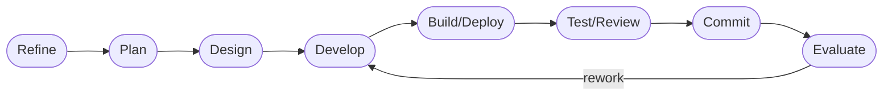

# DASHBOARD

## Actual Progress

- Goal: Advance runtime flexibility and operator maintainability (tizenclaw_improve)
- Active roadmap focus: all five roadmap items completed + three rework passes complete
- Current workflow phase: evaluate (complete)
- Last completed workflow phase: evaluate
- Supervisor verdict: `approved`
- Escalation status: `none`

## Third Rework Pass — Reviewer Finding

One correctness gap identified in the third review. Addressed in commit cb3c1153.

### Finding (Medium): fallback status misreports provider order for providers[] configs

**Root cause**: The write-lock fallback branch in `get_llm_runtime()`
(`runtime_admin_impl.rs` line 233) reconstructed `configured_provider_order`
from `self.llm_config.active_backend` and `fallback_backends` only. `LlmConfig`
did not store the raw document, so the authoritative `providers[]` array could
not be represented in the fallback status. Operators querying runtime status
during a reload would see the legacy-derived order even when they had configured
`providers[]` as authoritative.

**Fix**: Added `raw_doc: Value` field to `LlmConfig` (populated in
`from_document()`). The fallback path now calls
`ProviderCompatibilityTranslator::translate(&raw_doc)` to derive
`configured_provider_order`, which correctly handles both legacy and
`providers[]`-based configs and now matches `ProviderRegistry::status_json()`
on both normal and write-locked paths.

## Completed Work

All five roadmap targets have been implemented, tested, and committed.
Three rework passes have addressed all reviewer findings.

1. **Provider-selection layer** — `src/tizenclaw/src/core/provider_selection.rs`
   - `ProviderRegistry` owns initialized backends with preference-ordered routing
   - `ProviderSelector` selects the first available provider at request time
   - `ProviderSelector::ordered_enabled_names` is the authoritative source for the
     provider iteration order in `chat_with_fallback`
   - Compatibility translation maps legacy `active_backend`/`fallback_backends` config
   - Admin/runtime status exposes `configured_provider_order`, `providers[]`, and
     `current_selection` on both normal and fallback (write-locked) paths
   - Fallback path now uses `ProviderCompatibilityTranslator::translate()` on
     the stored raw doc, correctly representing `providers[]`-based configs

2. **Telegram model configuration externalized**
   - All three builtin backends (codex, gemini, claude) have `model_choices: vec![]`
   - Operators configure model choices via `telegram_config.json`
   - Precedence chain documented and tested

3. **ClawHub update flow** — `src/tizenclaw/src/core/clawhub_client.rs`
   - `clawhub_update()` reads `workspace/.clawhub/lock.json` and re-installs skills
   - Reports `updated`, `skipped`, and `failed` entries
   - One failure does not abort the full batch
   - Tests cover empty lock, source-identity reuse, and partial-failure accumulation

4. **Skill snapshot caching** — `src/tizenclaw/src/core/skill_capability_manager.rs`
   - `SkillSnapshotCache` with `SkillSnapshotFingerprint` tracks root mtimes,
     registration, and capability-config changes
   - `invalidate_snapshot_cache` is called on all paths that change the
     skill filesystem: clawhub install, clawhub update

5. **Host validation** — all tests passed via `./deploy_host.sh --test`
   (592 passed, 0 failed across three rework passes)

## Workflow Phases

- [O] Stage 0. Refine — DONE
- [O] Stage 1. Plan — DONE
- [O] Stage 2. Design — DONE
- [O] Stage 3. Develop — DONE (rework pass 3: fallback provider order fixed)
- [O] Stage 4. Build/Deploy — DONE (`./deploy_host.sh -b` PASS)
- [O] Stage 5. Test/Review — DONE (`./deploy_host.sh --test` PASS: 592+others; 0 failed)
- [O] Stage 6. Commit — DONE (cb3c1153)
- [O] Stage 7. Evaluate — DONE

## Risks And Watchpoints

- Provider init-time failures degrade gracefully to next available provider.
- ClawHub update failure for one entry does not abort the full batch.
- Snapshot cache fingerprint uses 1-second mtime resolution; same-second writes
  are covered by explicit `invalidate_snapshot_cache` calls on all clawhub
  operation handlers.
- Telegram model choices are empty in builtins; operators must supply them via config.
- The startup-path `providers_authoritative` filter gap was closed in rework pass 1.
- `chat_with_fallback` routes through `ProviderSelector::ordered_enabled_names`;
  disabled providers cannot slip into the fallback loop.
- `get_llm_runtime()` write-lock fallback now reports the correct provider order
  for both legacy and `providers[]`-based configs (fixed in rework pass 3).
