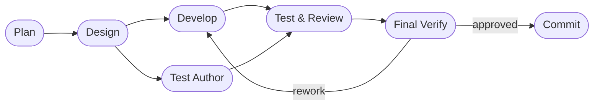

# DASHBOARD

## Actual Progress

- Goal: <!-- dormammu:goal_source=/home/hjhun/.dormammu/goals/tizenclaw_improve.md -->
- Prompt-driven scope: All 5 prompt-derived PLAN items complete.
- Active roadmap focus: complete
- Current workflow phase: evaluate
- Last completed workflow phase: evaluate
- Supervisor verdict: `approved`
- Escalation status: `approved`
- Resume point: All PLAN items marked [O]; implementation validated at rework pass 12

## Workflow Phases

## In Progress

Nothing — all PLAN items are complete and host validation passed (604 passed, 0 failed).

## Progress Notes

- This file should show the actual progress of the active scope.
- workflow_state.json remains machine truth.
- PLAN.md should list prompt-derived development items in phase order.
- Repository rules to follow: AGENTS.md
- Relevant repository workflows: .github/workflows/ci.yml, .github/workflows/release-host-bundle.yml

## Rework Pass 12 — 2026-04-17

### Reviewer Findings Addressed

**High (fixed)**: `SkillRootSignature` used `as_secs()` (1-second mtime granularity),
making in-place `SKILL.md` edits within the same second invisible to the
fingerprint.  Changed to nanosecond precision (`as_nanos(): u128`) throughout
`SkillRootSignature` and updated the test sleep from 1 s → 10 ms.

**Medium (fixed)**: `providers: []` (explicit empty array) was not authoritative.
`is_candidate_allowed` returned `true` for every backend absent from the list
via `unwrap_or(true)`, so legacy backends were still initialized and routed.
Fixed by returning `false` for all backends when `providers_array_present &&
providers.is_empty()`.  Updated the existing `providers_array_explicit_disable_pre_init_gate`
test and its docstring.  Also moved the `providers_array_present` log statement
outside the `!ordered_names.is_empty()` guard in both startup and reload paths.

### Validation

`./deploy_host.sh --test`: 604 passed; 0 failed.

### Supervisor Verdict

PASS — both reviewer findings resolved; host gate green.

## Reviewer Pass 13 — 2026-04-17

### Findings

No further findings. The follow-up patch preserves the intended provider
routing semantics and fixes the snapshot fingerprint granularity issue.

### Validation

`./deploy_host.sh --test`: passed, including the host workspace tests,
canonical Rust workspace tests, mock parity harness, and documentation-driven
architecture verification.

### Verdict

APPROVED — no remaining correctness or regression issue found in the modified
paths.

## Risks And Watchpoints

- Do not overwrite existing operator-authored Markdown.
- Keep JSON merges additive so interrupted runs stay resumable.
- Keep session-scoped state isolated when multiple workflows run in parallel.
