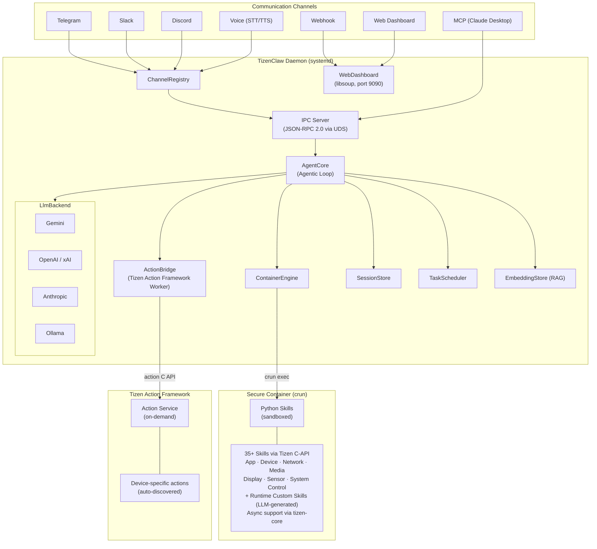

<p align="center">
  
</p>

<h1 align="center">TizenClaw</h1>

<p align="center">
  <strong>An AI-powered agent daemon for Tizen OS</strong><br>
  Control your Tizen device through natural language — powered by multi-provider LLMs, containerized skill execution, and a web-based admin dashboard.
</p>

<p align="center">
  <a href="LICENSE"></a>
  
  
  
  
</p>

---

## Overview

TizenClaw is a native C++ system daemon that brings LLM-based AI agent capabilities to [Tizen](https://www.tizen.org/) devices. It receives natural language commands via multiple communication channels, interprets them through configurable LLM backends, and executes device-level actions using sandboxed Python skills inside OCI containers and the **Tizen Action Framework**.

---

## Why TizenClaw?

TizenClaw is part of the **Claw** family of AI agent runtimes, each targeting different environments:

| | **TizenClaw** | **OpenClaw** | **NanoClaw** | **ZeroClaw** |
|---|:---:|:---:|:---:|:---:|
| **Language** | C++20 | TypeScript | TypeScript | Rust |
| **Target** | Tizen embedded | Cloud / Desktop | Container hosts | Edge hardware |
| **Binary** | ~812KB binary | Node.js runtime | Node.js runtime | ~8.8MB single binary |
| **Channels** | 7 | 22+ | 5 | 17 |
| **LLM Backends** | 5 | 4+ | 1 (Claude) | 5+ |
| **Sandboxing** | OCI (crun) | Docker | Docker | Docker |
| **Unique** | Tizen C-API, MCP | Canvas/A2UI, ClawHub | SKILL.md, AI-native | <5MB RAM, traits |

**What makes TizenClaw different:**

- 🚀 **Native C++ Performance** — Lower memory/CPU vs TypeScript/Node.js runtimes, ~812KB stripped native executable (armv7l), optimal for embedded devices
- 🔒 **OCI Container Isolation** — crun-based seccomp + namespace, finer syscall control than app-level sandboxing
- 📱 **Direct Tizen C-API** — ctypes wrappers for device hardware (battery, Wi-Fi, BT, display, volume, sensors, notifications, alarm, app management)
- 🎯 **Tizen Action Framework** — Native integration with per-action LLM tools, MD schema caching, event-driven updates
- 🤖 **Dynamic LLM Backends** — Built-in support for Gemini, OpenAI, Anthropic, xAI, Ollama with unified priority-based switching, seamlessly cascading between active, fallbacks, and dynamically loaded built-in/RPK Plugins.
- 🧩 **RPK Tool Distribution** — Extend the skill ecosystem dynamically using Tizen Resource Packages (RPKs) bundling Python skills and CLI tools without daemon recompilation. Platform-signed RPK packages are automatically discovered and symlinked into the skills directory.
- 📦 **Lightweight Deployment** — systemd + RPM, standalone device execution without Node.js/Docker
- 🔧 **Native MCP Server** — C++ MCP server integrated into daemon, Claude Desktop controls Tizen via sdb
- 📊 **Health Monitoring** — Built-in Prometheus-style metrics endpoint + live dashboard panel
- 🔄 **OTA Updates** — Over-the-air skill updates with version checking and rollback

---

## Quick Start

### Installing Tizen Build Tools (GBS & MIC)

To build TizenClaw, you need the Git Build System (GBS) and MIC. For Ubuntu, you can set up the apt repository and install the tools with the following commands:

```bash
echo "deb [trusted=yes] http://download.tizen.org/tools/latest-release/Ubuntu_$(lsb_release -rs)/ /" | \
sudo tee /etc/apt/sources.list.d/tizen.list > /dev/null

sudo apt update
sudo apt install gbs mic
```

For detailed installation guides, refer to the [official Tizen documentation](https://docs.tizen.org/platform/developing/installing/).

### Automated Deployment

The recommended way to build and deploy TizenClaw is using the included `deploy.sh` script. This script automatically handles building the core daemon, the RAG knowledge base, and deploying them to your connected device.

```bash
# Automated build + deploy to device
./deploy.sh

# To build and deploy with the secure tunnel dependency (ngrok):
./deploy.sh --with-ngrok
```

Once deployed, the `deploy.sh` script will automatically fetch the secure public URL from the local ngrok API (`127.0.0.1:4040`) and output the URL to access the Web Dashboard.

#### What gets installed?
The build process generates the core RPM package:
1. **`tizenclaw`**: The core AI daemon, Action Framework bridge, and built-in skills.

A companion project, [tizenclaw-rag](https://github.com/hjhun/tizenclaw-rag), produces a separate RPM:
2. **`tizenclaw-rag`**: Pre-built SQLite vector databases, ONNX Runtime, and the `all-MiniLM-L6-v2` embedding model for LLM-independent on-device RAG. **Highly recommended** for accurate skill generation.

> **Note**: `deploy.sh` automatically detects and builds `tizenclaw-rag` if it exists at `../tizenclaw-rag`.

#### On-Device Dashboard ([tizenclaw-webview](https://github.com/hjhun/tizenclaw-webview))
TizenClaw also includes a companion Tizen web app (`tizenclaw-webview`) that provides direct on-device access to the Web Admin Dashboard. 
If installed, you can launch the dashboard directly on the device screen:

```bash
# Launch the dashboard UI on the device
sdb shell app_launcher -s org.tizen.tizenclaw-webview __APP_SVC_URI__ "http://localhost:9090"
```

Alternatively, access it from your development machine:
```bash
# Forward port and access dashboard from host
sdb forward tcp:9090 tcp:9090
open http://localhost:9090
```

### Manual Build and Deployment

If you prefer to build and deploy manually, use the following commands:

```bash
# Build
gbs build -A x86_64 --include-all

# Manual deployment to device
sdb root on && sdb shell mount -o remount,rw /
sdb push ~/GBS-ROOT/local/repos/tizen/x86_64/RPMS/tizenclaw-1.0.0-1.x86_64.rpm /tmp/
sdb push ~/GBS-ROOT/local/repos/tizen/x86_64/RPMS/tizenclaw-rag-1.0.0-1.x86_64.rpm /tmp/
sdb shell rpm -Uvh --force /tmp/tizenclaw-1.0.0-1.x86_64.rpm /tmp/tizenclaw-rag-1.0.0-1.x86_64.rpm

# Start daemon
sdb shell systemctl daemon-reload
sdb shell systemctl restart tizenclaw
```

---

### Key Features

- **Standardized IPC (JSON-RPC 2.0)** — Communicates with the `tizenclaw-cli` and external clients over Unix Domain Sockets using standard JSON-RPC 2.0.
- **Aggressive Edge Memory Management** — Monitors daemon idle states locally and dynamically flushes SQLite caches (`sqlite3_release_memory(50MB)`) while aggressively reclaiming heap space back to Tizen OS (`malloc_trim(0)`) utilizing PSS profiling.
- **Unified LLM Priority Routing** — Supports Gemini, OpenAI, Anthropic, xAI, Ollama, and runtime RPK Plugins via a unified queue, automatically falling back based strictly on assigned priority values (`1` baseline).
- **7 Communication Channels** — Telegram, Slack, Discord, MCP (Claude Desktop), Webhook, Voice (TTS/STT), and Web Dashboard — all managed through a `Channel` abstraction.
- **Function Calling / Tool Use** — The LLM autonomously invokes device skills through an iterative Agentic Loop with streaming responses.
- **Tizen Action Framework** — Native device actions via `ActionBridge` with per-action typed LLM tools, MD schema caching, and live updates via `action_event_cb`.
- **OCI Container Isolation** — Skills run inside a `crun` container with namespace isolation, limiting access to host resources.
- **Semantic Search (RAG)** — On-device embedding (all-MiniLM-L6-v2 via ONNX Runtime) with SQLite vector store for LLM-independent knowledge retrieval. See [RAG System](docs/RAG.md).
- **Task Scheduler** — Cron/interval/one-shot/weekly scheduled tasks with LLM integration and retry logic.
- **Security** — Encrypted API keys, tool execution policies with risk levels, structured audit logging, HMAC-SHA256 webhook auth.
- **Web Admin Dashboard** — Dark glassmorphism SPA on port 9090 with session monitoring, chat interface, config editor, and admin authentication.
- **Multi-Agent** — Supervisor agent pattern, skill pipelines, A2A protocol for cross-device agent collaboration.
- **Session Persistence** — Conversation history stored as Markdown with YAML frontmatter, surviving daemon restarts.
- **Persistent Memory** — Long-term, episodic, and session-scoped short-term memory with LLM tools (`remember`, `recall`, `forget`). Configurable retention via `memory_config.json`, idle-time summary regeneration, and automatic skill execution tracking.
- **Tool Schema Discovery** — Embedded tool and Action Framework schemas stored as Markdown files under `/opt/usr/share/tizenclaw/tools/`, automatically loaded into the LLM system prompt for precise tool invocation.
- **Health Monitoring** — Prometheus-style `/api/metrics` endpoint with live dashboard health panel (CPU, memory, uptime, request counts).
- **OTA Updates** — Over-the-air skill updates via HTTP pull, version checking against remote manifest, and automatic rollback on failure.

---

## Architecture

TizenClaw uses a **dual-container architecture** powered by OCI-compliant runtimes (`crun`):



---

## Skills

TizenClaw ships with **35 container skills** (Python, OCI sandbox) and **10+ built-in tools** (native C++). Async skills use the **tizen-core** event loop for callback-based APIs.

| Category | Skills | Examples |
|----------|:------:|---------|
| **App Management** | 5 | `send_app_control`, `list_apps`, `terminate_app`, `get_package_info` |
| **Device Info & Sensors** | 7 | `get_device_info`, `get_sensor_data`, `get_thermal_info`, `get_runtime_info` |
| **Network & Connectivity** | 6 | `get_wifi_info`, `scan_wifi_networks` ⚡, `scan_bluetooth_devices` ⚡, `get_data_usage` |
| **Display & Hardware** | 6 | `control_display`, `control_volume`, `control_haptic`, `control_led` |
| **Media & Content** | 5 | `get_metadata`, `get_media_content`, `get_mime_type`, `get_sound_devices` |
| **System Actions** | 6 | `download_file` ⚡, `send_notification`, `schedule_alarm`, `play_tone`, `web_search` |
| **Built-in Tools** | 15+ | `execute_code`, `file_manager`, `manage_custom_skill`, `create_task`, `search_knowledge`, `remember`, `recall`, `forget` |

> ⚡ = Async skill using tizen-core event loop

📖 **Full reference**: [Skills Reference](docs/SKILLS.md)

### Tizen Action Framework (Native Device Actions)

Actions registered via the Tizen Action Framework are automatically discovered and exposed as **per-action LLM tools** (e.g., `action_<name>`). Schema files are cached as Markdown and kept in sync via `action_event_cb` events. Available actions vary by device.

### RPK Skill Plugins

TizenClaw supports dynamically injecting Python skills via **platform-signed RPK (Resource Package)** packages. When an RPK with the skill metadata key is installed through the Tizen package manager, `SkillPluginManager` automatically creates symbolic links from the RPK's `lib/<skill_name>/` directories into the TizenClaw skills directory, triggering a hot-reload.

**RPK Structure:**
```
lib/
├── get_sample_info/
│   ├── manifest.json      # Skill schema (name, description, parameters)
│   └── skill.py           # Python implementation
└── get_sample_status/
    ├── manifest.json
    └── skill.py
```

**Metadata Declaration** (`tizen-manifest.xml`):
```xml
<metadata key="http://tizen.org/metadata/tizenclaw/skill"
          value="get_sample_info|get_sample_status"/>
```

> **Note**: Only packages signed with a **platform-level certificate** are allowed to register skills. Multiple skills can be declared using `|` as a delimiter or via multiple `<metadata>` entries.

📦 **Sample project**: [tizenclaw-skill-plugin-sample](https://github.com/hjhun/tizenclaw-skill-plugin-sample)

### Multi-Agent System

TizenClaw includes a default multi-agent system designed to transition from a single monolithic agent toward a highly decentralized **11 MVP Agent Set** for robust device operation:

| Category | MVP Agent | Role |
|----------|-------|------|
| **Understanding** | **Input Understanding** | Parses raw user input across channels to determine intent |
| **Perception** | **Environment Perception** | Consolidates device/system/sensor schemas via event bus |
| **Memory** | **Session / Context** | Manages short, long-term, and episodic memory Retrieval |
| **Planning** | **Planning / Decision** | **Orchestrator**: Analyzes requests, decomposes goals, plans steps |
| **Execution** | **Action Execution** | Executes planned skills via ContainerEngine & Action Framework |
| **Protection** | **Policy / Safety** | Enforces tool policy, risk levels, and system safeguards |
| **Monitoring** | **Health Monitoring** | Tracks metrics (CPU, Memory, uptime, RPK states) |
|          | **Recovery** | Recovers from failures, missing context, and rate limits |
|          | **Logging / Trace** | Manages structured audit logs and execution traces |
| **Utility** | **Knowledge Retrieval** | Manages RAG embeddings and semantic document search |
|          | **Skill Manager** | **(Legacy)** Creates/updates custom Python skills at runtime |

Agents communicate via `create_session` / `send_to_session` and are defined in `config/agent_roles.json`. 

#### Perception Architecture
To transition towards this robust multi-agent ecosystem, TizenClaw utilizes a dedicated perception layer focusing on:
- **Common State Schemas**: Strict JSON structures (`DeviceState`, `UserState`, `TaskState`, etc.)
- **Capability Registries**: Defined boundaries of what loaded RPK tools and built-in skills can achieve.
- **Event-Driven Bus**: Overcoming polling limits by reacting to `sensor.changed`, `app.started`, etc.

---

## Prerequisites

- **Tizen 10.0** or later target device / emulator
- **crun** OCI runtime (built from source during RPM packaging)
- Required Tizen packages: `tizen-core`, `glib-2.0`, `dlog`, `libcurl`, `libsoup-3.0`, `libwebsockets`, `sqlite3`, `capi-appfw-tizen-action`

---

## Build

TizenClaw uses the Tizen GBS build system. The default target is **x86_64** (emulator), but it also supports **armv7l** and **aarch64** for real devices:

```bash
# x86_64 (emulator, default)
gbs build -A x86_64 --include-all

# armv7l (32-bit ARM devices)
gbs build -A armv7l --include-all

# aarch64 (64-bit ARM devices)
gbs build -A aarch64 --include-all
```

For subsequent builds (after initial):
```bash
gbs build -A x86_64 --include-all --noinit
```

The build system automatically selects the correct rootfs image from `data/img/<arch>/rootfs.tar.gz` based on the target architecture.

RPM output:
```
~/GBS-ROOT/local/repos/tizen/<arch>/RPMS/tizenclaw-1.0.0-1.<arch>.rpm
```

For the RAG companion package, build separately from `../tizenclaw-rag`:
```bash
cd ../tizenclaw-rag && gbs build -A x86_64 --include-all
```
```
~/GBS-ROOT/local/repos/tizen/<arch>/RPMS/tizenclaw-rag-1.0.0-1.<arch>.rpm
```

Unit tests are automatically executed during the build via `%check`.

---

## Deploy

Deploy to a Tizen emulator or device over `sdb`:

```bash
# Enable root and remount filesystem
sdb root on
sdb shell mount -o remount,rw /

# Push and install TizenClaw and the optional RAG Database RPMs
# Push and install TizenClaw
sdb push ~/GBS-ROOT/local/repos/tizen/x86_64/RPMS/tizenclaw-1.0.0-1.x86_64.rpm /tmp/
sdb shell rpm -Uvh --force /tmp/tizenclaw-1.0.0-1.x86_64.rpm

# Push and install RAG (built from tizenclaw-rag project)
sdb push ~/GBS-ROOT/local/repos/tizen/x86_64/RPMS/tizenclaw-rag-1.0.0-1.x86_64.rpm /tmp/
sdb shell rpm -Uvh --force /tmp/tizenclaw-rag-1.0.0-1.x86_64.rpm

# Restart the daemon
sdb shell systemctl daemon-reload
sdb shell systemctl restart tizenclaw
sdb shell systemctl status tizenclaw -l
```

---

## Configuration

TizenClaw reads its configuration from `/opt/usr/share/tizenclaw/` on the device. All configuration files can be edited via the **Web Admin Dashboard** (port 9090).

| Config File | Purpose |
|---|---|
| `llm_config.json` | LLM backend selection, API keys, model settings, fallback order |
| `telegram_config.json` | Telegram bot token and allowed chat IDs |
| `slack_config.json` | Slack app/bot tokens and channel lists |
| `discord_config.json` | Discord bot token and guild/channel allowlists |
| `webhook_config.json` | Webhook route mapping and HMAC secrets |
| `tool_policy.json` | Tool execution policy (max iterations, blocked skills, risk overrides) |
| `agent_roles.json` | Agent roles and specialized system prompts |
| `memory_config.json` | Memory retention periods, size limits, and summary parameters |

### Example: LLM Backend (`llm_config.json`)

```json
{
  "active_backend": "gemini",
  "fallback_backends": ["openai", "ollama"],
  "backends": {
    "gemini": {
      "api_key": "YOUR_API_KEY",
      "model": "gemini-2.5-flash"
    },
    "openai": {
      "api_key": "YOUR_API_KEY",
      "model": "gpt-4o",
      "endpoint": "https://api.openai.com/v1"
    },
    "anthropic": {
      "api_key": "YOUR_API_KEY",
      "model": "claude-sonnet-4-20250514"
    },
    "ollama": {
      "model": "llama3",
      "endpoint": "http://localhost:11434"
    }
  }
}
```

Sample configuration files are included in `data/`.

---

## Project Structure

```
tizenclaw/
├── src/
│   ├── common/                    # Logging, shared utilities
│   └── tizenclaw/                 # Daemon core
│       ├── core/                  # Main daemon, agent loop, tool policy
│       │   ├── tizenclaw.cc       #   Daemon entry, IPC server
│       │   ├── agent_core.cc      #   Agentic Loop, streaming
│       │   ├── action_bridge.cc   #   Tizen Action Framework bridge
│       │   ├── tool_policy.cc     #   Risk-level tool policy
│       │   └── skill_watcher.cc   #   inotify skill hot-reload
│       ├── llm/                   # LLM backend providers
│       │   ├── llm_backend.hh     #   Unified LLM interface
│       │   ├── gemini_backend.cc  #   Google Gemini
│       │   ├── openai_backend.cc  #   OpenAI / xAI
│       │   ├── anthropic_backend.cc  # Anthropic
│       │   └── ollama_backend.cc  #   Ollama (local)
│       ├── channel/               # Communication channels
│       │   ├── channel.hh         #   Channel interface
│       │   ├── channel_registry.cc#   Lifecycle management
│       │   ├── telegram_client.cc #   Telegram Bot API
│       │   ├── slack_channel.cc   #   Slack (WebSocket)
│       │   ├── discord_channel.cc #   Discord (WebSocket)
│       │   ├── mcp_server.cc      #   MCP (JSON-RPC 2.0)
│       │   ├── webhook_channel.cc #   Webhook HTTP
│       │   ├── voice_channel.cc   #   Tizen STT/TTS
│       │   └── web_dashboard.cc   #   Admin SPA (port 9090)
│       ├── storage/               # Data persistence
│       │   ├── session_store.cc   #   Markdown sessions
│       │   ├── memory_store.cc    #   Persistent memory (long-term, episodic, short-term)
│       │   ├── embedding_store.cc #   SQLite RAG vectors
│       │   └── audit_logger.cc    #   Audit logging
│       ├── infra/                 # Infrastructure
│       │   ├── http_client.cc     #   libcurl HTTP wrapper
│       │   ├── key_store.cc       #   Encrypted API keys
│       │   ├── container_engine.cc#   OCI container (crun)
│       │   ├── health_monitor.cc  #   Prometheus-style metrics
│       │   └── ota_updater.cc     #   OTA skill updates
│       ├── orchestrator/          # Multi-agent orchestration
│       │   ├── supervisor_engine.cc # Supervisor agent pattern
│       │   ├── pipeline_executor.cc # Skill pipeline engine
│       │   └── a2a_handler.cc     #   A2A protocol
│       └── scheduler/             # Task automation
│           └── task_scheduler.cc  #   Cron/interval tasks
├── tools/skills/                  # Python skill scripts
├── tools/embedded/                # Embedded tool MD schemas (13 files)
├── scripts/                       # Container setup, CI, hooks
├── test/unit_tests/               # Google Test unit tests
├── data/                          # Config samples, rootfs, web SPA
├── packaging/                     # RPM spec, systemd services
├── docs/                          # Design, Analysis, Roadmap
├── LICENSE                        # Apache License 2.0
└── CMakeLists.txt
```

---

## Related Projects

- [tizenclaw-rag](https://github.com/hjhun/tizenclaw-rag): Companion RAG package — pre-built Tizen documentation knowledge databases, ONNX Runtime, and the all-MiniLM-L6-v2 embedding model for LLM-independent on-device semantic search.
- [tizenclaw-webview](https://github.com/hjhun/tizenclaw-webview): A companion Tizen web application that provides an on-device Web Admin Dashboard for TizenClaw.
- [tizenclaw-llm-plugin-sample](https://github.com/hjhun/tizenclaw-llm-plugin-sample): A sample project demonstrating how to build an RPM to RPK (Resource Package) plugin to dynamically inject new customized LLM backends into TizenClaw at runtime.
- [tizenclaw-skill-plugin-sample](https://github.com/hjhun/tizenclaw-skill-plugin-sample): A sample project demonstrating how to build an RPK skill plugin to dynamically inject Python skills into TizenClaw via platform-signed packages.

---

## Documentation

- [System Design](docs/DESIGN.md)
- [Project Analysis](docs/ANALYSIS.md)
- [RAG System](docs/RAG.md)
- [Development Roadmap](docs/ROADMAP.md)

---

## License

This project is licensed under the [Apache License 2.0](LICENSE).

Copyright 2024-2026 Samsung Electronics Co., Ltd.
