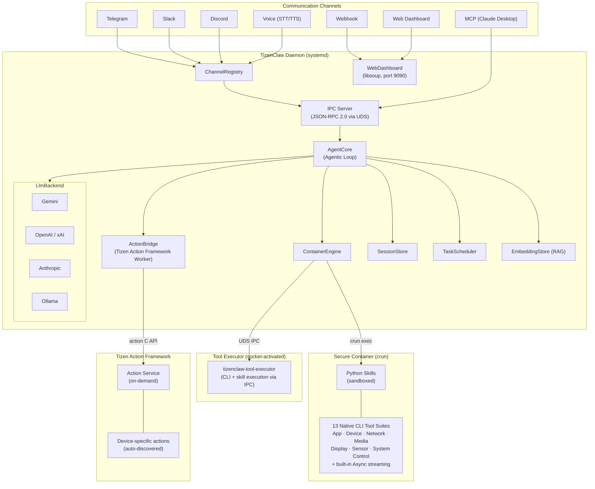

<p align="center">
  
</p>

<h1 align="center">TizenClaw</h1>

<p align="center">
  <strong>An AI-powered agent daemon for Tizen OS</strong><br>
  Control your Tizen device through natural language — powered by multi-provider LLMs, containerized skill execution, and a web-based admin dashboard.
</p>

<p align="center">
  <a href="LICENSE"></a>
  
  
  
  
</p>

---

## Overview

TizenClaw is a native C++ system daemon that brings LLM-based AI agent capabilities to [Tizen](https://www.tizen.org/) devices. It receives natural language commands via multiple communication channels, interprets them through configurable LLM backends, and executes device-level actions using sandboxed Python skills inside OCI containers and the **Tizen Action Framework**. The LLM can also proactively send outbound messages through channels (e.g., autonomous notifications via Telegram).

---

## Why TizenClaw?

TizenClaw is part of the **Claw** family of AI agent runtimes, each targeting different environments:

| | **TizenClaw** | **OpenClaw** | **NanoClaw** | **ZeroClaw** |
|---|:---:|:---:|:---:|:---:|
| **Language** | C++20 | TypeScript | TypeScript | Rust |
| **Target** | Tizen embedded | Cloud / Desktop | Container hosts | Edge hardware |
| **Binary** | ~812KB binary | Node.js runtime | Node.js runtime | ~8.8MB single binary |
| **Channels** | 7+ (extensible) | 22+ | 5 | 17 |
| **LLM Backends** | 5+ (extensible) | 4+ | 1 (Claude) | 5+ |
| **Sandboxing** | OCI (crun) | Docker | Docker | Docker |
| **Unique** | Tizen C-API, MCP | Canvas/A2UI, ClawHub | SKILL.md, AI-native | <5MB RAM, traits |

**What makes TizenClaw different:**

- 🚀 **Native C++ Performance** — Lower memory/CPU vs TypeScript/Node.js runtimes, ~812KB stripped native executable (armv7l), optimal for embedded devices
- 🔒 **OCI Container Isolation** — crun-based seccomp + namespace, finer syscall control than app-level sandboxing
- 📱 **Direct Tizen C-API** — ctypes wrappers for device hardware (battery, Wi-Fi, BT, display, volume, sensors, notifications, alarm, app management)
- 🎯 **Tizen Action Framework** — Native integration with per-action LLM tools, MD schema caching, event-driven updates
- 🤖 **Extensible LLM Backends** — 5 built-in backends (Gemini, OpenAI, Anthropic, xAI, Ollama) with unified priority-based switching. Extend with unlimited additional backends via RPK plugins — no daemon recompilation required.
- 🧩 **RPK Tool Distribution** — Extend the skill ecosystem dynamically using Tizen Resource Packages (RPKs) bundling Python skills without daemon recompilation. Platform-signed RPK packages are automatically discovered and symlinked into the skills directory.
- 🔧 **CLI Tool Plugins** — Extend agent capabilities with native CLI tools packaged as TPKs. CLI tools run directly on the host for Tizen C-API access, with rich Markdown descriptors (`.tool.md`) for LLM tool discovery.
- 📦 **Lightweight Deployment** — systemd + RPM with socket activation, standalone device execution without Node.js/Docker
- 🤖 **Anthropic Standard Compatibility** — Full compliance with the Anthropic standard. Skills use the `SKILL.md` format (YAML frontmatter + JSON schemas), and the built-in **MCP Client** (Model Context Protocol) seamlessly integrates with external MCP tool servers.
- 🔧 **Native MCP Server** — C++ MCP server integrated into daemon, Claude Desktop controls Tizen via sdb
- 📊 **Health Monitoring** — Built-in Prometheus-style metrics endpoint + live dashboard panel
- 🔄 **OTA Updates** — Over-the-air skill updates with version checking and rollback

---

## Quick Start

### Installing Tizen Build Tools (GBS & MIC)

To build TizenClaw, you need the Git Build System (GBS) and MIC. For Ubuntu, you can set up the apt repository and install the tools with the following commands:

```bash
echo "deb [trusted=yes] http://download.tizen.org/tools/latest-release/Ubuntu_$(lsb_release -rs)/ /" | \
sudo tee /etc/apt/sources.list.d/tizen.list > /dev/null

sudo apt update
sudo apt install gbs mic
```

For detailed installation guides, refer to the [official Tizen documentation](https://docs.tizen.org/platform/developing/installing/).

### Automated Deployment

The recommended way to build and deploy TizenClaw is using the included `deploy.sh` script. This script automatically handles building the core daemon, the RAG knowledge base, and deploying them to your connected device.

```bash
# Automated build + deploy to device
./deploy.sh

# To build and deploy with the secure tunnel dependency (ngrok):
./deploy.sh --with-ngrok
```

Once deployed, the `deploy.sh` script will automatically fetch the secure public URL from the local ngrok API (`127.0.0.1:4040`) and output the URL to access the Web Dashboard.

#### What gets installed?
The build process generates the core RPM package:
1. **`tizenclaw`**: The core AI daemon, Action Framework bridge, and built-in skills.

A companion project, [tizenclaw-assets](https://github.com/hjhun/tizenclaw-assets), produces a separate RPM:
2. **`tizenclaw-assets`**: Consolidated ML/AI asset package — ONNX Runtime, pre-built RAG knowledge databases, embedding model (`all-MiniLM-L6-v2`), PaddleOCR PP-OCRv3 on-device OCR engine with CLI tool. **Highly recommended** for full AI capabilities.

> **Note**: `deploy.sh` automatically detects and builds `tizenclaw-assets` if it exists at `../tizenclaw-assets`.

#### On-Device Dashboard ([tizenclaw-webview](https://github.com/hjhun/tizenclaw-webview))
TizenClaw also includes a companion Tizen web app (`tizenclaw-webview`) that provides direct on-device access to the Web Admin Dashboard. 
If installed, you can launch the dashboard directly on the device screen:

```bash
# Launch the dashboard UI on the device
sdb shell app_launcher -s org.tizen.tizenclaw-webview __APP_SVC_URI__ "http://localhost:9090"
```

Alternatively, access it from your development machine:
```bash
# Forward port and access dashboard from host
sdb forward tcp:9090 tcp:9090
open http://localhost:9090
```

### Testing Outbound Messaging

Once deployed, you can test LLM-initiated outbound messaging via the CLI:

```bash
# Send a message via a specific channel
sdb shell tizenclaw-cli --send-to telegram "Hello from TizenClaw!"

# Broadcast to all outbound-capable channels
sdb shell tizenclaw-cli --send-to all "System alert: disk usage 90%"
```

### Manual Build and Deployment

If you prefer to build and deploy manually, use the following commands:

```bash
# Build
gbs build -A x86_64 --include-all

# Manual deployment to device
sdb root on && sdb shell mount -o remount,rw /
sdb push ~/GBS-ROOT/local/repos/tizen/x86_64/RPMS/tizenclaw-1.0.0-1.x86_64.rpm /tmp/
sdb push ~/GBS-ROOT/local/repos/tizen/x86_64/RPMS/tizenclaw-assets-1.0.0-1.x86_64.rpm /tmp/
sdb shell rpm -Uvh --force /tmp/tizenclaw-1.0.0-1.x86_64.rpm /tmp/tizenclaw-assets-1.0.0-1.x86_64.rpm

# Start daemon and enable socket activation
sdb shell systemctl daemon-reload
sdb shell systemctl enable tizenclaw-tool-executor.socket tizenclaw-code-sandbox.socket
sdb shell systemctl restart tizenclaw-tool-executor.socket tizenclaw-code-sandbox.socket
sdb shell systemctl restart tizenclaw
```

---

### Key Features

- **Standardized IPC (JSON-RPC 2.0)** — Communicates with the `tizenclaw-cli` and external clients over Unix Domain Sockets using standard JSON-RPC 2.0. Supports `prompt`, `get_usage`, and `send_to` methods.
- **Aggressive Edge Memory Management** — Monitors daemon idle states locally and dynamically flushes SQLite caches (`sqlite3_release_memory(50MB)`) while aggressively reclaiming heap space back to Tizen OS (`malloc_trim(0)`) utilizing PSS profiling.
- **Unified LLM Priority Routing** — Supports Gemini, OpenAI, Anthropic, xAI, Ollama, and runtime RPK Plugins via a unified queue, automatically falling back based strictly on assigned priority values (`1` baseline).
- **7+ Communication Channels** — Telegram, Slack, Discord, MCP (Claude Desktop), Webhook, Voice (TTS/STT), and Web Dashboard built-in — all managed through a pluggable `Channel` abstraction with config-driven factory and runtime SO plugin support. Extend with unlimited additional channels via shared object plugins — no daemon recompilation required.
- **Outbound Messaging** — LLM-initiated proactive notifications via `ChannelRegistry::SendTo()` / `Broadcast()`. Channels that support outbound (Telegram, Slack, Discord, Voice) implement `Channel::SendMessage()`. Testable via `tizenclaw-cli --send-to <channel> <text>`.
- **Function Calling / Tool Use** — The LLM autonomously invokes device skills through an iterative Agentic Loop with streaming responses.
- **Tizen Action Framework** — Native device actions via `ActionBridge` with per-action typed LLM tools, MD schema caching, and live updates via `action_event_cb`.
- **OCI Container Isolation** — Skills run inside a `crun` container with namespace isolation, limiting access to host resources.
- **Capability Registry** — Unified registry for all tools with `FunctionContract` (input/output schemas, side effects, retry policies, required permissions). LLM receives `{{CAPABILITY_SUMMARY}}` with category-grouped tool descriptions for intelligent planning.
- **Hybrid RAG Search** — FTS5-based BM25 keyword search fused with vector cosine similarity via Reciprocal Rank Fusion (RRF). Falls back to vector-only if FTS5 unavailable. Token budget estimation for context-aware retrieval.
- **Modular Tool Dispatcher** — Extracted `ToolDispatcher` class with thread-safe O(1) dispatch, testable in isolation from `AgentCore`.
- **Skill Repository** — Manifest v2 support with `version`, `author`, `compatibility` fields. Stub for remote skill marketplace (search, install, update).
- **Fleet Management** — Enterprise `FleetAgent` for multi-device management with heartbeat, device registration, and remote command support (stub, opt-in via `fleet_config.json`).
- **Semantic Search (RAG)** — On-device embedding (all-MiniLM-L6-v2 via ONNX Runtime) with SQLite vector store for LLM-independent knowledge retrieval. See [ML/AI Assets](docs/ASSETS.md).
- **On-Device OCR** — PaddleOCR PP-OCRv3 text detection and recognition via ONNX Runtime. Korean+English (lite, ~13MB) or CJK (full, ~84MB) model selectable at build time.
- **Task Scheduler** — Cron/interval/one-shot/weekly scheduled tasks with LLM integration and retry logic.
- **Security** — Encrypted API keys, tool execution policies with risk levels, structured audit logging, HMAC-SHA256 webhook auth.
- **Web Admin Dashboard** — Dark glassmorphism SPA on port 9090 with session monitoring, chat interface, config editor, and admin authentication.
- **Multi-Agent** — Supervisor agent pattern, skill pipelines, A2A protocol for cross-device agent collaboration.
- **Autonomous Triggers** — Event-driven rule engine with LLM-based evaluation for context-aware autonomous actions. Subscribes to `EventBus` for system events.
- **Session Persistence** — Conversation history stored as Markdown with YAML frontmatter, surviving daemon restarts.
- **Persistent Memory** — Long-term, episodic, and session-scoped short-term memory with LLM tools (`remember`, `recall`, `forget`). Configurable retention via `memory_config.json`, idle-time summary regeneration, and automatic skill execution tracking.
- **Tool Schema Discovery** — Embedded tool and Action Framework schemas stored as Markdown files under `/opt/usr/share/tizenclaw/tools/`, automatically loaded into the LLM system prompt for precise tool invocation.
- **Health Monitoring** — Prometheus-style `/api/metrics` endpoint with live dashboard health panel (CPU, memory, uptime, request counts).
- **OTA Updates** — Over-the-air skill updates via HTTP pull, version checking against remote manifest, and automatic rollback on failure.

---

## Architecture

TizenClaw uses a **dual-container architecture** powered by OCI-compliant runtimes (`crun`) with **systemd socket activation** for on-demand service startup:



---

## Skills

TizenClaw ships with **13 native CLI tool suites** containing diverse sub-commands (replacing the legacy Python OCI sandbox skills) and **20+ built-in tools** (native C++). Async functions and streaming events handle callback-based APIs effectively.

| Category | Skills | Examples |
|----------|:------:|---------|
| **App Management** | 5 | `send_app_control`, `list_apps`, `terminate_app`, `get_package_info` |
| **Device Info & Sensors** | 7 | `get_device_info`, `get_sensor_data`, `get_thermal_info`, `get_runtime_info` |
| **Network & Connectivity** | 6 | `get_wifi_info`, `scan_wifi_networks` ⚡, `scan_bluetooth_devices` ⚡, `get_data_usage` |
| **Display & Hardware** | 6 | `control_display`, `control_volume`, `control_haptic`, `control_led` |
| **Media & Content** | 5 | `get_metadata`, `get_media_content`, `get_mime_type`, `get_sound_devices` |
| **System Actions** | 6 | `download_file` ⚡, `send_notification`, `schedule_alarm`, `play_tone`, `web_search` |

> ⚡ = Async skill using tizen-core event loop

- **Built-in Tools**: `execute_code`, `file_manager`, `manage_custom_skill`, `create_task`, `list_tasks`, `cancel_task`, `create_session`, `list_sessions`, `send_to_session`, `ingest_document`, `search_knowledge`, `execute_action`, `action_<name>` (per-action tools), `execute_cli` (CLI tool plugins), `create_workflow`, `list_workflows`, `run_workflow`, `delete_workflow`, `create_pipeline`, `list_pipelines`, `run_pipeline`, `delete_pipeline`, `run_supervisor`, `remember`, `recall`, `forget` (persistent memory)
- **Tool Dispatch**: Modular `ToolDispatcher` class with thread-safe O(1) dispatch and `starts_with` fallback for dynamically named tools (e.g., `action_*`). All tools registered in `CapabilityRegistry` with function contracts.

📖 **Full reference**: [Tools Reference](docs/TOOLS.md)

### Tizen Action Framework (Native Device Actions)

Actions registered via the Tizen Action Framework are automatically discovered and exposed as **per-action LLM tools** (e.g., `action_<name>`). Schema files are cached as Markdown and kept in sync via `action_event_cb` events. Available actions vary by device.

### RPK Skill Plugins

TizenClaw supports dynamically injecting Python skills via **platform-signed RPK (Resource Package)** packages. When an RPK with the skill metadata key is installed through the Tizen package manager, `SkillPluginManager` automatically creates symbolic links from the RPK's `lib/<skill_name>/` directories into the TizenClaw skills directory, triggering a hot-reload.

**RPK Structure:**
```
lib/
├── get_sample_info/
│   ├── manifest.json      # Skill schema (name, description, parameters)
│   └── skill.py           # Python implementation
└── get_sample_status/
    ├── manifest.json
    └── skill.py
```

**Metadata Declaration** (`tizen-manifest.xml`):
```xml
<metadata key="http://tizen.org/metadata/tizenclaw/skill"
          value="get_sample_info|get_sample_status"/>
```

> **Note**: Only packages signed with a **platform-level certificate** are allowed to register skills. Multiple skills can be declared using `|` as a delimiter or via multiple `<metadata>` entries.

📦 **Sample project**: [tizenclaw-skill-plugin-sample](https://github.com/hjhun/tizenclaw-skill-plugin-sample)

### CLI Tool Plugins

TizenClaw also supports native **CLI tool plugins** packaged as TPKs (Tizen Package). Unlike containerized Python skills, CLI tools run directly on the host to access Tizen C-APIs without sandbox overhead. Each CLI tool includes a rich Markdown descriptor (`.tool.md`) that enables the LLM to understand commands, subcommands, arguments, and output formats.

**TPK Structure:**
```
bin/
├── get_package_info          # Native CLI executable
└── get_app_info              # Native CLI executable
res/
├── get_package_info.tool.md  # LLM tool descriptor
└── get_app_info.tool.md      # LLM tool descriptor
```

**Metadata Declaration** (`tizen-manifest.xml`):
```xml
<service-application appid="org.tizen.sample.get_package_info"
                     exec="get_package_info" type="capp">
    <metadata key="http://tizen.org/metadata/tizenclaw/cli"
              value="get_package_info"/>
</service-application>
```

`CliPluginManager` discovers installed CLI TPKs via `pkgmgrinfo_appinfo_metadata_filter`, creates symlinks for the executable and `.tool.md` descriptor into `/opt/usr/share/tizenclaw/tools/cli/`, and injects the tool documentation into the LLM system prompt. The LLM invokes CLI tools through the `execute_cli` built-in tool. CLI tools naturally support **one-shot execution** for instant queries (like `get`) and **streaming mode** for continuous event monitoring (like `watch`), allowing for highly flexible real-time interactions with the device.

> **Note**: Only packages signed with a **platform-level certificate** are allowed to register CLI tools. The `tizenclaw-metadata-cli-plugin.so` parser plugin enforces this at install time.

📦 **Sample project**: [tizenclaw-cli-plugin-sample](https://github.com/hjhun/tizenclaw-cli-plugin-sample)

### Channel Plugins

TizenClaw supports dynamically loaded **channel plugins** via shared objects (`.so`). Channel activation is controlled through `channels.json`, and plugins are loaded at runtime through `ChannelFactory` + `PluginChannel` using the `tizenclaw_channel.h` C API.

**Plugin C API** (`tizenclaw_channel.h`):
```c
void TIZENCLAW_CHANNEL_INITIALIZE(tizenclaw_channel_context_h ctx);
const char* TIZENCLAW_CHANNEL_GET_NAME(void);
bool TIZENCLAW_CHANNEL_START(void);
void TIZENCLAW_CHANNEL_STOP(void);
bool TIZENCLAW_CHANNEL_SEND_MESSAGE(const char* text);  // optional
```

The `SEND_MESSAGE` export is optional — plugins that omit it simply don't support outbound messaging.

### Multi-Agent System

TizenClaw includes a default multi-agent system designed to transition from a single monolithic agent toward a highly decentralized **11 MVP Agent Set** for robust device operation:

| Category | MVP Agent | Role |
|----------|-------|------|
| **Understanding** | **Input Understanding** | Parses raw user input across channels to determine intent |
| **Perception** | **Environment Perception** | Consolidates device/system/sensor schemas via event bus |
| **Memory** | **Session / Context** | Manages short, long-term, and episodic memory Retrieval |
| **Planning** | **Planning / Decision** | **Orchestrator**: Analyzes requests, decomposes goals, plans steps |
| **Execution** | **Action Execution** | Executes planned skills via ContainerEngine & Action Framework |
| **Protection** | **Policy / Safety** | Enforces tool policy, risk levels, and system safeguards |
| **Monitoring** | **Health Monitoring** | Tracks metrics (CPU, Memory, uptime, RPK states) |
|          | **Recovery** | Recovers from failures, missing context, and rate limits |
|          | **Logging / Trace** | Manages structured audit logs and execution traces |
| **Utility** | **Knowledge Retrieval** | Manages RAG embeddings and semantic document search |
|          | **Skill Manager** | **(Legacy)** Creates/updates custom Python skills at runtime |

Agents communicate via `create_session` / `send_to_session` and are defined in `config/agent_roles.json`. 

#### Perception Architecture
To transition towards this robust multi-agent ecosystem, TizenClaw utilizes a dedicated perception layer focusing on:
- **Common State Schemas**: Strict JSON structures (`DeviceState`, `UserState`, `TaskState`, etc.)
- **Capability Registries**: Defined boundaries of what loaded RPK tools and built-in skills can achieve.
- **Event-Driven Bus**: Overcoming polling limits by reacting to `sensor.changed`, `app.started`, etc.

---

## Prerequisites

- **Tizen 10.0** or later target device / emulator
- **crun** OCI runtime (built from source during RPM packaging)
- Required Tizen packages: `tizen-core`, `glib-2.0`, `dlog`, `libcurl`, `libsoup-2.4`, `libwebsockets`, `sqlite3`, `capi-appfw-tizen-action`, `libaurum`, `capi-appfw-event`, `capi-appfw-app-manager`, `capi-appfw-package-manager`, `aul`, `rua`, `vconf`

---

## Build

TizenClaw uses the Tizen GBS build system. The default target is **x86_64** (emulator), but it also supports **armv7l** and **aarch64** for real devices:

```bash
# x86_64 (emulator, default)
gbs build -A x86_64 --include-all

# armv7l (32-bit ARM devices)
gbs build -A armv7l --include-all

# aarch64 (64-bit ARM devices)
gbs build -A aarch64 --include-all
```

For subsequent builds (after initial):
```bash
gbs build -A x86_64 --include-all --noinit
```

The build system automatically selects the correct rootfs image from `data/img/<arch>/rootfs.tar.gz` based on the target architecture.

RPM output:
```
~/GBS-ROOT/local/repos/tizen/<arch>/RPMS/tizenclaw-1.0.0-1.<arch>.rpm
```

For the ML/AI assets companion package, build separately from `../tizenclaw-assets`:
```bash
cd ../tizenclaw-assets && gbs build -A x86_64 --include-all

# For CJK full OCR model (default is lite Korean+English):
cd ../tizenclaw-assets && gbs build -A x86_64 --include-all --define "ocr_model full"
```
```
~/GBS-ROOT/local/repos/tizen/<arch>/RPMS/tizenclaw-assets-1.0.0-1.<arch>.rpm
```

Unit tests are automatically executed during the build via `%check`.

---

## Deploy

Deploy to a Tizen emulator or device over `sdb`:

```bash
# Enable root and remount filesystem
sdb root on
sdb shell mount -o remount,rw /

# Push and install TizenClaw and the optional RAG Database RPMs
# Push and install TizenClaw
sdb push ~/GBS-ROOT/local/repos/tizen/x86_64/RPMS/tizenclaw-1.0.0-1.x86_64.rpm /tmp/
sdb shell rpm -Uvh --force /tmp/tizenclaw-1.0.0-1.x86_64.rpm

# Push and install Assets (built from tizenclaw-assets project)
sdb push ~/GBS-ROOT/local/repos/tizen/x86_64/RPMS/tizenclaw-assets-1.0.0-1.x86_64.rpm /tmp/
sdb shell rpm -Uvh --force /tmp/tizenclaw-assets-1.0.0-1.x86_64.rpm

# Restart the daemon with socket activation
sdb shell systemctl daemon-reload
sdb shell systemctl enable tizenclaw-tool-executor.socket tizenclaw-code-sandbox.socket
sdb shell systemctl restart tizenclaw-tool-executor.socket tizenclaw-code-sandbox.socket
sdb shell systemctl restart tizenclaw
sdb shell systemctl status tizenclaw -l
sdb shell systemctl status tizenclaw-tool-executor.socket
```

---

## Configuration

TizenClaw reads its configuration from `/opt/usr/share/tizenclaw/` on the device. All configuration files can be edited via the **Web Admin Dashboard** (port 9090).

| Config File | Purpose |
|---|---|
| `llm_config.json` | LLM backend selection, API keys, model settings, fallback order |
| `channels.json` | Channel activation and plugin paths |
| `telegram_config.json` | Telegram bot token and allowed chat IDs |
| `slack_config.json` | Slack app/bot tokens and channel lists |
| `discord_config.json` | Discord bot token and guild/channel allowlists |
| `webhook_config.json` | Webhook route mapping and HMAC secrets |
| `web_search_config.json` | Web search engine keys (Naver, Google, Brave, Gemini, Grok) |
| `tool_policy.json` | Tool execution policy (max iterations, blocked skills, risk overrides) |
| `agent_roles.json` | Agent roles and specialized system prompts |
| `memory_config.json` | Memory retention periods, size limits, and summary parameters |
| `autonomous_trigger.json` | Autonomous trigger rules, cooldown, and LLM evaluation settings |
| `fleet_config.json` | Fleet management endpoint, heartbeat interval (disabled by default) |

### Example: LLM Backend (`llm_config.json`)

```json
{
  "active_backend": "gemini",
  "fallback_backends": ["openai", "ollama"],
  "backends": {
    "gemini": {
      "api_key": "YOUR_API_KEY",
      "model": "gemini-2.5-flash"
    },
    "openai": {
      "api_key": "YOUR_API_KEY",
      "model": "gpt-4o",
      "endpoint": "https://api.openai.com/v1"
    },
    "anthropic": {
      "api_key": "YOUR_API_KEY",
      "model": "claude-sonnet-4-20250514"
    },
    "ollama": {
      "model": "llama3",
      "endpoint": "http://localhost:11434"
    }
  }
}
```

Sample configuration files are included in `data/`.

---

## Project Structure

```
tizenclaw/
├── src/
│   ├── common/                    # Logging, shared utilities, nlohmann JSON
│   ├── tizenclaw/                 # Daemon core
│   │   ├── core/                  # Main daemon, agent loop, tool policy (55 files)
│   │   │   ├── tizenclaw.cc       #   Daemon entry, IPC server, signal handling
│   │   │   ├── agent_core.cc      #   Agentic Loop, streaming, context compaction
│   │   │   ├── agent_factory.cc   #   Agent creation factory
│   │   │   ├── agent_role.cc      #   Agent role management
│   │   │   ├── action_bridge.cc   #   Tizen Action Framework bridge
│   │   │   ├── tool_policy.cc     #   Risk-level tool policy
│   │   │   ├── tool_dispatcher.cc #   Modular tool dispatch (O(1) lookup)
│   │   │   ├── tool_indexer.cc    #   Tool index generation
│   │   │   ├── capability_registry.cc # Unified tool capability registry
│   │   │   ├── skill_repository.cc#   Skill manifest v2 & marketplace
│   │   │   ├── skill_plugin_manager.cc # RPK skill plugin management
│   │   │   ├── skill_verifier.cc  #   Skill verification & validation
│   │   │   ├── cli_plugin_manager.cc # CLI tool plugin management (TPK)
│   │   │   ├── auto_skill_agent.cc#   LLM-driven auto skill generation
│   │   │   ├── autonomous_trigger.cc # Event-driven autonomous actions
│   │   │   ├── event_bus.cc       #   Pub/sub event bus
│   │   │   ├── event_adapter_manager.cc # Event adapter lifecycle
│   │   │   ├── perception_engine.cc  # Environment perception & analysis
│   │   │   ├── context_fusion_engine.cc # Multi-source context fusion
│   │   │   ├── device_profiler.cc #   Device state profiling
│   │   │   ├── proactive_advisor.cc # Proactive device advisory
│   │   │   ├── system_context_provider.cc # System context for LLM
│   │   │   ├── system_event_collector.cc # System event collection
│   │   │   ├── system_cli_adapter.cc  # System CLI tool adapter
│   │   │   ├── workflow_engine.cc #   Deterministic workflow execution
│   │   │   ├── pipeline_executor.cc # Skill pipeline engine
│   │   │   ├── skill_watcher.cc   #   inotify skill hot-reload
│   │   │   └── ...                #   + headers (.hh)
│   │   ├── llm/                   # LLM backend providers (14 files)
│   │   ├── channel/               # Communication channels (23 files)
│   │   ├── storage/               # Data persistence (8 files)
│   │   ├── infra/                 # Infrastructure (28 files)
│   │   │   ├── container_engine.cc#   OCI container + tool-executor IPC
│   │   │   └── ...                #   HTTP, keys, fleet, OTA, event adapters
│   │   ├── embedding/             # On-device ML embedding (5 files)
│   │   └── scheduler/             # Task automation (2 files)
│   ├── tizenclaw-cli/             # CLI tool (modular classes)
│   │   ├── main.cc                #   Entry point, argument parsing
│   │   ├── socket_client.cc/hh    #   UDS IPC client
│   │   ├── request_handler.cc/hh  #   JSON-RPC request builder
│   │   ├── response_printer.cc/hh #   Formatted output renderer
│   │   └── interactive_shell.cc/hh#   Interactive REPL mode
│   ├── tizenclaw-tool-executor/   # Tool executor daemon (socket-activated)
│   │   ├── tizenclaw_tool_executor.cc # Main, IPC dispatcher, execute_cli handler
│   │   ├── python_engine.cc/hh    #   Embedded Python interpreter
│   │   ├── tool_handler.cc/hh     #   Skill execution handler
│   │   ├── sandbox_proxy.cc/hh    #   Code sandbox proxy
│   │   ├── file_manager.cc/hh     #   File operations handler
│   │   └── peer_validator.cc/hh   #   SO_PEERCRED peer validation
│   ├── libtizenclaw/              # C-API client library (SDK)
│   ├── libtizenclaw-core/         # Core library (curl, LLM backend)
│   └── pkgmgr-metadata-plugin/    # Metadata parser plugins (skills, CLI, LLM backends)
├── tools/cli/                     # Native CLI tool plugins (13 suites)
├── tools/embedded/                # Embedded tool MD schemas (17 files)
├── tools/cli/                     # CLI tools (aurum-cli + plugin symlinks from TPKs)
├── scripts/                       # Container setup, CI, hooks
├── test/
│   ├── unit_tests/                # Google Test unit tests (42 test files)
│   └── e2e/                       # End-to-end test scripts
├── data/
│   ├── config/                    # Active configuration files
│   ├── devel/                     # Development configuration
│   ├── sample/                    # Sample config templates
│   ├── system_cli/                # System CLI tool descriptors
│   ├── web/                       # Dashboard SPA (HTML/CSS/JS)
│   └── img/                       # Container rootfs images (per-arch)
├── packaging/                     # RPM spec, systemd services & sockets
│   ├── tizenclaw.service          #   Main daemon service
│   ├── tizenclaw-tool-executor.service  # Tool executor (socket-activated)
│   ├── tizenclaw-tool-executor.socket   # Socket unit for tool executor
│   ├── tizenclaw-code-sandbox.service   # Code sandbox (socket-activated)
│   └── tizenclaw-code-sandbox.socket    # Socket unit for code sandbox
├── docs/                          # Design, Analysis, Roadmap
├── LICENSE                        # Apache License 2.0
└── CMakeLists.txt                 # Build system (C++20)
```

---

## Related Projects

- [tizenclaw-assets](https://github.com/hjhun/tizenclaw-assets): Consolidated ML/AI asset package — ONNX Runtime, pre-built RAG knowledge databases, embedding model, PaddleOCR PP-OCRv3 on-device OCR engine with CLI tool for Korean+English/CJK text recognition.
- [tizenclaw-webview](https://github.com/hjhun/tizenclaw-webview): A companion Tizen web application that provides an on-device Web Admin Dashboard for TizenClaw.
- [tizenclaw-llm-plugin-sample](https://github.com/hjhun/tizenclaw-llm-plugin-sample): A sample project demonstrating how to build an RPM to RPK (Resource Package) plugin to dynamically inject new customized LLM backends into TizenClaw at runtime.
- [tizenclaw-skill-plugin-sample](https://github.com/hjhun/tizenclaw-skill-plugin-sample): A sample project demonstrating how to build an RPK skill plugin to dynamically inject Python skills into TizenClaw via platform-signed packages.
- [tizenclaw-cli-plugin-sample](https://github.com/hjhun/tizenclaw-cli-plugin-sample): A sample project demonstrating how to build a TPK CLI tool plugin providing native device query tools (`get_package_info`, `get_app_info`) with LLM-readable Markdown descriptors.

---

## Documentation

- [System Design](docs/DESIGN.md)
- [Project Analysis](docs/ANALYSIS.md)
- [ML/AI Assets (RAG, OCR, ONNX Runtime)](docs/ASSETS.md)
- [Development Roadmap](docs/ROADMAP.md)

---

## License

This project is licensed under the [Apache License 2.0](LICENSE).

Copyright 2024-2026 Samsung Electronics Co., Ltd.
