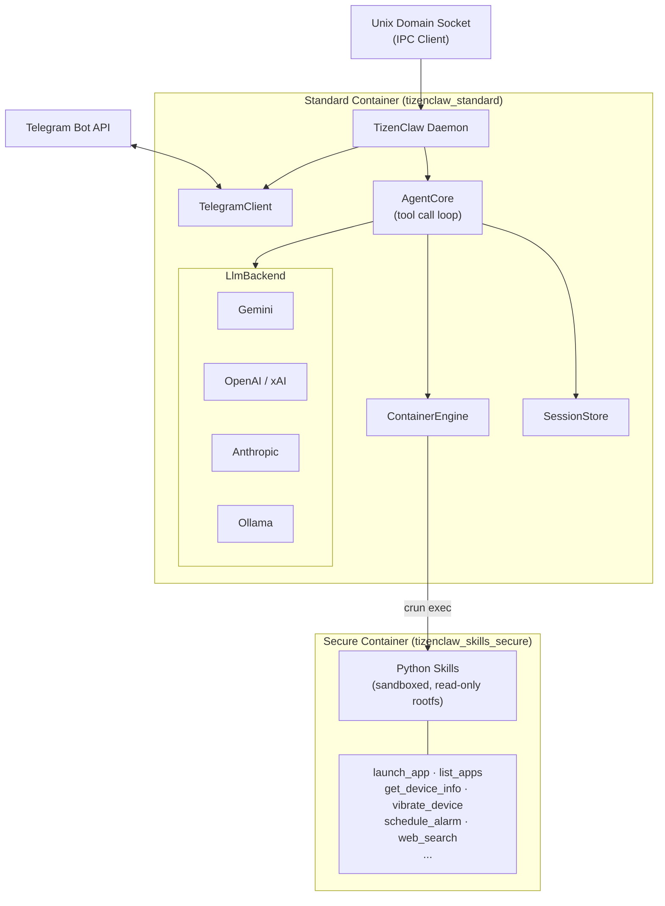

<p align="center">
  
</p>

<h1 align="center">TizenClaw</h1>

<p align="center">
  <strong>An AI-powered agent daemon for Tizen OS</strong><br>
  Control your Tizen device through natural language — powered by multi-provider LLMs and containerized skill execution.
</p>

---

## Overview

TizenClaw is a native C++ system daemon that brings LLM-based AI agent capabilities to [Tizen](https://www.tizen.org/) devices. It receives natural language commands via Telegram, interprets them through configurable LLM backends, and executes device-level actions using sandboxed Python skills running inside OCI containers.

### Key Features

- **Multi-LLM Backend** — Supports Gemini, OpenAI, Anthropic, xAI (Grok), and Ollama out of the box via a unified `LlmBackend` interface.
- **Function Calling / Tool Use** — The LLM can invoke device skills autonomously through provider-native tool-call APIs.
- **OCI Container Isolation** — Skills run inside a lightweight `crun` container with a minimal rootfs, limiting access to host resources.
- **Host Fallback** — When the container runtime is unavailable, skills execute directly on the host via `fork/exec`.
- **Telegram Integration** — A built-in Telegram bot client enables remote interaction from any Telegram chat.
- **IPC via Unix Domain Sockets** — Local clients (e.g., `telegram_listener`) communicate with the daemon over abstract Unix domain sockets.
- **Session Persistence** — Conversation history is stored on disk, allowing multi-turn interactions to survive daemon restarts.
- **Systemd Service** — Ships as an RPM package with systemd unit files for automatic startup.

---

## Architecture

TizenClaw uses a **dual-container architecture** powered by OCI-compliant runtimes (`crun` / `runc`):

- **Standard Container** — Runs the `tizenclaw` daemon itself in an isolated environment with access to host system libraries and D-Bus.
- **Secure Container** — A separate, more restricted container where Python skills execute with minimal privileges and read-only access.



---

## Skills

TizenClaw includes the following built-in skills, each implemented as a standalone Python script:

| Skill | Description |
|---|---|
| `launch_app` | Launch a Tizen application by app ID |
| `list_apps` | List installed applications |
| `get_device_info` | Query device information (model, OS version, etc.) |
| `get_battery_info` | Read battery level and charging status |
| `get_wifi_info` | Get Wi-Fi connection details |
| `get_bluetooth_info` | Query Bluetooth adapter state |
| `vibrate_device` | Trigger device vibration |
| `schedule_alarm` | Set a timed alarm/reminder |
| `web_search` | Search Wikipedia for information |
| `mcp_server` | MCP (Model Context Protocol) server bridge |

---

## Prerequisites

- **Tizen SDK / GBS** (Git Build System) for cross-compilation
- **Tizen 10.0** or later target device / emulator
- **crun** OCI runtime (bundled or built from source)
- Required Tizen packages: `tizen-core`, `glib-2.0`, `dlog`, `libcurl`

---

## Build

TizenClaw uses the Tizen GBS build system:

```bash
gbs build -A x86_64 --include-all
```

This produces an RPM package at:
```
~/GBS-ROOT/local/repos/tizen/x86_64/RPMS/tizenclaw-1.0.0-1.x86_64.rpm
```

Unit tests are automatically executed during the build via `%check`.

---

## Deploy

Deploy to a Tizen emulator or device over `sdb`:

```bash
# Enable root and remount filesystem
sdb root on
sdb shell mount -o remount,rw /

# Push and install RPM
sdb push ~/GBS-ROOT/local/repos/tizen/x86_64/RPMS/tizenclaw-1.0.0-1.x86_64.rpm /tmp/
sdb shell rpm -Uvh --force /tmp/tizenclaw-1.0.0-1.x86_64.rpm

# Restart the daemon
sdb shell systemctl daemon-reload
sdb shell systemctl restart tizenclaw
sdb shell systemctl status tizenclaw -l
```

---

## Configuration

TizenClaw reads its configuration from `/opt/usr/share/tizenclaw/` on the device.

### LLM Backend (`llm_config.json`)

```json
{
  "active_backend": "gemini",
  "backends": {
    "gemini": {
      "api_key": "YOUR_API_KEY",
      "model": "gemini-2.5-flash"
    },
    "openai": {
      "api_key": "YOUR_API_KEY",
      "model": "gpt-4o",
      "endpoint": "https://api.openai.com/v1"
    },
    "anthropic": {
      "api_key": "YOUR_API_KEY",
      "model": "claude-sonnet-4-20250514"
    },
    "ollama": {
      "model": "llama3",
      "endpoint": "http://localhost:11434"
    }
  }
}
```

### Telegram Bot (`telegram_config.json`)

```json
{
  "bot_token": "YOUR_TELEGRAM_BOT_TOKEN",
  "allowed_chat_ids": []
}
```

Sample configuration files are included in `data/`.

---

## Project Structure

```
tizenclaw/
├── src/
│   ├── common/            # Logging, shared utilities
│   └── tizenclaw/         # Daemon core
│       ├── tizenclaw.cc   # Main daemon, IPC server
│       ├── agent_core.cc  # LLM agent loop with tool calling
│       ├── container_engine.cc  # OCI container management
│       ├── gemini_backend.cc    # Google Gemini provider
│       ├── openai_backend.cc    # OpenAI / xAI provider
│       ├── anthropic_backend.cc # Anthropic provider
│       ├── ollama_backend.cc    # Ollama (local) provider
│       ├── http_client.cc       # libcurl HTTP wrapper
│       ├── session_store.cc     # Conversation persistence
│       └── telegram_client.cc   # Telegram Bot API client
├── skills/                # Python skill scripts
├── scripts/               # Container setup, CI, hooks
├── test/unit_tests/       # Google Test unit tests
├── data/                  # Config samples, rootfs
├── packaging/             # RPM spec, systemd services
└── CMakeLists.txt
```

---

## License

This project is currently under development. License information will be added soon.
