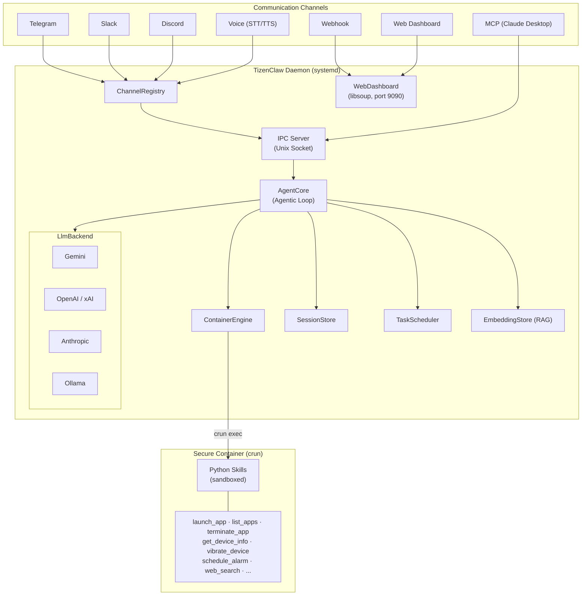

<p align="center">
  
</p>

<h1 align="center">TizenClaw</h1>

<p align="center">
  <strong>An AI-powered agent daemon for Tizen OS</strong><br>
  Control your Tizen device through natural language — powered by multi-provider LLMs, containerized skill execution, and a web-based admin dashboard.
</p>

---

## Overview

TizenClaw is a native C++ system daemon that brings LLM-based AI agent capabilities to [Tizen](https://www.tizen.org/) devices. It receives natural language commands via multiple communication channels, interprets them through configurable LLM backends, and executes device-level actions using sandboxed Python skills running inside OCI containers.

### Key Features

- **Multi-LLM Backend** — Supports Gemini, OpenAI, Anthropic, xAI (Grok), and Ollama via a unified `LlmBackend` interface with automatic model fallback.
- **7 Communication Channels** — Telegram, Slack, Discord, MCP (Claude Desktop), Webhook, Voice (TTS/STT), and Web Dashboard — all managed through a `Channel` abstraction.
- **Function Calling / Tool Use** — The LLM autonomously invokes device skills through an iterative Agentic Loop with streaming responses.
- **OCI Container Isolation** — Skills run inside a `crun` container with namespace isolation, limiting access to host resources.
- **Semantic Search (RAG)** — SQLite-backed embedding store with multi-provider embeddings (Gemini, OpenAI, Ollama) for knowledge retrieval.
- **Task Scheduler** — Cron/interval/one-shot/weekly scheduled tasks with LLM integration and retry logic.
- **Security** — Encrypted API keys, tool execution policies with risk levels, structured audit logging, HMAC-SHA256 webhook auth.
- **Web Admin Dashboard** — Dark glassmorphism SPA on port 9090 with session monitoring, chat interface, config editor, and admin authentication.
- **Multi-Agent** — Concurrent agent sessions with per-session system prompts and inter-session message passing.
- **Session Persistence** — Conversation history stored as Markdown with YAML frontmatter, surviving daemon restarts.

---

## Architecture

TizenClaw uses a **dual-container architecture** powered by OCI-compliant runtimes (`crun`):



---

## Skills

### Container Skills (Python)

| Skill | Description |
|---|---|
| `launch_app` | Launch a Tizen application by app ID |
| `terminate_app` | Terminate a running application |
| `list_apps` | List installed applications |
| `get_device_info` | Query device information (model, OS version, etc.) |
| `get_battery_info` | Read battery level and charging status |
| `get_wifi_info` | Get Wi-Fi connection details |
| `get_bluetooth_info` | Query Bluetooth adapter state |
| `vibrate_device` | Trigger device vibration |
| `schedule_alarm` | Set a timed alarm/reminder |
| `web_search` | Search Wikipedia for information |

### Built-in Tools (AgentCore)

| Tool | Description |
|---|---|
| `execute_code` | Execute Python code inside the container |
| `file_manager` | Read/write/delete files and list directories |
| `create_task` | Create a scheduled task (cron/interval/once/weekly) |
| `list_tasks` / `cancel_task` | Manage scheduled tasks |
| `create_session` | Create a new agent session with custom system prompt |
| `list_sessions` / `send_to_session` | Multi-agent coordination |
| `ingest_document` | Add documents to the knowledge base (RAG) |
| `search_knowledge` | Semantic search over ingested documents |

---

## Prerequisites

- **Tizen SDK / GBS** (Git Build System) for cross-compilation
- **Tizen 10.0** or later target device / emulator
- **crun** OCI runtime (built from source during RPM packaging)
- Required Tizen packages: `tizen-core`, `glib-2.0`, `dlog`, `libcurl`, `libsoup-3.0`, `libwebsockets`, `sqlite3`

---

## Build

TizenClaw uses the Tizen GBS build system:

```bash
gbs build -A x86_64 --include-all
```

For subsequent builds (after initial):
```bash
gbs build -A x86_64 --include-all --noinit
```

This produces an RPM package at:
```
~/GBS-ROOT/local/repos/tizen/x86_64/RPMS/tizenclaw-1.0.0-1.x86_64.rpm
```

Unit tests are automatically executed during the build via `%check`.

---

## Deploy

Deploy to a Tizen emulator or device over `sdb`:

```bash
# Enable root and remount filesystem
sdb root on
sdb shell mount -o remount,rw /

# Push and install RPM
sdb push ~/GBS-ROOT/local/repos/tizen/x86_64/RPMS/tizenclaw-1.0.0-1.x86_64.rpm /tmp/
sdb shell rpm -Uvh --force /tmp/tizenclaw-1.0.0-1.x86_64.rpm

# Restart the daemon
sdb shell systemctl daemon-reload
sdb shell systemctl restart tizenclaw
sdb shell systemctl status tizenclaw -l
```

---

## Configuration

TizenClaw reads its configuration from `/opt/usr/share/tizenclaw/` on the device. All configuration files can be edited via the **Web Admin Dashboard** (port 9090).

| Config File | Purpose |
|---|---|
| `llm_config.json` | LLM backend selection, API keys, model settings, fallback order |
| `telegram_config.json` | Telegram bot token and allowed chat IDs |
| `slack_config.json` | Slack app/bot tokens and channel lists |
| `discord_config.json` | Discord bot token and guild/channel allowlists |
| `webhook_config.json` | Webhook route mapping and HMAC secrets |
| `tool_policy.json` | Tool execution policy (max iterations, blocked skills, risk overrides) |
| `system_prompt.txt` | System prompt for agent behavior customization |

### Example: LLM Backend (`llm_config.json`)

```json
{
  "active_backend": "gemini",
  "fallback_backends": ["openai", "ollama"],
  "backends": {
    "gemini": {
      "api_key": "YOUR_API_KEY",
      "model": "gemini-2.5-flash"
    },
    "openai": {
      "api_key": "YOUR_API_KEY",
      "model": "gpt-4o",
      "endpoint": "https://api.openai.com/v1"
    },
    "anthropic": {
      "api_key": "YOUR_API_KEY",
      "model": "claude-sonnet-4-20250514"
    },
    "ollama": {
      "model": "llama3",
      "endpoint": "http://localhost:11434"
    }
  }
}
```

Sample configuration files are included in `data/`.

---

## Project Structure

```
tizenclaw/
├── src/
│   ├── common/                    # Logging, shared utilities
│   └── tizenclaw/                 # Daemon core (49 files)
│       ├── tizenclaw.cc           # Main daemon, IPC server, signal handling
│       ├── agent_core.cc          # Agentic Loop, streaming, multi-session
│       ├── container_engine.cc    # OCI container management (crun)
│       ├── gemini_backend.cc      # Google Gemini provider
│       ├── openai_backend.cc      # OpenAI / xAI provider
│       ├── anthropic_backend.cc   # Anthropic provider
│       ├── ollama_backend.cc      # Ollama (local) provider
│       ├── http_client.cc         # libcurl HTTP wrapper
│       ├── session_store.cc       # Markdown conversation persistence
│       ├── telegram_client.cc     # Telegram Bot API client
│       ├── slack_channel.cc       # Slack Bot (libwebsockets)
│       ├── discord_channel.cc     # Discord Bot (libwebsockets)
│       ├── mcp_server.cc          # Native MCP Server (JSON-RPC 2.0)
│       ├── webhook_channel.cc     # Webhook HTTP listener
│       ├── voice_channel.cc       # Tizen STT/TTS integration
│       ├── web_dashboard.cc       # Admin dashboard SPA
│       ├── task_scheduler.cc      # Cron/interval task automation
│       ├── embedding_store.cc     # SQLite RAG vector store
│       ├── tool_policy.cc         # Risk-level tool execution policy
│       ├── key_store.cc           # Encrypted API key storage
│       ├── audit_logger.cc        # Markdown audit logging
│       ├── skill_watcher.cc       # inotify skill hot-reload
│       └── channel_registry.cc    # Channel lifecycle management
├── skills/                        # Python skill scripts
├── scripts/                       # Container setup, CI, hooks
├── test/unit_tests/               # Google Test unit tests
├── data/                          # Config samples, rootfs, web SPA
├── packaging/                     # RPM spec, systemd services
├── docs/                          # Design, Analysis, Roadmap
└── CMakeLists.txt
```

---

## Documentation

- [System Design](docs/DESIGN.md) / [설계 문서](docs/DESIGN_KOR.md)
- [Project Analysis](docs/ANALYSIS.md) / [프로젝트 분석](docs/ANALYSIS_KOR.md)
- [Development Roadmap](docs/ROADMAP.md) / [개발 로드맵](docs/ROADMAP_KOR.md)

---

## License

This project is currently under development. License information will be added soon.
