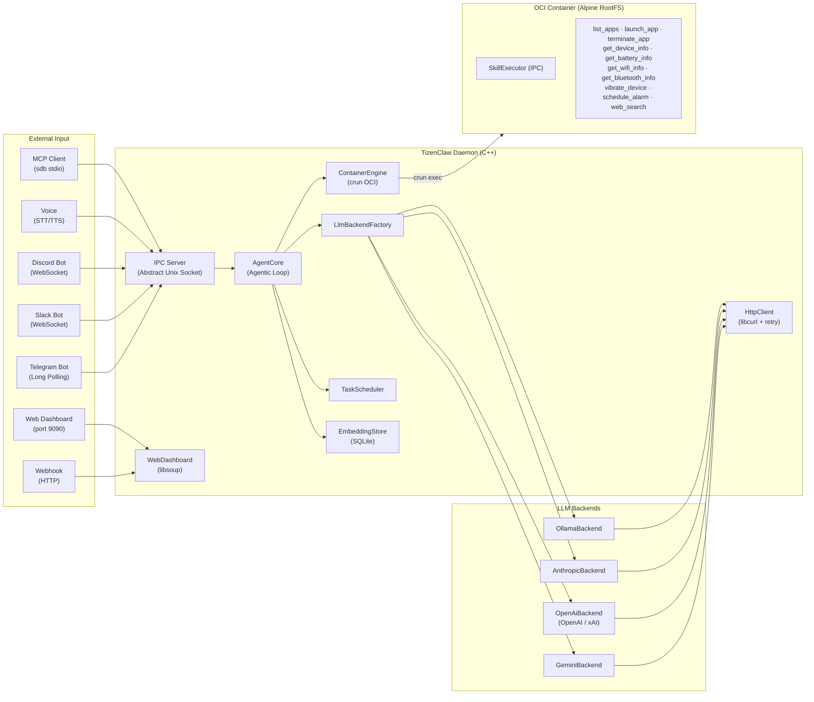

# TizenClaw Project Analysis

> **Last Updated**: 2026-03-07

---

## 1. Project Overview

**TizenClaw** is a **Native C++ AI Agent system daemon** running on the Tizen Embedded Linux platform.

It interprets natural language prompts through multiple LLM backends (Gemini, OpenAI, Claude, xAI, Ollama), executes Python skills inside OCI containers (crun), and controls the device. It autonomously performs complex tasks through a Function Calling-based iterative loop (Agentic Loop). The system supports 7 communication channels, encrypted credential storage, structured audit logging, scheduled task automation, semantic search (RAG), a web-based admin dashboard, and multi-agent coordination.



---

## 2. Project Structure

```
tizenclaw/
├── src/                             # Source and headers
│   ├── tizenclaw/                   # Daemon core (49 files)
│   │   ├── tizenclaw.cc/hh          # Daemon main, IPC server, signal handling
│   │   ├── agent_core.cc/hh         # Agentic Loop, skill dispatch, session mgmt
│   │   ├── container_engine.cc/hh   # OCI container lifecycle management (crun)
│   │   ├── http_client.cc/hh        # libcurl HTTP Post (retry, timeout, SSL)
│   │   ├── llm_backend.hh           # LlmBackend abstract interface
│   │   ├── llm_backend_factory.cc   # Backend factory pattern
│   │   ├── gemini_backend.cc/hh     # Google Gemini API
│   │   ├── openai_backend.cc/hh     # OpenAI / xAI (Grok) API
│   │   ├── anthropic_backend.cc/hh  # Anthropic Claude API
│   │   ├── ollama_backend.cc/hh     # Ollama local LLM
│   │   ├── telegram_client.cc/hh    # Telegram Bot client (native)
│   │   ├── slack_channel.cc/hh      # Slack Bot (libwebsockets)
│   │   ├── discord_channel.cc/hh    # Discord Bot (libwebsockets)
│   │   ├── mcp_server.cc/hh         # Native MCP Server (JSON-RPC 2.0)
│   │   ├── webhook_channel.cc/hh    # Webhook HTTP listener (libsoup)
│   │   ├── voice_channel.cc/hh      # Tizen STT/TTS (conditional)
│   │   ├── web_dashboard.cc/hh      # Admin dashboard SPA (libsoup)
│   │   ├── channel.hh               # Channel abstract interface
│   │   ├── channel_registry.cc/hh   # Channel lifecycle management
│   │   ├── session_store.cc/hh      # Markdown conversation persistence
│   │   ├── task_scheduler.cc/hh     # Cron/interval task automation
│   │   ├── tool_policy.cc/hh        # Risk-level + loop detection
│   │   ├── key_store.cc/hh          # Encrypted API key storage
│   │   ├── audit_logger.cc/hh       # Markdown audit logging
│   │   ├── skill_watcher.cc/hh      # inotify skill hot-reload
│   │   └── embedding_store.cc/hh    # SQLite RAG vector store
│   └── common/                      # Common utilities (logging, etc.)
├── skills/                          # Python skills (11 directories)
│   ├── common/tizen_capi_utils.py   # ctypes-based Tizen C-API wrapper
│   ├── skill_executor.py            # Container-side IPC skill executor
│   ├── list_apps/                   # List installed apps
│   ├── launch_app/                  # Launch an app
│   ├── terminate_app/               # Terminate an app
│   ├── get_device_info/             # Device info query
│   ├── get_battery_info/            # Battery status query
│   ├── get_wifi_info/               # Wi-Fi status query
│   ├── get_bluetooth_info/          # Bluetooth status query
│   ├── vibrate_device/              # Haptic vibration
│   ├── schedule_alarm/              # Alarm scheduling
│   └── web_search/                  # Web search (Wikipedia API)
├── scripts/                         # Container & infra scripts (9)
│   ├── run_standard_container.sh    # Daemon OCI container
│   ├── skills_secure_container.sh   # Skill execution secure container
│   ├── build_rootfs.sh              # Alpine RootFS builder
│   ├── start_mcp_tunnel.sh          # MCP tunnel via SDB
│   ├── fetch_crun_source.sh         # crun source downloader
│   ├── ci_build.sh                  # CI build script
│   ├── pre-commit                   # Git pre-commit hook
│   ├── setup-hooks.sh               # Hook installer
│   └── Dockerfile                   # RootFS build reference
├── data/
│   ├── llm_config.json.sample       # LLM config sample
│   ├── telegram_config.json.sample  # Telegram Bot config sample
│   ├── slack_config.json.sample     # Slack config sample
│   ├── discord_config.json.sample   # Discord config sample
│   ├── webhook_config.json.sample   # Webhook config sample
│   ├── tool_policy.json             # Tool execution policy
│   ├── system_prompt.txt            # Default system prompt
│   ├── web/                         # Dashboard SPA files
│   └── rootfs.tar.gz                # Alpine RootFS (49 MB)
├── test/unit_tests/                 # gtest/gmock unit tests
├── packaging/                       # RPM packaging & systemd
│   ├── tizenclaw.spec               # GBS RPM build spec
│   ├── tizenclaw.service            # Daemon systemd service
│   ├── tizenclaw-skills-secure.service  # Skills container service
│   └── tizenclaw.manifest           # Tizen SMACK manifest
├── docs/                            # Documentation
├── CMakeLists.txt                   # Build system (C++17)
└── third_party/                     # crun 1.26 source
```

---

## 3. Core Module Details

### 3.1 System Core

| Module | Files | Role | Status |
|--------|-------|------|--------|
| **Daemon** | `tizenclaw.cc/hh` | systemd service, IPC server (thread pool), channel lifecycle, signal handling | ✅ |
| **AgentCore** | `agent_core.cc/hh` | Agentic Loop, streaming, context compaction, multi-session, model fallback | ✅ |
| **ContainerEngine** | `container_engine.cc/hh` | crun OCI container, Skill Executor IPC, host bind-mounts, chroot fallback | ✅ |
| **HttpClient** | `http_client.cc/hh` | libcurl POST, exponential backoff, SSL CA auto-discovery | ✅ |
| **SessionStore** | `session_store.cc/hh` | Markdown persistence (YAML frontmatter), daily logs, token usage tracking | ✅ |
| **TaskScheduler** | `task_scheduler.cc/hh` | Cron/interval/once/weekly tasks, LLM-integrated execution, retry with backoff | ✅ |
| **EmbeddingStore** | `embedding_store.cc/hh` | SQLite vector store, cosine similarity, multi-provider embeddings | ✅ |
| **WebDashboard** | `web_dashboard.cc/hh` | libsoup SPA, REST API, admin auth, config editor | ✅ |

### 3.2 LLM Backend Layer

| Backend | Source File | API Endpoint | Default Model | Status |
|---------|-------------|-------------|---------------|--------|
| **Gemini** | `gemini_backend.cc` | `generativelanguage.googleapis.com` | `gemini-2.5-flash` | ✅ |
| **OpenAI** | `openai_backend.cc` | `api.openai.com/v1` | `gpt-4o` | ✅ |
| **xAI (Grok)** | `openai_backend.cc` (shared) | `api.x.ai/v1` | `grok-3` | ✅ |
| **Anthropic** | `anthropic_backend.cc` | `api.anthropic.com/v1` | `claude-sonnet-4-20250514` | ✅ |
| **Ollama** | `ollama_backend.cc` | `localhost:11434` | `llama3` | ✅ |

- **Abstraction**: `LlmBackend` interface → `LlmBackendFactory::Create()` factory
- **Shared structs**: `LlmMessage`, `LlmResponse`, `LlmToolCall`, `LlmToolDecl`
- **Runtime switching**: `active_backend` field in `llm_config.json`
- **Model fallback**: `fallback_backends` array for sequential retry with rate-limit backoff
- **System prompt**: 4-level fallback with `{{AVAILABLE_TOOLS}}` dynamic placeholder

### 3.3 Communication & IPC

| Module | Implementation | Protocol | Status |
|--------|---------------|----------|--------|
| **IPC Server** | `tizenclaw.cc` | Abstract Unix Socket, length-prefix framing, thread pool | ✅ |
| **UID Auth** | `IsAllowedUid()` | `SO_PEERCRED` (root, app_fw, system, developer) | ✅ |
| **Telegram** | `telegram_client.cc` | Bot API Long-Polling, streaming `editMessageText` | ✅ |
| **Slack** | `slack_channel.cc` | Socket Mode via libwebsockets | ✅ |
| **Discord** | `discord_channel.cc` | Gateway WebSocket via libwebsockets | ✅ |
| **MCP Server** | `mcp_server.cc` | Native C++ stdio JSON-RPC 2.0 | ✅ |
| **Webhook** | `webhook_channel.cc` | HTTP inbound (libsoup), HMAC-SHA256 auth | ✅ |
| **Voice** | `voice_channel.cc` | Tizen STT/TTS C-API (conditional compilation) | ✅ |
| **Web Dashboard** | `web_dashboard.cc` | libsoup SPA, REST API, admin auth | ✅ |

### 3.4 Skills System

| Skill | Parameters | Tizen C-API | Status |
|-------|-----------|-------------|--------|
| `list_apps` | None | `app_manager` | ✅ |
| `launch_app` | `app_id` (string, required) | `app_control` | ✅ |
| `terminate_app` | `app_id` (string, required) | `app_manager` | ✅ |
| `get_device_info` | None | `system_info` | ✅ |
| `get_battery_info` | None | `device` (battery) | ✅ |
| `get_wifi_info` | None | `wifi-manager` | ✅ |
| `get_bluetooth_info` | None | `bluetooth` | ✅ |
| `vibrate_device` | `duration_ms` (int, optional) | `feedback` / `haptic` | ✅ |
| `schedule_alarm` | `delay_sec` (int), `prompt_text` (string) | `alarm` | ✅ |
| `web_search` | `query` (string, required) | None (Wikipedia API) | ✅ |

Built-in tools (implemented in AgentCore directly):
`execute_code`, `file_manager`, `create_task`, `list_tasks`, `cancel_task`, `create_session`, `list_sessions`, `send_to_session`, `ingest_document`, `search_knowledge`

### 3.5 Security

| Component | File | Role |
|-----------|------|------|
| **KeyStore** | `key_store.cc` | Device-bound API key encryption (GLib SHA-256 + XOR) |
| **ToolPolicy** | `tool_policy.cc` | Per-skill risk_level, loop detection, idle progress check |
| **AuditLogger** | `audit_logger.cc` | Markdown table daily audit files, size-based rotation |
| **UID Auth** | `tizenclaw.cc` | SO_PEERCRED IPC sender validation |
| **Admin Auth** | `web_dashboard.cc` | Session-token + SHA-256 password hashing |
| **Webhook Auth** | `webhook_channel.cc` | HMAC-SHA256 signature validation |

### 3.6 Build & Packaging

| Item | Details |
|------|---------|
| **Build System** | CMake 3.0+, C++17, `pkg-config` (tizen-core, glib-2.0, dlog, libcurl, libsoup-3.0, libwebsockets, sqlite3) |
| **Packaging** | GBS RPM (`tizenclaw.spec`), includes crun source build |
| **systemd** | `tizenclaw.service` (Type=simple), `tizenclaw-skills-secure.service` (Type=oneshot) |
| **Testing** | gtest/gmock, `ctest -V` run during `%check` |

---

## 4. Completed Development Phases

| Phase | Title | Key Deliverables | Status |
|:-----:|-------|-----------------|:------:|
| 1 | Foundation Architecture | C++ daemon, 5 LLM backends, HttpClient, factory pattern | ✅ |
| 2 | Container Execution | ContainerEngine (crun OCI), dual container, unshare+chroot fallback | ✅ |
| 3 | Agentic Loop | Max 5-iteration loop, parallel tool exec, session memory | ✅ |
| 4 | Skills System | 10 skills, tizen_capi_utils.py, CLAW_ARGS convention | ✅ |
| 5 | Communication | Unix Socket IPC, SO_PEERCRED auth, Telegram, MCP | ✅ |
| 6 | IPC Stabilization | Length-prefix protocol, JSON session persistence, Telegram allowlist | ✅ |
| 7 | Secure Container | OCI skill sandbox, Skill Executor IPC, Native MCP, built-in tools | ✅ |
| 8 | Streaming & Concurrency | LLM streaming, thread pool (4 clients), tool_call_id mapping | ✅ |
| 9 | Context & Memory | Context compaction, Markdown persistence, token counting | ✅ |
| 10 | Security Hardening | Tool execution policy, encrypted keys, audit logging | ✅ |
| 11 | Task Scheduler | Cron/interval/once/weekly, LLM integration, retry backoff | ✅ |
| 12 | Extensibility Layer | Channel abstraction, system prompt externalization, usage tracking | ✅ |
| 13 | Skill Ecosystem | inotify hot-reload, model fallback, loop detection enhancement | ✅ |
| 14 | New Channels | Slack, Discord, Webhook, Agent-to-Agent messaging | ✅ |
| 15 | Advanced Features | RAG (SQLite embeddings), Web Dashboard, Voice (TTS/STT) | ✅ |
| 16 | Operational Excellence | Admin authentication, config editor, branding | ✅ |

---

## 5. Competitive Analysis: Gap Analysis vs OpenClaw & NanoClaw

> **Analysis Date**: 2026-03-07 (Post Phase 16)
> **Targets**: OpenClaw, NanoClaw

### 5.1 Project Scale Comparison

| Item | **TizenClaw** | **OpenClaw** | **NanoClaw** |
|------|:---:|:---:|:---:|
| Language | C++ / Python | TypeScript | TypeScript |
| Source files | ~75 | ~700+ | ~50 |
| Skills | 10 + 10 built-in | 52 | 5+ (skills-engine) |
| LLM Backends | 5 | 15+ | Claude SDK |
| Channels | 7 | 22+ | 5 |
| Test coverage | 15+ cases | Hundreds | Dozens |
| Plugin system | Channel interface | ✅ (npm-based) | ❌ |

### 5.2 Remaining Gaps

Most gaps identified in the original analysis have been resolved through Phases 6-16. Remaining gaps:

| Area | OpenClaw | TizenClaw Status | Priority |
|------|---------|-----------------|:--------:|
| **RAG scalability** | sqlite-vec + ANN index | Brute-force cosine similarity | 🟡 Medium |
| **Browser control** | CDP Chrome automation | ❌ Not implemented | 🟡 Medium |
| **Channel count** | 22+ channels | 7 channels | 🟢 Low |
| **Skill marketplace** | ClawHub remote install | Manual copy/inotify | 🟢 Low |
| **Multi-agent patterns** | sessions_send | Session-based + Agent-to-Agent (basic) | 🟡 Medium |

---

## 6. TizenClaw Unique Strengths

| Strength | Description |
|----------|-------------|
| **Native C++ Performance** | Lower memory/CPU vs TypeScript — optimal for embedded |
| **OCI Container Isolation** | crun-based `seccomp` + `namespace` — finer syscall control |
| **Direct Tizen C-API** | ctypes wrappers for device hardware (battery, Wi-Fi, BT, haptic, etc.) |
| **Multi-LLM Support** | 5 backends switchable at runtime with automatic fallback |
| **Lightweight Deployment** | systemd + RPM — standalone device execution without Node.js/Docker |
| **Native MCP Server** | C++ MCP server integrated into daemon — Claude Desktop controls Tizen devices |
| **RAG Integration** | SQLite-backed semantic search with multi-provider embeddings |
| **Web Admin Dashboard** | In-daemon glassmorphism SPA with config editing and admin auth |
| **Voice Control** | Native Tizen STT/TTS integration (conditional compilation) |

---

## 7. Technical Debt & Improvement Areas

| Item | Current State | Improvement Direction |
|------|-------------|----------------------|
| RAG index | Brute-force cosine search | ANN index (HNSW) for large doc sets |
| Token budgeting | Post-response counting | Pre-request estimation to prevent overflow |
| Concurrent tasks | Sequential execution | Parallel with dependency graph |
| Skill output parsing | Raw stdout JSON | JSON schema validation |
| Error recovery | In-flight request loss on crash | Request journaling |
| Log aggregation | Local Markdown files | Remote syslog forwarding |
| Skill pipeline | LLM-reactive only | Deterministic sequential execution |
| Multi-agent | Session-based messaging | Supervisor/Router patterns |

---

## 8. Code Statistics

| Category | Files | LOC |
|----------|-------|-----|
| C++ Source (`src/tizenclaw/*.cc`) | 27 | ~11,500 |
| C++ Headers (`src/tizenclaw/*.hh`) | 22 | ~2,250 |
| C++ Common (`src/common/`) | 5 | ~40 |
| Python Skills & Utils | 12 | ~1,300 |
| Shell Scripts | 7 | ~800 |
| Web Frontend (HTML/CSS/JS) | 3 | ~1,500 |
| **Total** | ~76 | ~17,400 |
