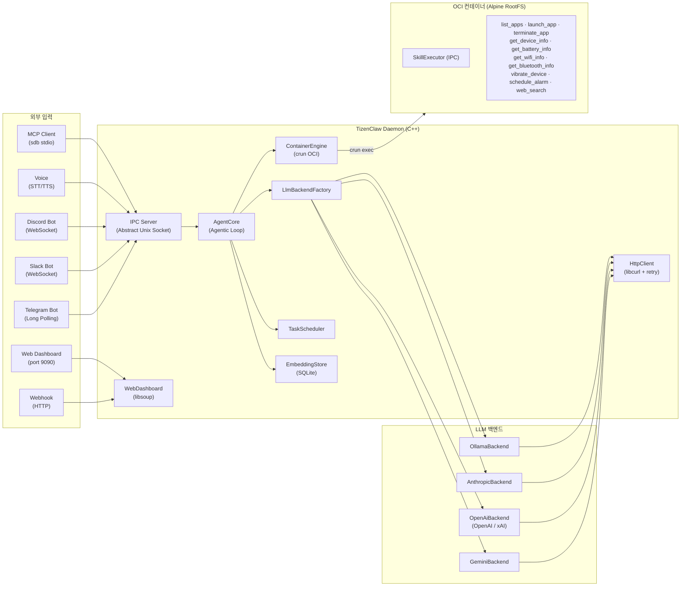

# TizenClaw 프로젝트 분석

> **최종 업데이트**: 2026-03-07

---

## 1. 프로젝트 개요

**TizenClaw**는 Tizen Embedded Linux 환경에서 동작하는 **Native C++ AI Agent 시스템 데몬**입니다.

사용자의 자연어 프롬프트를 다중 LLM 백엔드(Gemini, OpenAI, Claude, xAI, Ollama)를 통해 해석하고, OCI 컨테이너(crun) 안에서 Python 스킬을 실행하여 디바이스를 제어합니다. Function Calling 기반의 반복 루프(Agentic Loop)를 통해 복합 작업을 자율적으로 수행합니다. 7개 통신 채널, 암호화된 자격증명 저장, 구조화된 감사 로깅, 예약 작업 자동화, 시맨틱 검색(RAG), 웹 기반 관리 대시보드, 멀티 에이전트 협조를 지원합니다.



---

## 2. 프로젝트 구조

```
tizenclaw/
├── src/                             # 소스 및 헤더
│   ├── tizenclaw/                   # 데몬 코어 (49개 파일)
│   │   ├── tizenclaw.cc/hh          # 데몬 메인, IPC 서버, 시그널 핸들링
│   │   ├── agent_core.cc/hh         # Agentic Loop, 스킬 디스패치, 세션 관리
│   │   ├── container_engine.cc/hh   # OCI 컨테이너 생명주기 관리 (crun)
│   │   ├── http_client.cc/hh        # libcurl HTTP Post (재시도, 타임아웃, SSL)
│   │   ├── llm_backend.hh           # LlmBackend 추상 인터페이스
│   │   ├── llm_backend_factory.cc   # 백엔드 팩토리 패턴
│   │   ├── gemini_backend.cc/hh     # Google Gemini API
│   │   ├── openai_backend.cc/hh     # OpenAI / xAI (Grok) API
│   │   ├── anthropic_backend.cc/hh  # Anthropic Claude API
│   │   ├── ollama_backend.cc/hh     # Ollama 로컬 LLM
│   │   ├── telegram_client.cc/hh    # Telegram Bot 클라이언트 (네이티브)
│   │   ├── slack_channel.cc/hh      # Slack Bot (libwebsockets)
│   │   ├── discord_channel.cc/hh    # Discord Bot (libwebsockets)
│   │   ├── mcp_server.cc/hh         # 네이티브 MCP 서버 (JSON-RPC 2.0)
│   │   ├── webhook_channel.cc/hh    # 웹훅 HTTP 리스너 (libsoup)
│   │   ├── voice_channel.cc/hh      # Tizen STT/TTS (조건부 컴파일)
│   │   ├── web_dashboard.cc/hh      # 관리 대시보드 SPA (libsoup)
│   │   ├── channel.hh               # Channel 추상 인터페이스
│   │   ├── channel_registry.cc/hh   # 채널 생명주기 관리
│   │   ├── session_store.cc/hh      # Markdown 대화 영구 저장
│   │   ├── task_scheduler.cc/hh     # Cron/interval 태스크 자동화
│   │   ├── tool_policy.cc/hh        # 위험등급 + 루프 감지
│   │   ├── key_store.cc/hh          # API 키 암호화 저장
│   │   ├── audit_logger.cc/hh       # Markdown 감사 로깅
│   │   ├── skill_watcher.cc/hh      # inotify 스킬 핫리로드
│   │   └── embedding_store.cc/hh    # SQLite RAG 벡터 스토어
│   └── common/                      # 공통 유틸리티 (로깅 등)
├── skills/                          # Python 스킬 (11개 디렉터리)
│   ├── common/tizen_capi_utils.py   # ctypes 기반 Tizen C-API 래퍼
│   ├── skill_executor.py            # 컨테이너 측 IPC 스킬 실행기
│   ├── list_apps/                   # 설치된 앱 목록 조회
│   ├── launch_app/                  # 앱 실행
│   ├── terminate_app/               # 앱 종료
│   ├── get_device_info/             # 디바이스 정보 조회
│   ├── get_battery_info/            # 배터리 상태 조회
│   ├── get_wifi_info/               # Wi-Fi 상태 조회
│   ├── get_bluetooth_info/          # 블루투스 상태 조회
│   ├── vibrate_device/              # 햅틱 진동
│   ├── schedule_alarm/              # 알람 스케줄링
│   └── web_search/                  # 웹 검색 (Wikipedia API)
├── scripts/                         # 컨테이너 & 인프라 스크립트 (9개)
│   ├── run_standard_container.sh    # 데몬용 OCI 컨테이너
│   ├── skills_secure_container.sh   # 스킬 실행 보안 컨테이너
│   ├── build_rootfs.sh              # Alpine RootFS 빌드
│   ├── start_mcp_tunnel.sh          # SDB를 통한 MCP 터널
│   ├── fetch_crun_source.sh         # crun 소스 다운로드
│   ├── ci_build.sh                  # CI 빌드 스크립트
│   ├── pre-commit                   # Git pre-commit 훅
│   ├── setup-hooks.sh               # 훅 설치기
│   └── Dockerfile                   # RootFS 빌드 참고용
├── data/
│   ├── llm_config.json.sample       # LLM 설정 샘플
│   ├── telegram_config.json.sample  # Telegram Bot 설정 샘플
│   ├── slack_config.json.sample     # Slack 설정 샘플
│   ├── discord_config.json.sample   # Discord 설정 샘플
│   ├── webhook_config.json.sample   # Webhook 설정 샘플
│   ├── tool_policy.json             # 도구 실행 정책
│   ├── system_prompt.txt            # 기본 시스템 프롬프트
│   ├── web/                         # 대시보드 SPA 파일
│   └── rootfs.tar.gz                # Alpine RootFS (49 MB)
├── test/unit_tests/                 # gtest/gmock 단위 테스트
├── packaging/                       # RPM 패키징 & systemd
│   ├── tizenclaw.spec               # GBS RPM 빌드 스펙
│   ├── tizenclaw.service            # 데몬 systemd 서비스
│   ├── tizenclaw-skills-secure.service  # 스킬 컨테이너 서비스
│   └── tizenclaw.manifest           # Tizen SMACK 매니페스트
├── docs/                            # 문서
├── CMakeLists.txt                   # 빌드 시스템 (C++17)
└── third_party/                     # crun 1.26 소스
```

---

## 3. 핵심 모듈 상세

### 3.1 시스템 코어

| 모듈 | 파일 | 역할 | 상태 |
|------|------|------|------|
| **Daemon** | `tizenclaw.cc/hh` | systemd 서비스, IPC 서버 (스레드 풀), 채널 생명주기, 시그널 핸들링 | ✅ |
| **AgentCore** | `agent_core.cc/hh` | Agentic Loop, 스트리밍, 컨텍스트 압축, 멀티 세션, 모델 폴백 | ✅ |
| **ContainerEngine** | `container_engine.cc/hh` | crun OCI 컨테이너, Skill Executor IPC, 호스트 바인드 마운트, chroot 폴백 | ✅ |
| **HttpClient** | `http_client.cc/hh` | libcurl POST, 지수 백오프, SSL CA 자동 탐색 | ✅ |
| **SessionStore** | `session_store.cc/hh` | Markdown 영구 저장 (YAML frontmatter), 일별 로그, 토큰 사용량 추적 | ✅ |
| **TaskScheduler** | `task_scheduler.cc/hh` | Cron/interval/once/weekly 태스크, LLM 연동 실행, 백오프 재시도 | ✅ |
| **EmbeddingStore** | `embedding_store.cc/hh` | SQLite 벡터 스토어, 코사인 유사도, 다중 프로바이더 임베딩 | ✅ |
| **WebDashboard** | `web_dashboard.cc/hh` | libsoup SPA, REST API, 관리자 인증, 설정 편집기 | ✅ |

### 3.2 LLM 백엔드 계층

| 백엔드 | 소스 파일 | API 엔드포인트 | 기본 모델 | 상태 |
|--------|-----------|---------------|-----------|------|
| **Gemini** | `gemini_backend.cc` | `generativelanguage.googleapis.com` | `gemini-2.5-flash` | ✅ |
| **OpenAI** | `openai_backend.cc` | `api.openai.com/v1` | `gpt-4o` | ✅ |
| **xAI (Grok)** | `openai_backend.cc` (공용) | `api.x.ai/v1` | `grok-3` | ✅ |
| **Anthropic** | `anthropic_backend.cc` | `api.anthropic.com/v1` | `claude-sonnet-4-20250514` | ✅ |
| **Ollama** | `ollama_backend.cc` | `localhost:11434` | `llama3` | ✅ |

- **추상화**: `LlmBackend` 인터페이스 → `LlmBackendFactory::Create()` 팩토리
- **공통 구조체**: `LlmMessage`, `LlmResponse`, `LlmToolCall`, `LlmToolDecl`
- **런타임 전환**: `llm_config.json`의 `active_backend` 필드
- **모델 폴백**: `fallback_backends` 배열로 순차 재시도 + rate-limit 백오프
- **시스템 프롬프트**: 4단계 fallback + `{{AVAILABLE_TOOLS}}` 동적 placeholder

### 3.3 통신 & IPC

| 모듈 | 구현 | 프로토콜 | 상태 |
|------|------|---------|------|
| **IPC 서버** | `tizenclaw.cc` | Abstract Unix Socket, 길이-프리픽스, 스레드 풀 | ✅ |
| **UID 인증** | `IsAllowedUid()` | `SO_PEERCRED` (root, app_fw, system, developer) | ✅ |
| **Telegram** | `telegram_client.cc` | Bot API Long-Polling, 스트리밍 `editMessageText` | ✅ |
| **Slack** | `slack_channel.cc` | Socket Mode (libwebsockets) | ✅ |
| **Discord** | `discord_channel.cc` | Gateway WebSocket (libwebsockets) | ✅ |
| **MCP 서버** | `mcp_server.cc` | 네이티브 C++ stdio JSON-RPC 2.0 | ✅ |
| **Webhook** | `webhook_channel.cc` | HTTP 인바운드 (libsoup), HMAC-SHA256 인증 | ✅ |
| **Voice** | `voice_channel.cc` | Tizen STT/TTS C-API (조건부 컴파일) | ✅ |
| **Web Dashboard** | `web_dashboard.cc` | libsoup SPA, REST API, 관리자 인증 | ✅ |

### 3.4 Skills 시스템

| 스킬 | 파라미터 | Tizen C-API | 상태 |
|------|---------|-------------|------|
| `list_apps` | 없음 | `app_manager` | ✅ |
| `launch_app` | `app_id` (string, required) | `app_control` | ✅ |
| `terminate_app` | `app_id` (string, required) | `app_manager` | ✅ |
| `get_device_info` | 없음 | `system_info` | ✅ |
| `get_battery_info` | 없음 | `device` (battery) | ✅ |
| `get_wifi_info` | 없음 | `wifi-manager` | ✅ |
| `get_bluetooth_info` | 없음 | `bluetooth` | ✅ |
| `vibrate_device` | `duration_ms` (int, optional) | `feedback` / `haptic` | ✅ |
| `schedule_alarm` | `delay_sec` (int), `prompt_text` (string) | `alarm` | ✅ |
| `web_search` | `query` (string, required) | 없음 (Wikipedia API) | ✅ |

AgentCore에 직접 구현된 내장 도구:
`execute_code`, `file_manager`, `create_task`, `list_tasks`, `cancel_task`, `create_session`, `list_sessions`, `send_to_session`, `ingest_document`, `search_knowledge`

### 3.5 보안

| 컴포넌트 | 파일 | 역할 |
|---------|------|------|
| **KeyStore** | `key_store.cc` | 디바이스 바인딩 API 키 암호화 (GLib SHA-256 + XOR) |
| **ToolPolicy** | `tool_policy.cc` | 스킬별 risk_level, 루프 감지, idle 진행 체크 |
| **AuditLogger** | `audit_logger.cc` | Markdown 테이블 일별 감사 파일, 크기 기반 로테이션 |
| **UID 인증** | `tizenclaw.cc` | SO_PEERCRED IPC 발신자 검증 |
| **Admin 인증** | `web_dashboard.cc` | 세션 토큰 + SHA-256 비밀번호 해싱 |
| **Webhook 인증** | `webhook_channel.cc` | HMAC-SHA256 서명 검증 |

### 3.6 빌드 & 패키징

| 항목 | 세부 내용 |
|------|----------|
| **빌드 시스템** | CMake 3.0+, C++17, `pkg-config` (tizen-core, glib-2.0, dlog, libcurl, libsoup-3.0, libwebsockets, sqlite3) |
| **패키징** | GBS RPM (`tizenclaw.spec`), crun 소스 빌드 포함 |
| **systemd** | `tizenclaw.service` (Type=simple), `tizenclaw-skills-secure.service` (Type=oneshot) |
| **테스트** | gtest/gmock, `%check`에서 `ctest -V` 실행 |

---

## 4. 완료된 개발 Phase

| Phase | 제목 | 주요 결과물 | 상태 |
|:-----:|------|-----------|:----:|
| 1 | 기반 아키텍처 | C++ 데몬, 5개 LLM 백엔드, HttpClient, 팩토리 패턴 | ✅ |
| 2 | 컨테이너 실행 환경 | ContainerEngine (crun OCI), 이중 컨테이너, unshare+chroot 폴백 | ✅ |
| 3 | Agentic Loop | 최대 5회 반복, 병렬 도구 실행, 세션 메모리 | ✅ |
| 4 | Skills 시스템 | 10개 스킬, tizen_capi_utils.py, CLAW_ARGS 규약 | ✅ |
| 5 | 통신 | Unix Socket IPC, SO_PEERCRED 인증, Telegram, MCP | ✅ |
| 6 | IPC 안정화 | 길이-프리픽스 프로토콜, JSON 세션 영구 저장, Telegram 허용목록 | ✅ |
| 7 | 보안 컨테이너 | OCI 스킬 샌드박스, Skill Executor IPC, 네이티브 MCP, 내장 도구 | ✅ |
| 8 | 스트리밍 & 동시성 | LLM 스트리밍, 스레드 풀 (4 클라이언트), tool_call_id 매핑 | ✅ |
| 9 | 컨텍스트 & 메모리 | 컨텍스트 압축, Markdown 영구 저장, 토큰 카운팅 | ✅ |
| 10 | 보안 강화 | 도구 실행 정책, 키 암호화, 감사 로깅 | ✅ |
| 11 | 태스크 스케줄러 | Cron/interval/once/weekly, LLM 연동, 재시도 백오프 | ✅ |
| 12 | 확장성 레이어 | 채널 추상화, 시스템 프롬프트 외부화, 사용량 추적 | ✅ |
| 13 | 스킬 생태계 | inotify 핫리로드, 모델 폴백, 루프 감지 강화 | ✅ |
| 14 | 신규 채널 | Slack, Discord, Webhook, 에이전트 간 메시징 | ✅ |
| 15 | 고급 기능 | RAG (SQLite 임베딩), 웹 대시보드, 음성 (TTS/STT) | ✅ |
| 16 | 운영 우수성 | 관리자 인증, 설정 편집기, 브랜딩 | ✅ |

---

## 5. 경쟁 분석: OpenClaw & NanoClaw 대비 Gap 분석

> **분석 기준**: 2026-03-07 (Phase 16 완료 후)
> **분석 대상**: OpenClaw, NanoClaw

### 5.1 프로젝트 규모 비교

| 항목 | **TizenClaw** | **OpenClaw** | **NanoClaw** |
|------|:---:|:---:|:---:|
| 언어 | C++ / Python | TypeScript | TypeScript |
| 소스 파일 수 | ~75 | ~700+ | ~50 |
| 스킬 수 | 10 + 10 내장 | 52 | 5+ (skills-engine) |
| LLM 백엔드 | 5 | 15+ | Claude SDK |
| 채널 수 | 7 | 22+ | 5 |
| 테스트 커버리지 | 15+ 케이스 | 수백 개 | 수십 개 |
| 플러그인 시스템 | Channel 인터페이스 | ✅ (npm 기반) | ❌ |

### 5.2 남은 Gap

Phase 6-16을 통해 원래 분석에서 식별된 대부분의 Gap이 해소되었습니다. 남은 Gap:

| 영역 | OpenClaw | TizenClaw 현황 | 우선순위 |
|------|---------|---------------|:--------:|
| **RAG 확장성** | sqlite-vec + ANN 인덱스 | 순차 코사인 유사도 | 🟡 중간 |
| **브라우저 제어** | CDP Chrome 자동화 | ❌ 미구현 | 🟡 중간 |
| **채널 수** | 22개 이상 | 7개 | 🟢 낮음 |
| **스킬 마켓플레이스** | ClawHub 원격 설치 | 수동 복사/inotify | 🟢 낮음 |
| **멀티 에이전트 패턴** | sessions_send | 세션 기반 + Agent-to-Agent (기본) | 🟡 중간 |

---

## 6. TizenClaw만의 강점

| 강점 | 설명 |
|------|------|
| **네이티브 C++ 성능** | TypeScript 대비 낮은 메모리/CPU — 임베디드 환경에 최적 |
| **OCI 컨테이너 격리** | crun 기반 `seccomp` + `namespace` — 앱 수준보다 정밀한 시스콜 제어 |
| **Tizen C-API 직접 호출** | ctypes 래퍼를 통한 디바이스 하드웨어 직접 제어 |
| **강력한 다중 LLM 지원** | 5개 백엔드 런타임 전환 가능 + 자동 폴백 |
| **경량 배포** | systemd + RPM — Node.js/Docker 없이 단독 디바이스 실행 |
| **네이티브 MCP 서버** | C++ 데몬 내장 MCP — Claude Desktop에서 Tizen 디바이스 제어 |
| **RAG 통합** | 다중 프로바이더 임베딩을 갖춘 SQLite 기반 시맨틱 검색 |
| **웹 관리 대시보드** | 설정 편집 및 관리자 인증을 갖춘 인데몬 글래스모피즘 SPA |
| **음성 제어** | 네이티브 Tizen STT/TTS 연동 (조건부 컴파일) |

---

## 7. 기술 부채 및 개선 포인트

| 항목 | 현재 상태 | 개선 방향 |
|------|----------|----------|
| RAG 인덱스 | 순차 코사인 검색 | 대규모 문서셋을 위한 ANN 인덱스 (HNSW) |
| 토큰 예산 | 응답 후 카운팅 | 사전 추정으로 오버플로 방지 |
| 동시 태스크 | 순차 실행 | 의존성 그래프 기반 병렬 실행 |
| 스킬 출력 파싱 | Raw stdout JSON | JSON 스키마 검증 |
| 에러 복구 | 크래시 시 진행 중 요청 손실 | 요청 저널링 |
| 로그 집약 | 로컬 Markdown 파일 | 원격 syslog 포워딩 |
| 스킬 파이프라인 | LLM 반응적 실행만 | 결정적 순차 실행 |
| 멀티 에이전트 | 세션 기반 메시징 | 슈퍼바이저/라우터 패턴 |

---

## 8. 코드 통계

| 카테고리 | 파일 수 | LOC |
|---------|--------|-----|
| C++ 소스 (`src/tizenclaw/*.cc`) | 27 | ~11,500 |
| C++ 헤더 (`src/tizenclaw/*.hh`) | 22 | ~2,250 |
| C++ 공통 (`src/common/`) | 5 | ~40 |
| Python 스킬 & 유틸 | 12 | ~1,300 |
| Shell 스크립트 | 7 | ~800 |
| Web 프론트엔드 (HTML/CSS/JS) | 3 | ~1,500 |
| **총계** | ~76 | ~17,400 |
