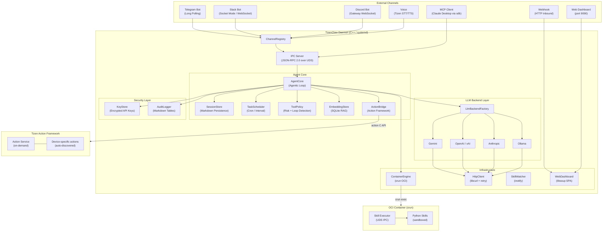
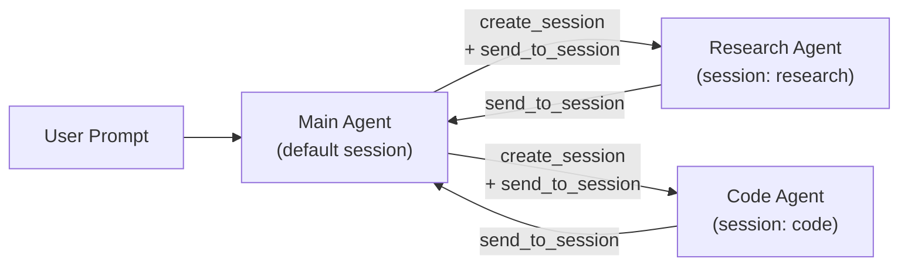
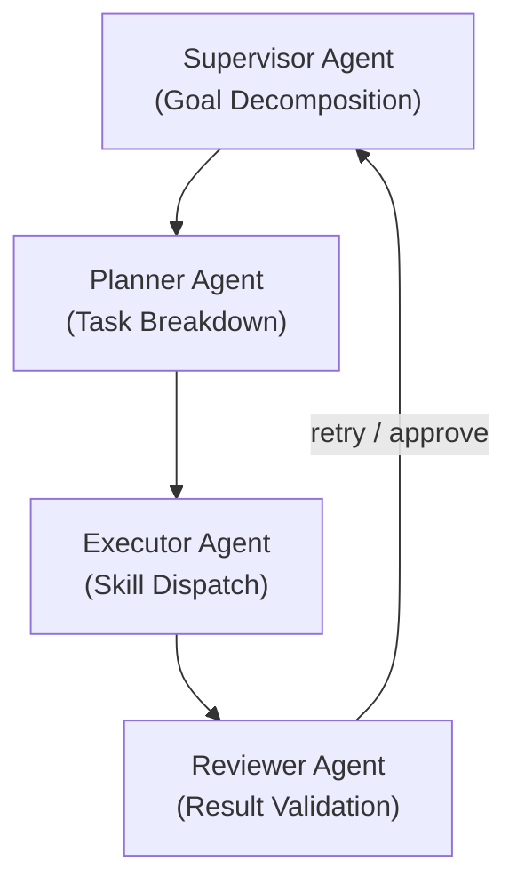
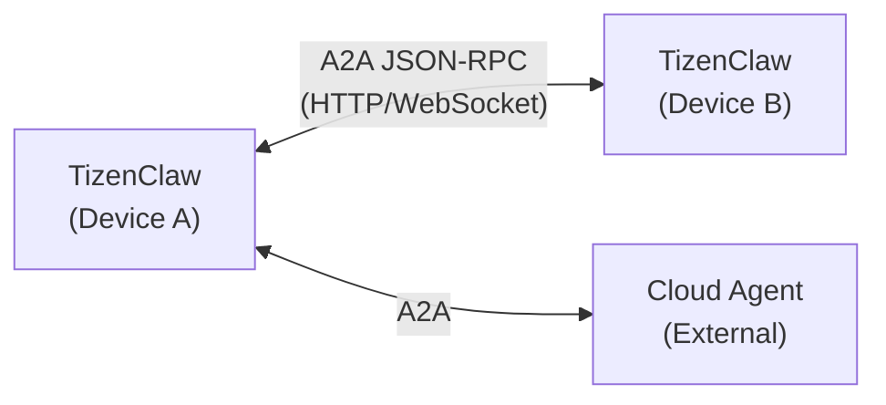
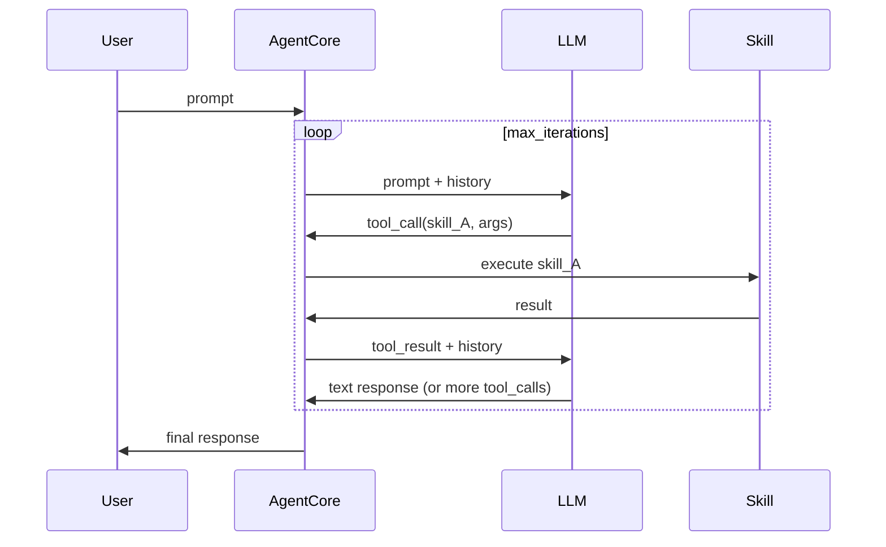
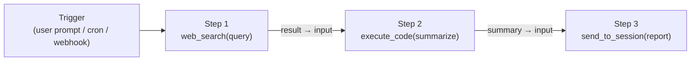

# TizenClaw System Design Document

> **Last Updated**: 2026-03-09
> **Version**: 2.1

---

## 1. Overview

**TizenClaw** is a native C++ AI agent **daemon** optimized for the Tizen Embedded Linux platform. It runs as a **systemd service** in the background, receives user prompts through multiple communication channels (Telegram, Slack, Discord, MCP, Webhook, Voice, Web Dashboard), interprets them via configurable LLM backends, and executes device-level actions using sandboxed Python skills inside OCI containers and the **Tizen Action Framework**.

The system establishes a safe and extensible Agent-Skill interaction environment under Tizen's strict security policies (SMACK, DAC, kUEP) while providing enterprise-grade features including multi-agent coordination, streaming responses, encrypted credential storage, and structured audit logging.

### System Environment

- **OS**: Tizen Embedded Linux (Tizen 10.0)
- **Runtime**: systemd daemon (`tizenclaw.service`)
- **Security**: SMACK + DAC enforced, kUEP (Kernel Unprivileged Execution Protection) enabled
- **Language**: C++17, Python 3.x (skills)

---

## 2. System Architecture



---

## 3. Core Module Design

### 3.1 Daemon Process (`tizenclaw.cc`)

The main daemon process manages the overall lifecycle:

- **systemd integration**: Runs as `Type=simple` service, handles `SIGINT`/`SIGTERM` for graceful shutdown
- **IPC Server**: Abstract Unix Domain Socket (`\0tizenclaw.sock`) with standard `JSON-RPC 2.0` and length-prefix framing (`[4-byte len][JSON]`)
- **UID Authentication**: `SO_PEERCRED`-based sender validation (root, app_fw, system, developer)
- **Thread Pool**: `kMaxConcurrentClients = 4` concurrent request handling
- **Channel Lifecycle**: Initializes and manages all channels via `ChannelRegistry`
- **Modular CAPI (`src/libtizenclaw`)**: The internal logic is fully decoupled from the external CAPI layer (`tizenclaw.h`), facilitating distribution as an SDK.

### 3.2 Agent Core (`agent_core.cc`)

The central orchestration engine implementing the **Agentic Loop**:

- **Iterative Tool Calling**: LLM generates tool calls → execute → feed results back → repeat (configurable `max_iterations`)
- **Streaming Responses**: Chunked IPC delivery (`stream_chunk` / `stream_end`) with progressive Telegram message editing
- **Context Compaction**: When exceeding 15 turns, oldest 10 turns are summarized via LLM into 1 compressed turn
- **Edge Memory Management**: The `MaintenanceLoop` aggressively monitors idle time, calling `malloc_trim(0)` and `sqlite3_release_memory` after 5 minutes of inactivity to reclaim PSS memory.
- **Multi-Session**: Concurrent agent sessions with per-session system prompts and history isolation
- **Model Fallback**: Sequential retry across `fallback_backends` with rate-limit backoff
- **Built-in Tools**: `execute_code`, `file_manager`, `create_task`, `list_tasks`, `cancel_task`, `create_session`, `list_sessions`, `send_to_session`, `ingest_document`, `search_knowledge`, `execute_action`, `action_<name>` (per-action tools)

### 3.3 LLM Backend Layer

Provider-agnostic abstraction via `LlmBackend` interface:

| Backend | Source | Default Model | Streaming | Token Counting |
|---------|--------|---------------|:---------:|:--------------:|
| Gemini | `gemini_backend.cc` | `gemini-2.5-flash` | ✅ | ✅ |
| OpenAI | `openai_backend.cc` | `gpt-4o` | ✅ | ✅ |
| xAI (Grok) | `openai_backend.cc` | `grok-3` | ✅ | ✅ |
| Anthropic | `anthropic_backend.cc` | `claude-sonnet-4-20250514` | ✅ | ✅ |
| Ollama | `ollama_backend.cc` | `llama3` | ✅ | ✅ |

- **Factory Pattern**: `LlmBackendFactory::Create()` instantiation
- **Runtime Switching**: `active_backend` field in `llm_config.json`
- **System Prompt**: 4-level fallback (config inline → file path → default file → hardcoded), `{{AVAILABLE_TOOLS}}` dynamic placeholder

### 3.4 Container Engine (`container_engine.cc`)

OCI-compliant skill execution environment:

- **Runtime**: `crun` 1.26 (built from source during RPM packaging)
- **Dual Architecture**: Standard Container (daemon) + Skills Secure Container (sandbox)
- **Namespace Isolation**: PID, Mount, User namespaces
- **Fallback**: `unshare + chroot` when cgroup unavailable
- **Skill Executor IPC**: Length-prefixed JSON over Unix Domain Socket between daemon and containerized Python executor
- **Host Bind-Mounts**: `/usr/bin`, `/usr/lib`, `/usr/lib64`, `/lib64` for Tizen C-API access

### 3.5 Channel Abstraction Layer

Unified `Channel` interface for all communication endpoints:

```cpp
class Channel {
 public:
  virtual std::string GetName() const = 0;
  virtual bool Start() = 0;
  virtual void Stop() = 0;
  virtual bool IsRunning() const = 0;
};
```

| Channel | Implementation | Protocol |
|---------|---------------|----------|
| Telegram | `telegram_client.cc` | Bot API Long-Polling |
| Slack | `slack_channel.cc` | Socket Mode (libwebsockets) |
| Discord | `discord_channel.cc` | Gateway WebSocket (libwebsockets) |
| MCP | `mcp_server.cc` | stdio JSON-RPC 2.0 |
| Webhook | `webhook_channel.cc` | HTTP inbound (libsoup) |
| Voice | `voice_channel.cc` | Tizen STT/TTS C-API (conditional compilation) |
| Web Dashboard | `web_dashboard.cc` | libsoup SPA (port 9090) |

`ChannelRegistry` manages lifecycle (register, start/stop all, lookup by name).

### 3.6 Security Subsystem

| Component | File | Function |
|-----------|------|----------|
| **KeyStore** | `key_store.cc` | Device-bound API key encryption (GLib SHA-256 + XOR, `/etc/machine-id`) |
| **ToolPolicy** | `tool_policy.cc` | Per-skill `risk_level`, loop detection (3x repeat block), idle progress check |
| **AuditLogger** | `audit_logger.cc` | Markdown table audit files (`audit/YYYY-MM-DD.md`), daily rotation, 5MB limit |
| **UID Auth** | `tizenclaw.cc` | `SO_PEERCRED` IPC sender validation |
| **Webhook Auth** | `webhook_channel.cc` | HMAC-SHA256 signature validation (GLib `GHmac`) |

### 3.7 Persistence & Storage

All storage uses **Markdown with YAML frontmatter** (no external DB dependency except SQLite for RAG):

```
/opt/usr/share/tizenclaw/
├── sessions/{YYYY-MM-DD}-{id}.md    ← Conversation history
├── logs/{YYYY-MM-DD}.md             ← Daily skill execution logs
├── usage/
│   ├── {session-id}.md              ← Per-session token usage
│   ├── daily/YYYY-MM-DD.md          ← Daily aggregate
│   └── monthly/YYYY-MM.md           ← Monthly aggregate
├── audit/YYYY-MM-DD.md              ← Audit trail
├── tasks/task-{id}.md               ← Scheduled tasks
├── tools/actions/{name}.md          ← Action schema cache (auto-synced, device-specific)
├── tools/embedded/{name}.md         ← Embedded tool schemas (installed via RPM)
└── knowledge/embeddings.db          ← SQLite vector store (RAG)
```

### 3.8 Tizen Action Framework Bridge (`action_bridge.cc`)

Native integration with the Tizen Action Framework for device-level actions:

- **Architecture**: `ActionBridge` runs Action C API on a dedicated `tizen_core_task` worker thread with `tizen_core_channel` for inter-thread communication
- **Schema Management**: Per-action Markdown files containing parameter tables, privileges, and raw JSON schema
- **Initialization Sync**: `SyncActionSchemas()` fetches all actions via `action_client_foreach_action`, writes/overwrites MD files, and removes stale entries
- **Event-Driven Updates**: `action_client_add_event_handler` subscribes to INSTALL/UNINSTALL/UPDATE events → auto-update MD files → invalidate tool cache
- **Per-Action Tools**: Each registered action becomes a typed LLM tool (e.g., `action_<name>`) loaded from MD cache at startup. Available actions vary by device.
- **Execution**: All action execution goes through `action_client_execute` with JSON-RPC 2.0 model format

```

Action schemas are auto-generated at runtime and vary by device. The directory is populated by `SyncActionSchemas()` at initialization.

### 3.9 Task Scheduler (`task_scheduler.cc`)

In-process automation with LLM integration:

- **Schedule Types**: `daily HH:MM`, `interval Ns/Nm/Nh`, `once YYYY-MM-DD HH:MM`, `weekly DAY HH:MM`
- **Execution**: Direct `AgentCore::ProcessPrompt()` call (no IPC slot consumption)
- **Persistence**: Markdown with YAML frontmatter
- **Retry**: Failed tasks retry with exponential backoff (max 3 retries)

### 3.10 RAG / Semantic Search (`embedding_store.cc`)

Knowledge retrieval beyond conversation history:

- **Storage**: SQLite with brute-force cosine similarity (sufficient for embedded scale)
- **Embedding APIs**: Gemini (`text-embedding-004`), OpenAI (`text-embedding-3-small`), Ollama
- **Built-in Tools**: `ingest_document` (chunking + embedding), `search_knowledge` (cosine similarity query)

### 3.11 Web Dashboard (`web_dashboard.cc`)

Built-in administrative dashboard:

- **Server**: libsoup `SoupServer` on port 9090
- **Frontend**: Dark glassmorphism SPA (HTML+CSS+JS)
- **REST API**: `/api/sessions`, `/api/tasks`, `/api/logs`, `/api/chat`, `/api/config`
- **Admin Auth**: Session-token mechanism with SHA-256 password hashing
- **Config Editor**: In-browser editing of 7 configuration files with backup-on-write

### 3.12 Tool Schema Discovery

LLM tool discovery through Markdown schema files:

- **Embedded Tools**: 13 MD files under `/opt/usr/share/tizenclaw/tools/embedded/` describe built-in tools (execute_code, file_manager, pipelines, tasks, RAG, etc.)
- **Action Tools**: MD files describe Tizen Action Framework actions (auto-synced, device-specific)
- **System Prompt Integration**: Both directories are scanned at prompt build time, and full MD content is appended to the `{{AVAILABLE_TOOLS}}` section
- **Schema-Execution Separation**: MD files provide LLM context only; execution logic is handled independently by `AgentCore` dispatch (embedded) or `ActionBridge` (actions)

---

## 4. Multi-Agent Orchestration Design

TizenClaw currently supports **multi-session agent-to-agent messaging** (Phase 14.3). This section outlines the design direction for more advanced multi-agent patterns.

### 4.1 Current State: Session-Based Agents



- Each session has its own system prompt and conversation history
- `create_session`, `list_sessions`, `send_to_session` built-in tools
- Sessions are isolated but can communicate via message passing

### 4.2 Future: Supervisor Pattern

A **Supervisor Agent** decomposes complex goals into sub-tasks and delegates to specialized role agents:



**Implementation Direction**:
- `AgentRole` struct: role name, system prompt, allowed tools
- `SupervisorLoop`: goal → plan → delegate → collect → validate → report
- Configurable via `agent_roles.json`

### 4.3 Future: A2A (Agent-to-Agent) Protocol

For cross-device or cross-instance agent coordination:



**Implementation Direction**:
- A2A endpoint on WebDashboard HTTP server
- Agent Card discovery (`.well-known/agent.json`)
- Task lifecycle: submit → working → artifact → done

---

## 5. Skill / Tool Pipeline (Chain) Execution Design

The current Agentic Loop executes tools **reactively** (LLM decides each step). This section proposes **proactive pipeline execution** for deterministic multi-step workflows.

### 5.1 Current: Reactive Agentic Loop



### 5.2 Future: Deterministic Skill Pipeline

Pre-defined sequences of skill executions with data flow between stages:



**Design**:

```json
{
  "pipeline_id": "daily_news_summary",
  "trigger": "daily 09:00",
  "steps": [
    {"skill": "web_search", "args": {"query": "{{topic}}"}, "output_as": "search_result"},
    {"skill": "execute_code", "args": {"code": "summarize({{search_result}})"}, "output_as": "summary"},
    {"skill": "send_to_session", "args": {"session": "report", "message": "{{summary}}"}}
  ]
}
```

**Implementation Direction**:
- `PipelineExecutor` class: load pipeline JSON → execute steps sequentially → pass outputs via `{{variable}}` interpolation
- Error handling: per-step retry, skip-on-failure, rollback
- Built-in tools: `create_pipeline`, `list_pipelines`, `run_pipeline`
- Storage: `pipelines/pipeline-{id}.json`
- Integration with `TaskScheduler` for cron-triggered pipelines

### 5.3 Future: Conditional / Branching Pipelines

```json
{
  "steps": [
    {"skill": "get_battery_info", "output_as": "battery"},
    {
      "condition": "{{battery.level}} < 20",
      "then": [{"skill": "vibrate_device", "args": {"duration_ms": 500}}],
      "else": [{"skill": "execute_code", "args": {"code": "print('Battery OK')"}}]
    }
  ]
}
```

---

## 6. Future Enhancements / TODO

### 6.1 New Features to Add

| Feature | Priority | Description |
|---------|:--------:|-------------|
| **Supervisor Agent** | 🔴 High | Multi-agent goal decomposition and delegation |
| **Skill Pipeline Engine** | 🔴 High | Deterministic sequential/conditional skill execution |
| **A2A Protocol** | 🟡 Medium | Cross-device agent communication (JSON-RPC) |
| **Wake Word Detection** | 🟡 Medium | Hardware mic-based voice activation (requires STT hardware) |
| **Skill Marketplace** | 🟢 Low | Remote skill download, validation, and installation |

### 6.2 Areas to Improve

| Area | Current State | Improvement Direction |
|------|--------------|----------------------|
| **RAG Scalability** | Brute-force cosine similarity | ANN index (HNSW) for large document sets |
| **Token Budgeting** | Token counting after response | Pre-request token estimation to prevent context overflow |
| **Concurrent Tasks** | Sequential task execution | Parallel task execution with dependency graph |
| **Skill Output Validation** | Raw stdout JSON | JSON schema validation per skill |
| **Error Recovery** | Crash loses in-flight requests | Request journaling for crash recovery |
| **Log Aggregation** | Local Markdown files | Remote syslog or structured log forwarding |

---

## 7. Requirements Summary

### 7.1 Functional Requirements

- **Agent Core**: Native C++ daemon with multi-LLM Agentic Loop, streaming, context compaction
- **Skills Execution**: OCI container-isolated Python skills with inotify hot-reload
- **Communication**: 7 channels (Telegram, Slack, Discord, MCP, Webhook, Voice, Web)
- **Security**: Encrypted keys, tool policy, audit logging, UID/HMAC authentication
- **Automation**: Cron/interval task scheduler with LLM integration
- **Knowledge**: SQLite-backed RAG with embedding search
- **Administration**: Web dashboard with config editor and admin authentication

### 7.2 Non-Functional Requirements

- **Deployment**: systemd service, RPM packaging via GBS
- **Runtime**: Python encapsulated inside Container RootFS (no host installation required)
- **Performance**: Native C++ for low memory/CPU footprint on embedded devices
- **Reliability**: Model fallback, exponential backoff, failed task retry
