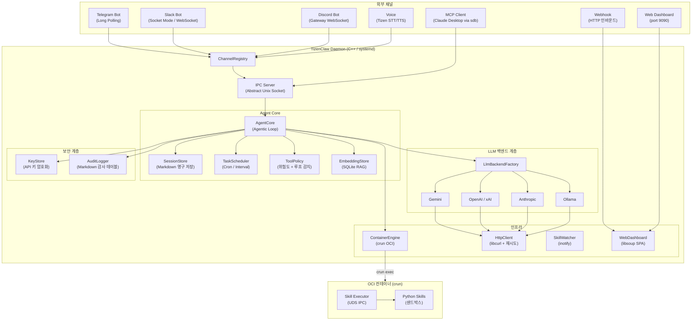
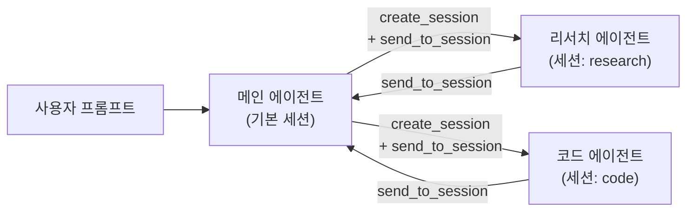
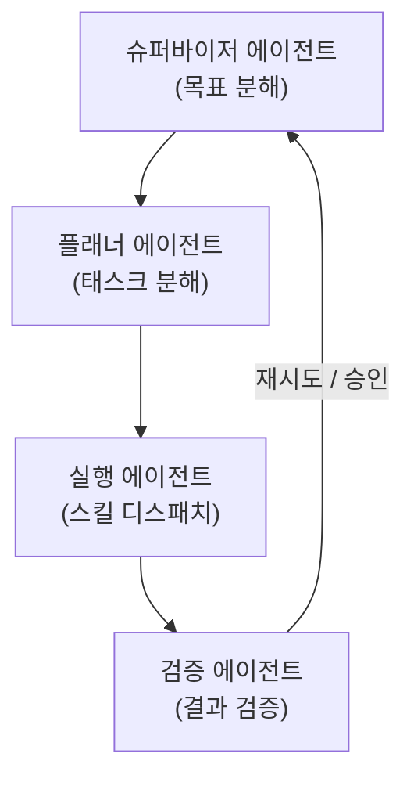
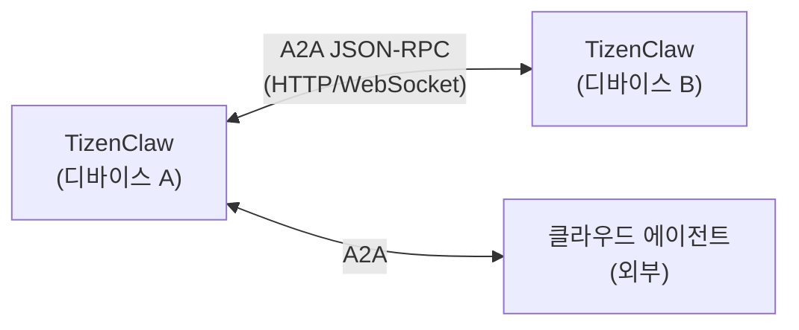
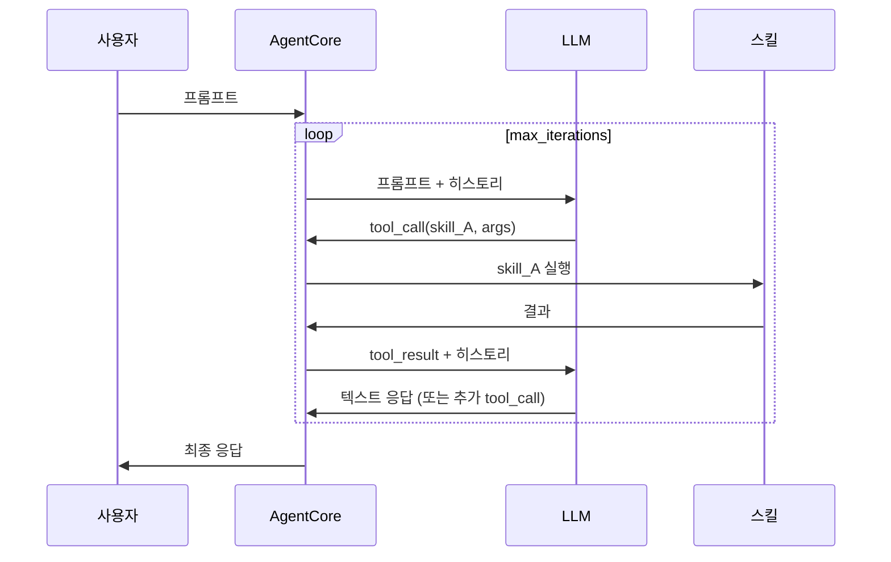
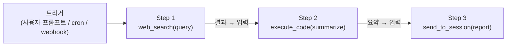

# TizenClaw 설계 문서

> **최종 업데이트**: 2026-03-07
> **버전**: 2.0

---

## 1. 개요

**TizenClaw**는 Tizen Embedded Linux 환경에 최적화된 네이티브 C++ AI 에이전트 **데몬**입니다. **systemd 서비스**로 백그라운드에서 실행되며, 다중 통신 채널(Telegram, Slack, Discord, MCP, Webhook, Voice, Web Dashboard)을 통해 사용자 프롬프트를 수신하고, 설정 가능한 LLM 백엔드를 통해 해석하여, OCI 컨테이너 내에서 샌드박스된 Python 스킬로 디바이스 작업을 수행합니다.

Tizen의 보안 정책(SMACK, DAC, kUEP) 하에서도 안전하고 확장 가능한 Agent-Skill 상호작용 환경을 구축하며, 멀티 에이전트 협조, 스트리밍 응답, 암호화된 자격증명 저장, 구조화된 감사 로깅 등 엔터프라이즈급 기능을 제공합니다.

### 시스템 구동 환경

- **OS**: Tizen Embedded Linux (Tizen 10.0)
- **런타임**: systemd 데몬 (`tizenclaw.service`)
- **보안**: SMACK + DAC 적용, kUEP (Kernel Unprivileged Execution Protection) 활성화
- **언어**: C++17, Python 3.x (스킬)

---

## 2. 시스템 아키텍처



---

## 3. 핵심 모듈 설계

### 3.1 데몬 프로세스 (`tizenclaw.cc`)

메인 데몬 프로세스가 전체 생명주기를 관리합니다:

- **systemd 통합**: `Type=simple` 서비스로 실행, `SIGINT`/`SIGTERM`으로 안전한 종료
- **IPC 서버**: Abstract Unix Domain Socket (`\0tizenclaw.sock`), 길이-프리픽스 프레이밍 (`[4바이트 길이][JSON]`)
- **UID 인증**: `SO_PEERCRED` 기반 발신자 검증 (root, app_fw, system, developer)
- **스레드 풀**: `kMaxConcurrentClients = 4` 동시 요청 처리
- **채널 생명주기**: `ChannelRegistry`를 통한 모든 채널 초기화 및 관리

### 3.2 Agent Core (`agent_core.cc`)

**Agentic Loop**을 구현하는 핵심 오케스트레이션 엔진:

- **반복적 도구 호출**: LLM이 도구 호출 생성 → 실행 → 결과 피드백 → 반복 (설정 가능한 `max_iterations`)
- **스트리밍 응답**: 청크 IPC 전달 (`stream_chunk` / `stream_end`), Telegram `editMessageText` 점진적 편집
- **컨텍스트 압축**: 15턴 초과 시 가장 오래된 10턴을 LLM으로 요약하여 1턴으로 압축
- **멀티 세션**: 세션별 시스템 프롬프트와 히스토리 격리를 통한 동시 에이전트 세션
- **모델 폴백**: `fallback_backends` 순차 재시도 + rate-limit 백오프
- **내장 도구**: `execute_code`, `file_manager`, `create_task`, `list_tasks`, `cancel_task`, `create_session`, `list_sessions`, `send_to_session`, `ingest_document`, `search_knowledge`

### 3.3 LLM 백엔드 계층

`LlmBackend` 인터페이스를 통한 프로바이더 불가지 추상화:

| 백엔드 | 소스 | 기본 모델 | 스트리밍 | 토큰 카운팅 |
|--------|------|----------|:--------:|:----------:|
| Gemini | `gemini_backend.cc` | `gemini-2.5-flash` | ✅ | ✅ |
| OpenAI | `openai_backend.cc` | `gpt-4o` | ✅ | ✅ |
| xAI (Grok) | `openai_backend.cc` | `grok-3` | ✅ | ✅ |
| Anthropic | `anthropic_backend.cc` | `claude-sonnet-4-20250514` | ✅ | ✅ |
| Ollama | `ollama_backend.cc` | `llama3` | ✅ | ✅ |

- **팩토리 패턴**: `LlmBackendFactory::Create()` 인스턴스 생성
- **런타임 전환**: `llm_config.json`의 `active_backend` 필드
- **시스템 프롬프트**: 4단계 fallback (config inline → 파일 경로 → 기본 파일 → 하드코딩), `{{AVAILABLE_TOOLS}}` 동적 placeholder

### 3.4 컨테이너 엔진 (`container_engine.cc`)

OCI 호환 스킬 실행 환경:

- **런타임**: `crun` 1.26 (RPM 패키징 시 소스 빌드)
- **이중 아키텍처**: Standard Container (데몬) + Skills Secure Container (샌드박스)
- **네임스페이스 격리**: PID, Mount, User 네임스페이스
- **폴백**: cgroup 미사용 시 `unshare + chroot`
- **Skill Executor IPC**: 데몬과 컨테이너 내 Python 실행기 간 길이-프리픽스 JSON + Unix Domain Socket
- **호스트 바인드 마운트**: Tizen C-API 접근을 위한 `/usr/bin`, `/usr/lib`, `/usr/lib64`, `/lib64`

### 3.5 채널 추상화 계층

모든 통신 엔드포인트를 위한 통합 `Channel` 인터페이스:

```cpp
class Channel {
 public:
  virtual std::string GetName() const = 0;
  virtual bool Start() = 0;
  virtual void Stop() = 0;
  virtual bool IsRunning() const = 0;
};
```

| 채널 | 구현 | 프로토콜 |
|------|------|---------|
| Telegram | `telegram_client.cc` | Bot API Long-Polling |
| Slack | `slack_channel.cc` | Socket Mode (libwebsockets) |
| Discord | `discord_channel.cc` | Gateway WebSocket (libwebsockets) |
| MCP | `mcp_server.cc` | stdio JSON-RPC 2.0 |
| Webhook | `webhook_channel.cc` | HTTP 인바운드 (libsoup) |
| Voice | `voice_channel.cc` | Tizen STT/TTS C-API (조건부 컴파일) |
| Web Dashboard | `web_dashboard.cc` | libsoup SPA (port 9090) |

`ChannelRegistry`가 생명주기 관리 (등록, 전체 시작/정지, 이름별 검색).

### 3.6 보안 서브시스템

| 컴포넌트 | 파일 | 기능 |
|---------|------|------|
| **KeyStore** | `key_store.cc` | 디바이스 바인딩 API 키 암호화 (GLib SHA-256 + XOR, `/etc/machine-id`) |
| **ToolPolicy** | `tool_policy.cc` | 스킬별 `risk_level`, 루프 감지 (3회 반복 차단), idle 진행 체크 |
| **AuditLogger** | `audit_logger.cc` | Markdown 테이블 감사 파일 (`audit/YYYY-MM-DD.md`), 일별 로테이션, 5MB 제한 |
| **UID 인증** | `tizenclaw.cc` | `SO_PEERCRED` IPC 발신자 검증 |
| **Webhook 인증** | `webhook_channel.cc` | HMAC-SHA256 서명 검증 (GLib `GHmac`) |

### 3.7 영구 저장 및 스토리지

모든 저장소는 **Markdown + YAML frontmatter** 사용 (RAG용 SQLite 제외):

```
/opt/usr/share/tizenclaw/
├── sessions/{YYYY-MM-DD}-{id}.md    ← 대화 히스토리
├── logs/{YYYY-MM-DD}.md             ← 일별 스킬 실행 로그
├── usage/
│   ├── {session-id}.md              ← 세션별 토큰 사용량
│   ├── daily/YYYY-MM-DD.md          ← 일별 누적
│   └── monthly/YYYY-MM.md           ← 월별 누적
├── audit/YYYY-MM-DD.md              ← 감사 추적
├── tasks/task-{id}.md               ← 예약 태스크
└── knowledge/embeddings.db          ← SQLite 벡터 저장소 (RAG)
```

### 3.8 태스크 스케줄러 (`task_scheduler.cc`)

LLM 연동 인프로세스 자동화:

- **스케줄 타입**: `daily HH:MM`, `interval Ns/Nm/Nh`, `once YYYY-MM-DD HH:MM`, `weekly DAY HH:MM`
- **실행**: `AgentCore::ProcessPrompt()` 직접 호출 (IPC 슬롯 미소비)
- **영구 저장**: YAML frontmatter Markdown
- **재시도**: 실패 태스크 지수 백오프 재시도 (최대 3회)

### 3.9 RAG / 시맨틱 검색 (`embedding_store.cc`)

대화 히스토리 너머의 지식 검색:

- **저장소**: SQLite + 순차 코사인 유사도 (임베디드 규모에 충분)
- **임베딩 API**: Gemini (`text-embedding-004`), OpenAI (`text-embedding-3-small`), Ollama
- **내장 도구**: `ingest_document` (청킹 + 임베딩), `search_knowledge` (코사인 유사도 쿼리)

### 3.10 웹 대시보드 (`web_dashboard.cc`)

내장 관리 대시보드:

- **서버**: libsoup `SoupServer` 포트 9090
- **프론트엔드**: 다크 글래스모피즘 SPA (HTML+CSS+JS)
- **REST API**: `/api/sessions`, `/api/tasks`, `/api/logs`, `/api/chat`, `/api/config`
- **관리자 인증**: SHA-256 비밀번호 해싱을 사용한 세션 토큰 메커니즘
- **설정 편집기**: 백업-온-라이트 기능의 7개 설정 파일 인브라우저 편집

---

## 4. 멀티 에이전트 오케스트레이션 설계

TizenClaw는 현재 **멀티 세션 에이전트 간 메시징** (Phase 14.3)을 지원합니다. 이 섹션은 보다 고급 멀티 에이전트 패턴의 설계 방향을 기술합니다.

### 4.1 현재 상태: 세션 기반 에이전트



- 각 세션은 고유한 시스템 프롬프트와 대화 히스토리 보유
- `create_session`, `list_sessions`, `send_to_session` 내장 도구
- 세션은 격리되지만 메시지 전달을 통해 통신 가능

### 4.2 향후: 슈퍼바이저 패턴

**슈퍼바이저 에이전트**가 복잡한 목표를 하위 태스크로 분해하여 전문 역할 에이전트에 위임:



**구현 방향**:
- `AgentRole` 구조체: 역할명, 시스템 프롬프트, 허용 도구
- `SupervisorLoop`: 목표 → 계획 → 위임 → 수집 → 검증 → 보고
- `agent_roles.json`으로 설정 가능

### 4.3 향후: A2A (Agent-to-Agent) 프로토콜

크로스 디바이스 또는 크로스 인스턴스 에이전트 협조:



**구현 방향**:
- WebDashboard HTTP 서버의 A2A 엔드포인트
- Agent Card 디스커버리 (`.well-known/agent.json`)
- 태스크 생명주기: submit → working → artifact → done

---

## 5. 스킬/툴 파이프라인 (Chain) 실행 설계

현재 Agentic Loop는 도구를 **반응적으로** 실행합니다 (LLM이 각 단계를 결정). 이 섹션은 결정적 다단계 워크플로우를 위한 **능동적 파이프라인 실행**을 제안합니다.

### 5.1 현재: 반응적 Agentic Loop



### 5.2 향후: 결정적 스킬 파이프라인

단계 간 데이터 흐름을 가진 사전 정의된 스킬 실행 시퀀스:



**설계**:

```json
{
  "pipeline_id": "daily_news_summary",
  "trigger": "daily 09:00",
  "steps": [
    {"skill": "web_search", "args": {"query": "{{topic}}"}, "output_as": "search_result"},
    {"skill": "execute_code", "args": {"code": "summarize({{search_result}})"}, "output_as": "summary"},
    {"skill": "send_to_session", "args": {"session": "report", "message": "{{summary}}"}}
  ]
}
```

**구현 방향**:
- `PipelineExecutor` 클래스: 파이프라인 JSON 로드 → 단계별 순차 실행 → `{{variable}}` 보간으로 출력 전달
- 에러 핸들링: 단계별 재시도, 실패 시 건너뛰기, 롤백
- 내장 도구: `create_pipeline`, `list_pipelines`, `run_pipeline`
- 저장소: `pipelines/pipeline-{id}.json`
- `TaskScheduler`와 통합하여 cron 트리거 파이프라인

### 5.3 향후: 조건부 / 분기 파이프라인

```json
{
  "steps": [
    {"skill": "get_battery_info", "output_as": "battery"},
    {
      "condition": "{{battery.level}} < 20",
      "then": [{"skill": "vibrate_device", "args": {"duration_ms": 500}}],
      "else": [{"skill": "execute_code", "args": {"code": "print('Battery OK')"}}]
    }
  ]
}
```

---

## 6. 향후 개선사항 / TODO

### 6.1 추가할 신규 기능

| 기능 | 우선순위 | 설명 |
|------|:-------:|------|
| **슈퍼바이저 에이전트** | 🔴 높음 | 멀티 에이전트 목표 분해 및 위임 |
| **스킬 파이프라인 엔진** | 🔴 높음 | 결정적 순차/조건 스킬 실행 |
| **A2A 프로토콜** | 🟡 중간 | 크로스 디바이스 에이전트 통신 (JSON-RPC) |
| **브라우저 제어** | 🟡 중간 | CDP (Chrome DevTools Protocol) 웹 자동화 연동 |
| **웨이크 워드 감지** | 🟡 중간 | 하드웨어 마이크 기반 음성 활성화 (STT 하드웨어 필요) |
| **스킬 마켓플레이스** | 🟢 낮음 | 원격 스킬 다운로드, 검증, 설치 |
| **OTA 업데이트** | 🟢 낮음 | 무선 데몬 및 스킬 업데이트 |
| **헬스 메트릭스** | 🟢 낮음 | Prometheus 스타일 모니터링 메트릭 (CPU, 메모리, 업타임) |

### 6.2 보완이 필요한 영역

| 영역 | 현재 상태 | 개선 방향 |
|------|----------|----------|
| **RAG 확장성** | 순차 코사인 유사도 | 대규모 문서셋을 위한 ANN 인덱스 (HNSW) |
| **토큰 예산** | 응답 후 토큰 카운팅 | 사전 요청 토큰 추정으로 컨텍스트 오버플로 방지 |
| **동시 태스크** | 순차 태스크 실행 | 의존성 그래프 기반 병렬 태스크 실행 |
| **스킬 출력 검증** | Raw stdout JSON | 스킬별 JSON 스키마 검증 |
| **에러 복구** | 크래시 시 진행 중 요청 손실 | 크래시 복구를 위한 요청 저널링 |
| **로그 집약** | 로컬 Markdown 파일 | 원격 syslog 또는 구조화된 로그 포워딩 |

---

## 7. 요구사항 요약

### 7.1 기능 요구사항

- **Agent Core**: 멀티 LLM Agentic Loop, 스트리밍, 컨텍스트 압축을 갖춘 네이티브 C++ 데몬
- **스킬 실행**: inotify 핫리로드를 갖춘 OCI 컨테이너 격리 Python 스킬
- **통신**: 7개 채널 (Telegram, Slack, Discord, MCP, Webhook, Voice, Web)
- **보안**: 암호화된 키, 도구 실행 정책, 감사 로깅, UID/HMAC 인증
- **자동화**: LLM 연동 Cron/interval 태스크 스케줄러
- **지식**: SQLite 기반 RAG 및 임베딩 검색
- **관리**: 설정 편집기 및 관리자 인증을 갖춘 웹 대시보드

### 7.2 비기능 요구사항

- **배포**: systemd 서비스, GBS를 통한 RPM 패키징
- **런타임**: Container RootFS 내부에 Python 캡슐화 (호스트 설치 불필요)
- **성능**: 임베디드 디바이스의 낮은 메모리/CPU 사용을 위한 네이티브 C++
- **안정성**: 모델 폴백, 지수 백오프, 실패 태스크 재시도
