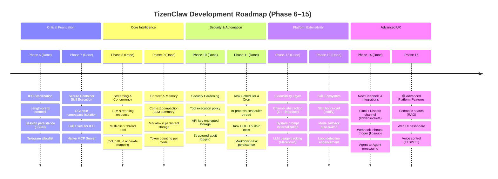
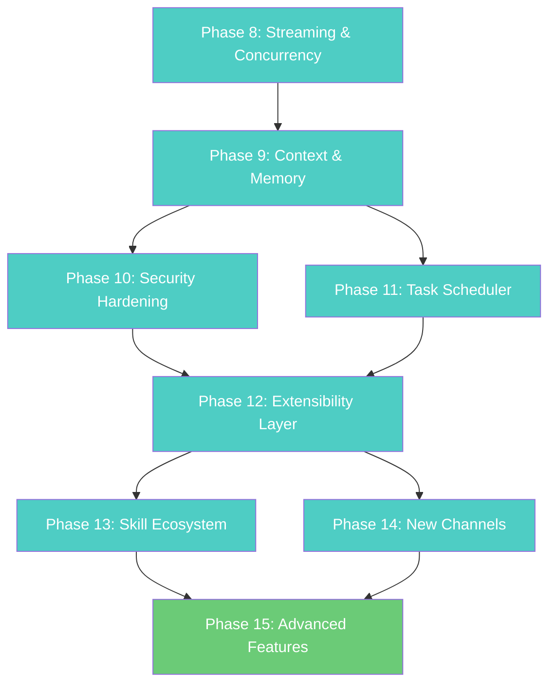

# TizenClaw Development Roadmap v3.0

> **Date**: 2026-03-07
> **Reference**: [Project Analysis](ANALYSIS.md) | [System Design](DESIGN.md)

---

## Feature Comparison Matrix

> Competitive analysis against **OpenClaw** (TypeScript, ~700+ files) and **NanoClaw** (TypeScript, ~50 files).

| Category | Feature | OpenClaw | NanoClaw | TizenClaw | Gap |
|----------|---------|:--------:|:--------:|:---------:|:---:|
| **IPC** | Multi-client concurrency | ✅ Parallel sessions | ✅ Group queue | ✅ Thread pool | ✅ |
| **IPC** | Streaming responses | ✅ SSE / WebSocket | ✅ `onOutput` callback | ✅ Chunked IPC | ✅ |
| **IPC** | Robust message framing | ✅ WebSocket + JSON-RPC | ✅ Sentinel markers | ✅ Length-prefix + JSON-RPC | ✅ |
| **Memory** | Conversation persistence | ✅ SQLite + Vector DB | ✅ SQLite | ✅ Markdown (YAML frontmatter) | ✅ |
| **Memory** | Context compaction | ✅ LLM auto-summarize | ❌ | ✅ LLM auto-summarize | ✅ |
| **Memory** | Semantic search (RAG) | ✅ MMR + embeddings | ❌ | ❌ | 🔴 |
| **LLM** | Model fallback | ✅ Auto-switch (18K LOC) | ❌ | ✅ Auto-switch + backoff | ✅ |
| **LLM** | Token counting | ✅ Per-model accurate | ❌ | ✅ Per-model parsing | ✅ |
| **LLM** | Usage tracking | ✅ Per-model token usage | ❌ | ✅ Daily/monthly Markdown | ✅ |
| **Security** | Tool execution policy | ✅ Whitelist/blacklist | ❌ | ✅ Risk-level + loop detect | ✅ |
| **Security** | Sender allowlist | ✅ `allowlist-match.ts` | ✅ `sender-allowlist.ts` | ✅ UID + chat_id | ✅ |
| **Security** | API key management | ✅ Rotation + encrypted | ✅ stdin delivery | ✅ Device-bound encryption | ✅ |
| **Security** | Audit logging | ✅ 45K LOC `audit.ts` | ✅ `ipc-auth.test.ts` | ✅ Markdown audit + dlog | ✅ |
| **Automation** | Task scheduler | ✅ Basic cron | ✅ cron/interval/one-shot | ✅ cron/interval/once/weekly | ✅ |
| **Channel** | Multi-channel support | ✅ 22+ channels | ✅ 5 channels (via skills) | ✅ 5 (Telegram, MCP, Webhook, Slack, Discord) | ✅ |
| **Channel** | Channel abstraction | ✅ Static registry | ✅ Self-registration | ✅ C++ Channel interface | ✅ |
| **Prompt** | System prompt | ✅ Dynamic generation | ✅ Per-group `CLAUDE.md` | ✅ External file + dynamic | ✅ |
| **Agent** | Agent-to-Agent | ✅ `sessions_send` | ✅ Agent Swarms | ✅ Per-session prompt + send_to_session | ✅ |
| **Agent** | Loop detection | ✅ 18K LOC detector | ✅ Timeout + idle | ✅ Repeat + idle + configurable | ✅ |
| **Agent** | tool_call_id mapping | ✅ Accurate tracking | ✅ SDK native | ✅ Per-backend parsing | ✅ |
| **Infra** | DB engine | ✅ SQLite + sqlite-vec | ✅ SQLite | ❌ | 🔴 |
| **Infra** | Structured logging | ✅ Pino (JSON) | ✅ Pino (JSON) | ✅ Markdown audit tables | ✅ |
| **Infra** | Skill hot-reload | ✅ Runtime install | ✅ apply/rebase | ✅ inotify auto-reload | ✅ |
| **UX** | Browser control | ✅ CDP Chrome | ❌ | ❌ | 🟢 |
| **UX** | Voice interface | ✅ Wake word + TTS | ❌ | ❌ | 🟢 |
| **UX** | Web UI | ✅ Control UI + WebChat | ❌ | ❌ | 🟢 |

---

## TizenClaw Unique Strengths

| Strength | Description |
|----------|-------------|
| **Native C++ Performance** | Lower memory/CPU vs TypeScript — optimal for Tizen embedded |
| **OCI Container Isolation** | crun-based `seccomp` + `namespace` — finer syscall control than app-level sandboxing |
| **Direct Tizen C-API** | ctypes wrappers for device hardware (battery, Wi-Fi, BT, haptic, alarm) |
| **Multi-LLM Support** | 5 backends (Gemini, OpenAI, Claude, xAI, Ollama) switchable at runtime |
| **Lightweight Deployment** | systemd + RPM — standalone device execution without Node.js/Docker |
| **Native MCP Server** | C++ MCP server integrated into daemon — Claude Desktop controls Tizen devices via sdb |

---

## Roadmap Overview



---

## Completed Phases

### Phase 1–5: Foundation → End-to-End Pipeline ✅

| Phase | Deliverable |
|:-----:|------------|
| 1 | C++ daemon, 5 LLM backends, `HttpClient`, factory pattern |
| 2 | `ContainerEngine` (crun OCI), dual container architecture, `unshare+chroot` fallback |
| 3 | Agentic Loop (max 5 iterations), parallel tool exec (`std::async`), session memory |
| 4 | 9 skills, `tizen_capi_utils.py` ctypes wrapper, `CLAW_ARGS` convention |
| 5 | Abstract Unix Socket IPC, `SO_PEERCRED` auth, Telegram bridge, MCP server |

### Phase 6: IPC/Agentic Loop Stabilization ✅

- ✅ Length-prefix IPC protocol (`[4-byte len][JSON]`)
- ✅ Session persistence (JSON file-based, `/opt/usr/share/tizenclaw/sessions/`)
- ✅ Telegram sender `allowed_chat_ids` validation
- ✅ Accurate `tool_call_id` mapping across all backends

### Phase 7: Secure Container Skill Execution ✅

- ✅ OCI container skill sandbox with namespace isolation (PID/Mount)
- ✅ Skill Executor IPC pattern (length-prefixed JSON over Unix Domain Socket)
- ✅ Host bind-mount strategy for Tizen C-API access inside containers
- ✅ Native C++ MCP Server (`--mcp-stdio`, JSON-RPC 2.0)
- ✅ Built-in tools: `execute_code`, `file_manager`

---

## Phase 8: Streaming & Concurrency ✅ (Done)

> **Goal**: Eliminate response latency, enable simultaneous multi-client usage

### 8.1 LLM Streaming Response Delivery
| Item | Details |
|------|---------|
| **Gap** | Full response buffered before delivery — perceived delay on long outputs |
| **Ref** | OpenClaw: SSE/WebSocket streaming · NanoClaw: `onOutput` callback |
| **Plan** | Chunked IPC responses (`type: "stream_chunk"` / `"stream_end"`) |

**Target Files:**
- Each LLM backend (`gemini_backend.cc`, `openai_backend.cc`, `anthropic_backend.cc`, `ollama_backend.cc`) — streaming API support
- `agent_core.cc` — streaming callback propagation
- `tizenclaw.cc` — chunk delivery via IPC socket
- `telegram_client.cc` — progressive message editing via `editMessageText`

**Done When:**
- [x] Tokens delivered to client simultaneously with LLM generation
- [x] Progressive response in Telegram
- [x] Non-streaming fallback for backends that don't support it

---

### 8.2 Multi-Client Concurrent Handling
| Item | Details |
|------|---------|
| **Gap** | Sequential `accept()` — only one client at a time |
| **Ref** | NanoClaw: `GroupQueue` fair scheduling · OpenClaw: parallel sessions |
| **Plan** | Thread pool (`std::thread`) with per-session mutex |

**Target Files:**
- `tizenclaw.cc` — per-client thread creation with pool limit
- `agent_core.cc` — per-session mutex for concurrent access

**Done When:**
- [x] Telegram + MCP simultaneous requests both receive responses
- [x] No data race (session_mutex_ per-session locking)
- [x] Connection limit: `kMaxConcurrentClients = 4`

---

### 8.3 Accurate tool_call_id Mapping
| Item | Details |
|------|---------|
| **Gap** | `call_0`, `toolu_0` sometimes hardcoded — parallel tool results mix up |
| **Ref** | OpenClaw: `tool-call-id.ts` accurate tracking |
| **Plan** | Parse actual IDs from each LLM response, thread through to feedback |

**Done When:**
- [x] Each backend parses actual `tool_call_id` from response
- [x] Gemini/Ollama now generate globally unique IDs (timestamp+hex+index)

---

## Phase 9: Context & Memory ✅ (Done)

> **Goal**: Intelligent context management, persistent structured storage

### 9.1 Context Compaction
| Item | Details |
|------|---------|
| **Gap** | Simple FIFO deletion after 20 turns — important early context lost |
| **Ref** | OpenClaw: `compaction.ts` LLM auto-summarization (15K LOC) |
| **Impl** | When exceeding 15 turns, oldest 10 summarized via LLM → compressed to 1 turn |

**Target Files:**
- `agent_core.hh` — added `CompactHistory()` method, compaction threshold constants
- `agent_core.cc` — LLM-based context compaction with FIFO fallback

**Done When:**
- [x] Oldest 10 turns summarized when exceeding 15 turns
- [x] `[compressed]` marker on summarized turns
- [x] Fallback to FIFO trim on summarization failure
- [x] Hard limit at 30 turns (FIFO)

---

### 9.2 Markdown Persistent Storage
| Item | Details |
|------|---------|
| **Gap** | JSON files for session data — limited readability, no metadata |
| **Ref** | NanoClaw: `db.ts` (19K LOC) — messages, tasks, sessions, groups |
| **Impl** | Markdown files (YAML frontmatter) — structured storage with no new dependencies |

**Storage Structure:**
```
/opt/usr/share/tizenclaw/
├── sessions/{id}.md       ← YAML frontmatter + ## role headers
├── logs/{YYYY-MM-DD}.md   ← Daily skill execution tables
└── usage/{id}.md          ← Per-session token usage
```

**Target Files:**
- `session_store.hh` — new structs (`SkillLogEntry`, `TokenUsageEntry`, `TokenUsageSummary`), Markdown serialization methods
- `session_store.cc` — Markdown parser/writer, YAML frontmatter, legacy JSON auto-migration, atomic file writes

**Done When:**
- [x] Session history saved as Markdown (JSON → MD auto-migration)
- [x] Skill execution logs as daily Markdown tables
- [x] Daemon restart preserves all data

---

### 9.3 Token Counting per Model
| Item | Details |
|------|---------|
| **Gap** | No awareness of context window consumption |
| **Ref** | OpenClaw: per-model accurate token counting |
| **Impl** | Parse `usage` field from each backend response → store in Markdown |

**Target Files:**
- `llm_backend.hh` — added `prompt_tokens`, `completion_tokens`, `total_tokens` to `LlmResponse`
- `gemini_backend.cc` — parse `usageMetadata`
- `openai_backend.cc` — parse `usage` + fix `insert()` ambiguity bug
- `anthropic_backend.cc` — parse `usage.input_tokens/output_tokens`
- `ollama_backend.cc` — parse `prompt_eval_count/eval_count`
- `agent_core.cc` — token logging after every LLM call, skill execution timing

**Done When:**
- [x] Token usage logged per request
- [x] Per-session cumulative usage tracked in Markdown files
- [x] Skill execution duration measured via `std::chrono` and logged

---

## Phase 10: Security Hardening ✅

> **Goal**: Tool execution safety, credential protection, audit trail

### 10.1 Tool Execution Policy System
| Item | Details |
|------|---------|
| **Gap** | All LLM-requested tools execute unconditionally |
| **Ref** | OpenClaw: `tool-policy.ts` (whitelist/blacklist) |
| **Plan** | Per-skill `risk_level` + loop detection + policy violation feedback |

**Done When:**
- [x] Side-effect skills (`launch_app`, `vibrate_device`, `terminate_app`, `schedule_alarm`) marked `risk_level: "high"`
- [x] Read-only skills (`get_battery_info`, `get_wifi_info`, `get_bluetooth_info`, `list_apps`, `get_device_info`) marked `risk_level: "low"`
- [x] Same skill + same args repeated 3x → blocked (loop prevention)
- [x] Policy violation reason fed back to LLM as tool result
- [x] Configurable policy via `tool_policy.json` (`max_repeat_count`, `blocked_skills`, `risk_overrides`)

---

### 10.2 API Key Encrypted Storage
| Item | Details |
|------|---------|
| **Gap** | API keys plaintext in `llm_config.json` |
| **Ref** | OpenClaw: `secrets/` · NanoClaw: stdin delivery |
| **Plan** | GLib SHA-256 key derivation + XOR stream cipher (device-bound encryption) |

**Done When:**
- [x] Encrypted storage with `ENC:` prefix + base64 format (backward compatible with plaintext)
- [x] Device-bound key derivation from `/etc/machine-id` via GLib GChecksum
- [x] CLI migration tool: `tizenclaw --encrypt-keys [config_path]`
- [x] Auto-decrypt at startup in `AgentCore::Initialize()`

---

### 10.3 Structured Audit Logging
| Item | Details |
|------|---------|
| **Gap** | dlog plain text — no structured query or remote collection |
| **Ref** | OpenClaw: Pino JSON logging · NanoClaw: Pino JSON logging |
| **Plan** | Markdown audit log files (consistent with Phase 9 storage format) |

**Done When:**
- [x] All IPC auth, tool executions, policy violations, config changes logged as Markdown table rows
- [x] Daily audit files at `audit/YYYY-MM-DD.md` with YAML frontmatter
- [x] Size-based log rotation (5MB, max 5 rotated files)
- [x] dlog + file dual output

---

## Phase 11: Task Scheduler & Cron ✅ (Done)

> **Goal**: Time-based automation with LLM integration

### 11.1 Cron/Interval Task System
| Item | Details |
|------|---------|
| **Gap** | `schedule_alarm` is a simple timer — no repeat, no cron, no LLM integration |
| **Ref** | NanoClaw: `task-scheduler.ts` (8K LOC) — cron, interval, one-shot |
| **Impl** | In-process `TaskScheduler` (timer thread + executor thread), built-in tools (`create_task`, `list_tasks`, `cancel_task`) |

**Implementation:**
- `TaskScheduler` class with separated timer/executor threads (no blocking of IPC)
- Schedule expressions: `daily HH:MM`, `interval Ns/Nm/Nh`, `once YYYY-MM-DD HH:MM`, `weekly DAY HH:MM`
- Direct `AgentCore::ProcessPrompt()` call (no IPC slot consumption)
- Markdown persistence in `tasks/task-{id}.md` with YAML frontmatter
- Failed task retry with exponential backoff (max 3 retries)

**Done When:**
- [x] "Tell me the weather every day at 9 AM" → cron task → auto execution
- [x] Task listing and cancellation via natural language
- [x] Execution history stored in Markdown (Phase 9.2)
- [x] Failed task retry with backoff

---

## Phase 12: Extensibility Layer ✅ (Done)

> **Goal**: Architecture flexibility for future growth

### 12.1 Channel Abstraction Layer
| Item | Details |
|------|---------|
| **Gap** | Telegram and MCP are completely separate — large effort for new channels |
| **Ref** | NanoClaw: `channels/registry.ts` self-registration · OpenClaw: static registry |
| **Impl** | `Channel` interface (C++) + `ChannelRegistry` for lifecycle management |

**Implementation:**
- `Channel` abstract interface: `GetName()`, `Start()`, `Stop()`, `IsRunning()`
- `ChannelRegistry`: register, start/stop all, lookup by name
- `TelegramClient` and `McpServer` migrated to implement `Channel`
- `TizenClawDaemon` uses `ChannelRegistry` instead of direct pointer management

**Done When:**
- [x] New channels added by implementing `Channel` interface only
- [x] Existing Telegram + MCP migrated to interface
- [x] `ChannelRegistry` manages lifecycle (start/stop all)

---

### 12.2 System Prompt Externalization ✅ (Done)
| Item | Details |
|------|---------|
| **Gap** | System prompt hardcoded in C++ — requires rebuild to change |
| **Ref** | NanoClaw: per-group `CLAUDE.md` · OpenClaw: `system-prompt.ts` |
| **Plan** | `system_prompt` in `llm_config.json` or `/opt/usr/share/tizenclaw/config/system_prompt.txt` |

**Implementation:**
- `LlmBackend::Chat()` interface: added `system_prompt` parameter
- 4-level fallback loading: config inline → `system_prompt_file` path → default file → hardcoded
- `{{AVAILABLE_TOOLS}}` placeholder dynamically replaced with current skill list
- Per-backend API format: Gemini (`system_instruction`), OpenAI/Ollama (`system` role), Anthropic (`system` field)

**Done When:**
- [x] Load from external file/config
- [x] Dynamically include current skill list in prompt
- [x] Default hardcoded prompt if no config (backward compatible)

---

### 12.3 LLM Usage Tracking
| Item | Details |
|------|---------|
| **Gap** | No API cost/usage visibility |
| **Ref** | OpenClaw: `usage.ts` (5K LOC) |
| **Impl** | Parse `usage` fields → Markdown aggregation → per-session/daily/monthly reports |

**Storage Structure:**
```
/opt/usr/share/tizenclaw/usage/
├── {session-id}.md       ← Per-session token usage
├── daily/YYYY-MM-DD.md   ← Daily aggregate
└── monthly/YYYY-MM.md    ← Monthly aggregate
```

**Done When:**
- [x] Per-session token usage summary (existing from Phase 9)
- [x] Daily/monthly aggregate in Markdown files
- [x] Usage query via IPC `get_usage` command (daily/monthly/session)

---

## Phase 13: Skill Ecosystem ✅ (Done)

> **Goal**: Robust skill management and LLM resilience

### 13.1 Skill Hot-Reload
| Item | Details |
|------|---------|
| **Gap** | Daemon restart required for new/modified skills |
| **Ref** | OpenClaw: runtime skill updates · NanoClaw: skills-engine apply/rebase |
| **Impl** | `SkillWatcher` class using Linux `inotify` API with 500ms debouncing |

**Implementation:**
- `SkillWatcher` monitors `/opt/usr/share/tizenclaw/skills/` for `manifest.json` changes
- 500ms debouncing to batch rapid file changes
- Auto-watch for newly created skill subdirectories
- Thread-safe `ReloadSkills()` in `AgentCore` clears cache and rebuilds system prompt
- Integrated into `TizenClawDaemon` lifecycle (`OnCreate`/`OnDestroy`)

**Done When:**
- [x] New skill directory detected automatically
- [x] Modified `manifest.json` triggers reload
- [x] No daemon restart needed

---

### 13.2 Model Fallback Auto-Switch
| Item | Details |
|------|---------|
| **Gap** | LLM API failure returns error — no retry with alternatives |
| **Ref** | OpenClaw: `model-fallback.ts` (18K LOC) |
| **Impl** | `fallback_backends` array in `llm_config.json`, `TryFallbackBackends()` sequential retry |

**Implementation:**
- `fallback_backends` array in `llm_config.json` for sequential LLM backend retry
- `TryFallbackBackends()` creates and initializes fallback backends lazily
- API key decryption and xAI identity injection for fallback backends
- Rate-limit (HTTP 429) detection with exponential backoff
- Successful fallback switches primary backend and logs audit event

**Done When:**
- [x] Gemini failure → auto try OpenAI → Ollama
- [x] Fallback logged with reason
- [x] Rate-limit errors trigger backoff before retry

---

### 13.3 Enhanced Loop Detection
| Item | Details |
|------|---------|
| **Gap** | Only `kMaxIterations = 5` — no content-aware detection |
| **Ref** | OpenClaw: 18K LOC `tool-loop-detection.ts` · NanoClaw: timeout + idle detection |
| **Impl** | `ToolPolicy::CheckIdleProgress()` + configurable `max_iterations` in `tool_policy.json` |

**Implementation:**
- Idle detection via `ToolPolicy::CheckIdleProgress()`: tracks last 3 iteration outputs
- Stops if all identical (no progress) with user-friendly message
- Configurable `max_iterations` in `tool_policy.json` (replaces hardcoded `kMaxIterations=5`)
- `ResetIdleTracking()` called at `ProcessPrompt` start

**Done When:**
- [x] Same tool + same args repeated 3x → force stop with explanation
- [x] Idle detection (no progress across iterations)
- [x] `max_iterations` configurable per session

---

## Phase 14: New Channels & Integrations ✅ (Done)

> **Goal**: Expand communication reach, introduce agent coordination

### 14.1 New Communication Channels
| Item | Details |
|------|---------|
| **Gap** | Only Telegram + MCP — no Slack, Discord, or webhook support |
| **Ref** | OpenClaw: 22+ channels · NanoClaw: WhatsApp, Telegram, Slack, Discord, Gmail |
| **Plan** | Implement Slack + Discord using Phase 12 channel abstraction |

**Done When:**
- [x] Slack channel via Bot API (Socket Mode, libwebsockets)
- [x] Discord channel via Gateway WebSocket (libwebsockets)
- [x] Each channel registered via `ChannelRegistry` (5 channels total)

---

### 14.2 Webhook Inbound Trigger
| Item | Details |
|------|---------|
| **Gap** | No way to trigger actions from external events |
| **Ref** | OpenClaw: webhook automation · NanoClaw: Gmail Pub/Sub |
| **Plan** | Lightweight HTTP listener for webhook events → route to Agentic Loop |

**Done When:**
- [x] HTTP endpoint for incoming webhooks (libsoup `SoupServer`)
- [x] Configurable URL path → session mapping (`webhook_config.json`)
- [x] HMAC-SHA256 signature validation (GLib `GHmac`)

---

### 14.3 Agent-to-Agent Messaging
| Item | Details |
|------|---------|
| **Gap** | Single agent session — no coordination between agents |
| **Ref** | OpenClaw: `sessions_send` · NanoClaw: Agent Swarms |
| **Plan** | Multi-session management + inter-session message passing |

**Done When:**
- [x] Multiple concurrent agent sessions with per-session system prompts
- [x] Built-in tools: `create_session`, `list_sessions`, `send_to_session`
- [x] Per-session isolation (separate history + system prompt via `GetSessionPrompt`)

---

## Phase 15: Advanced Platform Features 🟢

> **Goal**: Long-term vision features leveraging TizenClaw's unique platform position

### 15.1 Semantic Search (RAG)
| Item | Details |
|------|---------|
| **Gap** | No knowledge retrieval beyond conversation history |
| **Ref** | OpenClaw: sqlite-vec + embedding search + MMR |
| **Plan** | Embedding-based search over conversation history + document store |

**Done When:**
- [ ] Document ingestion and embedding storage
- [ ] Semantic search query in Agentic Loop
- [ ] Integration with SQLite (sqlite-vec extension)

---

### 15.2 Web UI Dashboard
| Item | Details |
|------|---------|
| **Gap** | No visual interface for monitoring/control |
| **Ref** | OpenClaw: Control UI + WebChat served from Gateway |
| **Plan** | Lightweight HTML+JS dashboard served via built-in HTTP server |

**Done When:**
- [ ] Session status, active tasks, skill execution history visible
- [ ] Real-time log streaming
- [ ] Basic chat interface for direct interaction

---

### 15.3 Voice Control (TTS/STT)
| Item | Details |
|------|---------|
| **Gap** | Text-only interaction |
| **Ref** | OpenClaw: Voice Wake + Talk Mode (ElevenLabs + system TTS) |
| **Plan** | Tizen native TTS/STT C-API integration for voice input/output |

**Done When:**
- [ ] Voice input via Tizen STT C-API
- [ ] Response spoken via Tizen TTS C-API
- [ ] Wake word detection (optional)

---

## Phase Dependency & Size Estimation



| Phase | Core Goal | Est. LOC | Priority | Dependencies |
|:-----:|-----------|:--------:|:--------:|:------------:|
| **8** | Streaming & concurrency | ~1,000 | ✅ Done | Phase 7 ✅ |
| **9** | Context & memory | ~1,200 | ✅ Done | Phase 8 ✅ |
| **10** | Security hardening | ~800 | ✅ Done | Phase 9 ✅ |
| **11** | Task scheduler & cron | ~1,000 | ✅ Done | Phase 9 ✅ |
| **12** | Extensibility layer | ~600 | ✅ Done | Phase 10, 11 ✅ |
| **13** | Skill ecosystem | ~800 | ✅ Done | Phase 12 ✅ |
| **14** | New channels & integrations | ~1,200 | ✅ Done | Phase 12 ✅ |
| **15** | Advanced platform features | ~2,000 | 🟢 Low | Phase 13, 14 |

> **Total estimated additional code**: ~8,600 LOC (current ~4,500 LOC → ~13,100 LOC)
