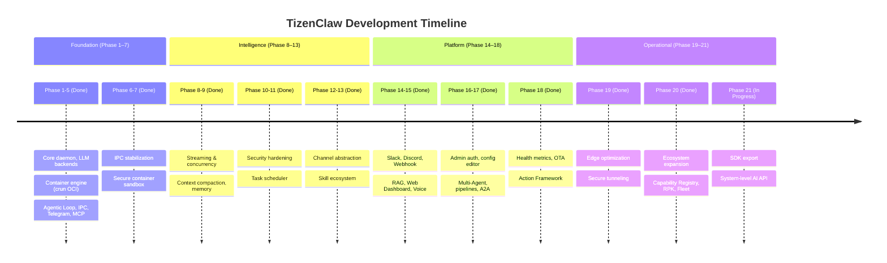
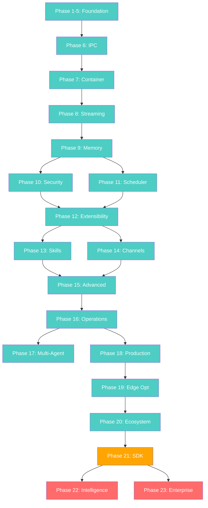

# TizenClaw Development Roadmap

> **Last Updated**: 2026-03-22
> **Reference**: [System Design](DESIGN.md) | [Project Analysis](ANALYSIS.md)

---

## Overview

> 🚀 **Update**: The Python port (`develPython` branch) has officially achieved **~99% feature parity** with the C++ `main` branch, successfully porting all core features, ActionBridge, Channels, and Operations.

This document outlines the development history, current status, and future direction of TizenClaw — the embedded AI agent daemon for Tizen OS. TizenClaw has completed 20 development phases and is actively working on Phase 21.

### Current Status: **Phase 21 — Framework Stabilization & SDK Export** 🔴 In Progress

---

## Completed Phases Summary

| Phase | Title | Key Deliverables | Status |
|:-----:|-------|-----------------|:------:|
| 1–5 | Foundation → E2E Pipeline | C++ daemon, 5 LLM backends, crun OCI, Agentic Loop, IPC, Telegram, MCP | ✅ |
| 6 | IPC Stabilization | Length-prefix protocol, JSON session persistence, Telegram allowlist | ✅ |
| 7 | Secure Container | OCI skill sandbox, Skill Executor IPC, Native MCP, built-in tools | ✅ |
| 8 | Streaming & Concurrency | LLM streaming, thread pool (4 clients), tool_call_id mapping | ✅ |
| 9 | Context & Memory | Context compaction, Markdown persistence, token counting | ✅ |
| 10 | Security Hardening | Tool policy (risk levels), encrypted keys, audit logging | ✅ |
| 11 | Task Scheduler | Cron/interval/once/weekly, LLM integration, retry backoff | ✅ |
| 12 | Extensibility Layer | Channel abstraction, system prompt, usage tracking | ✅ |
| 13 | Skill Ecosystem | inotify hot-reload, model fallback, loop detection | ✅ |
| 14 | New Channels | Slack, Discord, Webhook, Agent-to-Agent messaging | ✅ |
| 15 | Advanced Features | RAG (SQLite + FTS5), Web Dashboard, Voice (TTS/STT) | ✅ |
| 16 | Operational Excellence | Admin authentication, config editor, branding | ✅ |
| 17 | Multi-Agent Orchestration | Supervisor pattern, skill pipelines, A2A protocol | ✅ |
| 18 | Production Readiness | Health metrics, OTA updates, Action Framework, webview | ✅ |
| 19 | Edge Optimization | Secure tunneling, memory optimization, binary size reduction | ✅ |
| 20 | Ecosystem Expansion | Capability Registry, RPK skills/CLI/LLM plugins, Fleet, hybrid RAG | ✅ |

---

## Supported Features (✅ Implemented)

### Core System
| Feature | Description |
|---------|-------------|
| **Agentic Loop** | Iterative LLM → tool call → result → LLM loop with configurable max_iterations |
| **Streaming Responses** | Chunked IPC delivery with progressive Telegram message editing |
| **Context Compaction** | LLM-based summarization when exceeding 15 turns |
| **Edge Memory Management** | Aggressive idle memory reclamation (`malloc_trim`, SQLite cache flush) |
| **Multi-Session** | Concurrent sessions with per-session system prompt and history |
| **JSON-RPC 2.0 IPC** | Length-prefix framing over Abstract Unix Domain Sockets |
| **Thread Pool** | 4 concurrent client connections |

### LLM Backends
| Feature | Description |
|---------|-------------|
| **5 Built-in Backends** | Gemini, OpenAI, Anthropic (Claude), xAI (Grok), Ollama |
| **Unified Priority Switching** | Automatic fallback with configurable priority queue |
| **RPK LLM Plugins** | Runtime backend extension without recompilation |
| **Streaming** | All backends support streaming token delivery |
| **Token Counting** | Per-model token usage parsing and reporting |
| **Usage Tracking** | Per-session, daily, monthly aggregate reports (Markdown) |

### Communication Channels
| Feature | Description |
|---------|-------------|
| **7+ Channels** | Telegram, Slack, Discord, MCP, Webhook, Voice, Web Dashboard |
| **Outbound Messaging** | LLM-initiated proactive notifications and broadcast |
| **Channel Plugins** | `.so` shared object plugins via C API |
| **Config-Driven Activation** | `channels.json` for enable/disable |

### Skills & Tools
| Feature | Description |
|---------|-------------|
| **13 Native CLI Suites** | 35+ device APIs (battery, Wi-Fi, BT, display, sensors, etc.) |
| **20+ Built-in Tools** | Code execution, tasks, sessions, RAG, workflows, pipelines, memory |
| **RPK Skill Plugins** | Python skills via platform-signed Resource Packages |
| **CLI Tool Plugins** | Native TPK binaries with `.tool.md` descriptors |
| **Tizen Action Framework** | Per-action typed LLM tools with auto-discovery and event sync |
| **Hot-Reload** | inotify-based skill detection without daemon restart |
| **Capability Registry** | Unified tool registration with function contracts |
| **Async Skills** | tizen-core event loop for callback-based APIs |

### Security
| Feature | Description |
|---------|-------------|
| **OCI Container Isolation** | crun with PID/Mount/User namespace + seccomp |
| **Tool Execution Policy** | Risk levels, loop detection, blocked skills list |
| **Encrypted API Keys** | Device-bound encryption with `ENC:` prefix (backward compatible) |
| **Audit Logging** | Daily Markdown tables with size-based rotation |
| **UID Authentication** | `SO_PEERCRED` IPC sender validation |
| **Admin Authentication** | Session-token + SHA-256 password hashing |
| **Webhook HMAC** | HMAC-SHA256 signature validation |
| **Platform Signing** | Only platform-certified RPK/TPK plugins allowed |

### Knowledge & Intelligence
| Feature | Description |
|---------|-------------|
| **Hybrid RAG Search** | BM25 keyword (FTS5) + vector cosine via RRF (k=60) |
| **On-Device Embedding** | ONNX Runtime `all-MiniLM-L6-v2` (384-dim, lazy-loaded) |
| **Multi-DB Support** | Attach multiple knowledge databases simultaneously |
| **Persistent Memory** | Long-term, episodic, short-term with `remember`/`recall`/`forget` |
| **Context Fusion** | Multi-source context fusion for LLM |

### Automation & Orchestration
| Feature | Description |
|---------|-------------|
| **Task Scheduler** | Cron/interval/once/weekly with LLM integration and retry |
| **Supervisor Agent** | Goal decomposition and delegation to role agents |
| **Skill Pipelines** | Deterministic sequential execution with variable interpolation |
| **Workflow Engine** | Conditional branching pipelines |
| **Autonomous Triggers** | Event-driven rule engine with LLM evaluation |
| **A2A Protocol** | Cross-device agent communication (JSON-RPC) |

### Operations & Management
| Feature | Description |
|---------|-------------|
| **Web Dashboard** | Dark glassmorphism SPA (port 9090) with chat, sessions, config |
| **Health Monitoring** | Prometheus-style `/api/metrics` + live dashboard panel |
| **OTA Updates** | Over-the-air skill updates with version checking and rollback |
| **Fleet Management** | Multi-device heartbeat and registration (opt-in) |
| **Secure Tunneling** | ngrok for remote dashboard access |
| **Config Editor** | In-browser editing of 7+ config files with backup |

---

## Unsupported / In Progress Features

### 🔴 Phase 21: Framework Stabilization & SDK Export (In Progress)

| Feature | Status | Description |
|---------|:------:|-------------|
| **Modular CAPI Extraction** | 🔴 Pending | Extract `src/libtizenclaw` as independent SDK library |
| **System-level AI SDK** | 🔴 Pending | Enable other Tizen apps to use TizenClaw as AI backend |
| **Dynamic Library Bindings** | 🔴 Pending | C/C++ SDK with stable ABI for third-party integration |

### 🟡 Known Limitations

| Area | Current State | Improvement Direction |
|------|--------------|----------------------|
| **RAG Scalability** | Brute-force cosine similarity | ANN index (HNSW) for very large document sets |
| **Token Budgeting** | Post-response counting | Pre-request estimation to prevent context overflow |
| **Concurrent Tasks** | Sequential task execution | Parallel with dependency graph |
| **Skill Output Validation** | Raw stdout JSON | JSON schema validation per skill |
| **Error Recovery** | In-flight request loss on crash | Request journaling for crash recovery |
| **Log Aggregation** | Local Markdown files | Remote syslog or structured log forwarding |
| **Wake Word** | Not implemented | Requires hardware mic support (STT hardware) |
| **Per-Skill Seccomp** | Shared container profile | Per-skill seccomp profiles and resource quotas |
| **Dashboard Skill UI** | No skill marketplace UI | Dashboard UI for skill discovery and install |
| **Channel Count** | 7 channels | Additional channels (WhatsApp, email, SMS, etc.) |

---

## Future Roadmap

### Phase 21: Framework Stabilization & SDK Export

> **Goal**: Transform TizenClaw from a standalone daemon into a reusable system-level AI SDK

| Deliverable | Priority | Description |
|------------|:--------:|-------------|
| CAPI Library Export | 🔴 High | Stable C API with versioned ABI (`libtizenclaw.so`) |
| SDK Documentation | 🔴 High | Developer guide with integration examples |
| Package Distribution | 🟡 Medium | SDK RPM package for third-party developers |
| Dynamic Bindings | 🟡 Medium | Language bindings (Python, C#) for broader adoption |

### Phase 22: Advanced Intelligence (Planned)

| Deliverable | Priority | Description |
|------------|:--------:|-------------|
| ANN Index (HNSW) | 🟡 Medium | Replace brute-force cosine with approximate nearest neighbor |
| Pre-request Token Budget | 🟡 Medium | Estimate token count before LLM call to prevent overflow |
| Parallel Task Execution | 🟡 Medium | Dependency graph for concurrent task scheduling |
| Request Journaling | 🟡 Medium | Crash recovery via request replay |
| Wake Word Detection | 🟢 Low | Hardware mic-based voice activation |

### Phase 23: Enterprise Scale (Planned)

| Deliverable | Priority | Description |
|------------|:--------:|-------------|
| Remote Log Forwarding | 🟡 Medium | Syslog/structured log export for centralized monitoring |
| Skill Marketplace UI | 🟢 Low | Web Dashboard skill discovery and one-click install |
| Per-Skill Resource Quotas | 🟢 Low | CPU/memory limits per skill execution |
| Additional Channels | 🟢 Low | WhatsApp, email, SMS, Line, etc. |

---

## Phase Dependency Graph

---

## Competitive Comparison

| Category | Feature | TizenClaw | OpenClaw | NanoClaw | ZeroClaw |
|----------|---------|:---------:|:--------:|:--------:|:--------:|
| **Core** | Language | C++20 | TypeScript | TypeScript | Rust |
| | Binary Size | ~812KB | Node.js | Node.js | ~8.8MB |
| | Peak RAM | ~8.5MB idle | ~100MB+ | ~80MB+ | <5MB |
| **LLM** | Multi-backend | ✅ 5+ | ✅ 15+ | ❌ Claude only | ✅ 5+ |
| | Model fallback | ✅ | ✅ | ❌ | ✅ |
| | Streaming | ✅ | ✅ | ✅ | ✅ |
| | Token counting | ✅ | ✅ | ❌ | ✅ |
| **Security** | Container sandbox | ✅ OCI (crun) | ❌ | ❌ | ✅ Docker |
| | Tool policy | ✅ | ✅ | ❌ | ✅ |
| | Encrypted keys | ✅ | ✅ | ✅ | ✅ |
| | Audit logging | ✅ | ✅ | ✅ | ✅ |
| **Channels** | Count | 7+ | 22+ | 5 | 17 |
| | Plugin system | ✅ (.so) | ✅ (npm) | ❌ | ✅ (trait) |
| | Outbound messaging | ✅ | ✅ | ❌ | ❌ |
| **Knowledge** | RAG | ✅ Hybrid (BM25+vector) | ✅ MMR | ❌ | ✅ Hybrid |
| | Memory system | ✅ 3-tier | ✅ | ❌ | ✅ |
| **Agent** | Multi-agent | ✅ 11-agent MVP | ✅ | ✅ Swarms | ❌ |
| | Supervisor pattern | ✅ | ✅ | ❌ | ❌ |
| | A2A protocol | ✅ | ❌ | ❌ | ❌ |
| **Ops** | Web dashboard | ✅ | ✅ | ❌ | ❌ |
| | Health metrics | ✅ | ✅ | ❌ | ✅ |
| | OTA updates | ✅ | ❌ | ❌ | ❌ |
| **Device** | Native device API | ✅ 35+ APIs | ❌ | ❌ | ❌ |
| | Action Framework | ✅ | ❌ | ❌ | ❌ |
| | Voice control | ✅ | ✅ | ❌ | ❌ |

### TizenClaw Unique Strengths

| Strength | Description |
|----------|-------------|
| **Native C++ Performance** | ~812KB binary, ~8.5MB idle PSS — optimal for embedded devices |
| **Edge Memory Management** | Aggressive idle reclamation via `malloc_trim` + SQLite cache flushing |
| **Direct Tizen C-API** | 35+ device APIs via ctypes FFI and Tizen Action Framework |
| **OCI Container Isolation** | crun-based seccomp + namespace — finer syscall control |
| **Lightweight Deployment** | systemd + RPM — no Node.js/Docker runtime required |
| **Anthropic Standard** | SKILL.md format + built-in MCP client + MCP server |
| **Plugin Ecosystem** | RPK skills, TPK CLI tools, SO channels, RPK LLM backends |

---

## Code Statistics

| Category | Files | LOC |
|----------|------:|----:|
| C++ Source & Headers (`src/`) | 151 | ~34,200 |
| Python Skills & Utils | 36 | ~4,700 |
| Shell Scripts | 9 | ~950 |
| Web Frontend (HTML/CSS/JS) | 3 | ~3,700 |
| Unit Tests | 42 | ~7,800 |
| E2E Tests | 2 | ~800 |
| **Total** | **~243** | **~52,150** |
