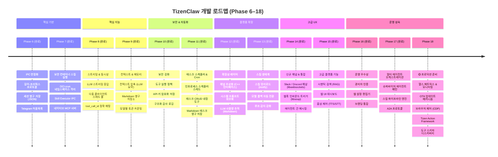
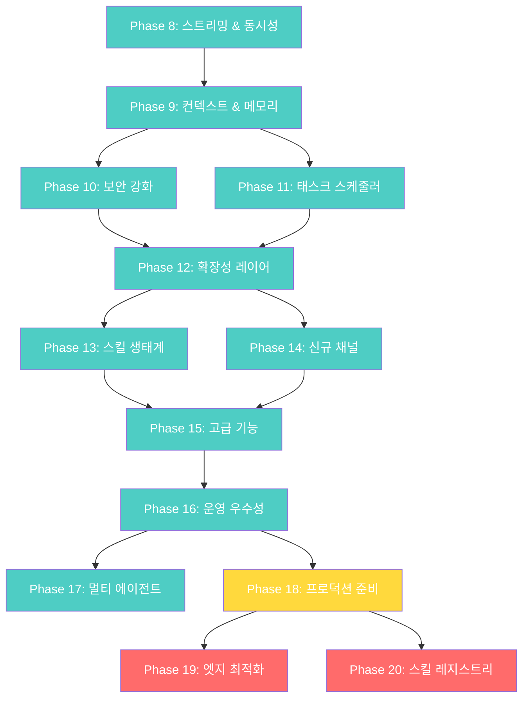

# TizenClaw 개발 로드맵 v4.0

> **작성일**: 2026-03-09
> **기반 문서**: [프로젝트 분석](ANALYSIS.md) | [설계 문서](DESIGN.md)

---

## 기능 비교 매트릭스

> **OpenClaw** (TypeScript, ~700+ 파일), **NanoClaw** (TypeScript, ~50 파일), **ZeroClaw** (Rust, 단일 바이너리)과의 경쟁 분석

| 카테고리 | 기능 | OpenClaw | NanoClaw | ZeroClaw | TizenClaw | 갭 |
|----------|------|:--------:|:--------:|:--------:|:---------:|:--:|
| **IPC** | 다중 클라이언트 동시 처리 | ✅ 병렬 세션 | ✅ 그룹 큐 | ✅ Async Tokio | ✅ 스레드 풀 | ✅ |
| **IPC** | 스트리밍 응답 | ✅ SSE / WebSocket | ✅ `onOutput` 콜백 | ✅ Block 스트리밍 | ✅ 청크 IPC | ✅ |
| **IPC** | 견고한 메시지 프레이밍 | ✅ WebSocket + JSON-RPC | ✅ 센티널 마커 | ✅ JSON-RPC 2.0 | ✅ 길이-프리픽스 + JSON-RPC | ✅ |
| **메모리** | 대화 영구 저장 | ✅ SQLite + Vector DB | ✅ SQLite | ✅ SQLite + FTS5 | ✅ Markdown (YAML frontmatter) | ✅ |
| **메모리** | 컨텍스트 압축 | ✅ LLM 자동 요약 | ❌ | ✅ Snapshot/hydrate | ✅ LLM 자동 요약 | ✅ |
| **메모리** | 시맨틱 검색 (RAG) | ✅ MMR + 임베딩 | ❌ | ✅ 하이브리드 BM25+벡터 | ✅ SQLite + 코사인 유사도 | ✅ |
| **LLM** | 모델 폴백 | ✅ 자동 전환 (18K LOC) | ❌ | ✅ Provider trait | ✅ 자동 전환 + 백오프 | ✅ |
| **LLM** | 토큰 카운팅 | ✅ 모델별 정확 계산 | ❌ | ✅ Provider 수준 | ✅ 모델별 파싱 | ✅ |
| **LLM** | 사용량 추적 | ✅ 모델별 토큰 사용량 | ❌ | ❌ | ✅ 일별/월별 Markdown | ✅ |
| **보안** | 도구 실행 정책 | ✅ 화이트/블랙리스트 | ❌ | ✅ 자율성 레벨 | ✅ 위험등급 + 루프 감지 | ✅ |
| **보안** | 발신자 허용목록 | ✅ `allowlist-match.ts` | ✅ `sender-allowlist.ts` | ✅ 기본 거부 | ✅ UID + chat_id | ✅ |
| **보안** | API 키 관리 | ✅ 로테이션 + 암호화 | ✅ stdin 전달 | ✅ 암호화 저장 | ✅ 디바이스 바인딩 암호화 | ✅ |
| **보안** | 감사 로깅 | ✅ 45K LOC `audit.ts` | ✅ `ipc-auth.test.ts` | ✅ Observer trait | ✅ Markdown 감사 + dlog | ✅ |
| **보안** | 관리자 인증 | ✅ OAuth / 토큰 | ❌ | ✅ 페어링 코드 | ✅ 세션 토큰 + SHA-256 | ✅ |
| **자동화** | 태스크 스케줄러 | ✅ 기본 cron | ✅ cron/interval/일회성 | ✅ Cron + HEARTBEAT.md | ✅ cron/interval/once/weekly | ✅ |
| **채널** | 멀티 채널 지원 | ✅ 22개 이상 | ✅ 5개 (스킬 기반) | ✅ 17개 채널 | ✅ 7개 (Telegram, MCP, Webhook, Slack, Discord, Voice, Web) | ✅ |
| **채널** | 채널 추상화 | ✅ 정적 레지스트리 | ✅ 자기 등록 | ✅ Channel trait | ✅ C++ Channel 인터페이스 | ✅ |
| **프롬프트** | 시스템 프롬프트 | ✅ 동적 생성 | ✅ 그룹별 `CLAUDE.md` | ✅ Identity config | ✅ 외부 파일 + 동적 생성 | ✅ |
| **에이전트** | 에이전트 간 통신 | ✅ `sessions_send` | ✅ Agent Swarms | ❌ | ✅ 세션별 프롬프트 + send_to_session | ✅ |
| **에이전트** | 루프 감지 | ✅ 18K LOC 감지기 | ✅ 타임아웃 + idle | ❌ | ✅ 반복 + idle + 설정 가능 | ✅ |
| **에이전트** | tool_call_id 매핑 | ✅ 정확 추적 | ✅ SDK 네이티브 | ✅ Provider trait | ✅ 백엔드별 파싱 | ✅ |
| **인프라** | DB 엔진 | ✅ SQLite + sqlite-vec | ✅ SQLite | ✅ SQLite + PostgreSQL | ✅ SQLite (RAG 임베딩) | ✅ |
| **인프라** | 구조화 로깅 | ✅ Pino (JSON) | ✅ Pino (JSON) | ✅ Observer trait | ✅ Markdown 감사 테이블 | ✅ |
| **인프라** | 스킬 핫리로드 | ✅ 런타임 설치 | ✅ apply/rebase | ✅ TOML 매니페스트 | ✅ inotify 자동 리로드 | ✅ |
| **인프라** | 터널 지원 | ✅ Tailscale Serve/Funnel | ❌ | ✅ Cloudflare/Tailscale/ngrok | ❌ | 🟡 |
| **인프라** | 헬스 메트릭스 | ✅ Health checks | ❌ | ✅ Observer trait | ✅ `/api/metrics` + 대시보드 | ✅ |
| **인프라** | OTA 업데이트 | ❌ | ❌ | ❌ | ✅ OTA 스킬 업데이터 + 롤백 | ✅ |
| **UX** | 브라우저 제어 | ✅ CDP Chrome | ❌ | ✅ Agent 브라우저 | ❌ | 🟡 |
| **UX** | 음성 인터페이스 | ✅ 웨이크 워드 + TTS | ❌ | ❌ | ✅ Tizen STT/TTS C-API | ✅ |
| **UX** | 웹 UI | ✅ 제어 UI + 웹챗 | ❌ | ❌ | ✅ 관리 대시보드 + 채팅 | ✅ |
| **운영** | 설정 관리 | ✅ UI 기반 설정 | ❌ | ✅ TOML + 핫리로드 | ✅ 웹 설정 편집기 + 백업 | ✅ |
| **디바이스** | 네이티브 디바이스 액션 | ❌ | ❌ | ❌ | ✅ Tizen Action Framework (Per-action LLM 도구) | ✅ |

---

## TizenClaw 고유 강점

| 강점 | 설명 |
|------|------|
| **네이티브 C++ 성능** | TypeScript 대비 낮은 메모리/CPU — Tizen 임베디드 환경에 최적 |
| **OCI 컨테이너 격리** | crun 기반 `seccomp` + `namespace` — 앱 수준 샌드박싱보다 정밀한 시스콜 제어 |
| **Tizen C-API 직접 접근** | ctypes 래퍼로 디바이스 하드웨어 (배터리, Wi-Fi, BT, 디스플레이, 볼륨, 센서, 알림, 알람) 직접 제어 |
| **멀티 LLM 지원** | 5개 백엔드 (Gemini, OpenAI, Claude, xAI, Ollama) 런타임 전환 가능 |
| **경량 배포** | systemd + RPM — Node.js/Docker 없이 단독 디바이스 실행 |
| **네이티브 MCP 서버** | C++ MCP 서버가 데몬에 내장 — Claude Desktop에서 sdb를 통해 Tizen 디바이스 제어 |
| **Tizen Action Framework** | Per-action LLM 도구 + MD 스키마 캐싱 + 이벤트 기반 업데이트 |
| **도구 스키마 디스커버리** | 내장 + 액션 도구 스키마를 MD 파일로 저장, LLM 시스템 프롬프트에 자동 로드 |

---

## 로드맵 개요



---

## 완료된 Phase

### Phase 1–5: 기반 → 엔드-투-엔드 파이프라인 ✅

| Phase | 주요 결과물 |
|:-----:|-----------|
| 1 | C++ 데몬, 5개 LLM 백엔드, `HttpClient`, 팩토리 패턴 |
| 2 | `ContainerEngine` (crun OCI), 이중 컨테이너 아키텍처, `unshare+chroot` 폴백 |
| 3 | Agentic Loop (최대 5회 반복), 병렬 도구 실행 (`std::async`), 세션 메모리 |
| 4 | 25개 스킬, `tizen_capi_utils.py` ctypes 래퍼, `CLAW_ARGS` 규약 |
| 5 | 추상 유닉스 소켓 IPC, `SO_PEERCRED` 인증, Telegram 브릿지, MCP 서버 |

### Phase 6: IPC/Agentic Loop 안정화 ✅

- ✅ 길이-프리픽스 IPC 프로토콜 (`[4바이트 길이][JSON]`)
- ✅ 세션 영구 저장 (JSON 파일 기반, `/opt/usr/share/tizenclaw/sessions/`)
- ✅ Telegram 발신자 `allowed_chat_ids` 검증
- ✅ 모든 백엔드에서 `tool_call_id` 정확 매핑

### Phase 7: 보안 컨테이너 스킬 실행 ✅

- ✅ OCI 컨테이너 스킬 샌드박스 — 네임스페이스 격리 (PID/Mount)
- ✅ Skill Executor IPC 패턴 (길이-프리픽스 JSON + 유닉스 도메인 소켓)
- ✅ 호스트 바인드 마운트 전략 — 컨테이너 내부에서 Tizen C-API 접근
- ✅ 네이티브 C++ MCP 서버 (`--mcp-stdio`, JSON-RPC 2.0)
- ✅ 내장 도구: `execute_code`, `file_manager`

---

## Phase 8: 스트리밍 & 동시성 ✅ (완료)

> **목표**: 응답 지연 제거, 다중 클라이언트 동시 사용 지원

### 8.1 LLM 스트리밍 응답 전달
| 항목 | 내용 |
|------|------|
| **갭** | 전체 응답 버퍼링 후 전달 — 긴 응답 시 체감 지연 발생 |
| **참고** | OpenClaw: SSE/WebSocket 스트리밍 · NanoClaw: `onOutput` 콜백 |
| **계획** | 청크 단위 IPC 응답 (`type: "stream_chunk"` / `"stream_end"`) |

**수정 대상 파일:**
- 각 LLM 백엔드 (`gemini_backend.cc`, `openai_backend.cc`, `anthropic_backend.cc`, `ollama_backend.cc`) — 스트리밍 API 지원
- `agent_core.cc` — 스트리밍 콜백 전파
- `tizenclaw.cc` — IPC 소켓 청크 전달
- `telegram_client.cc` — `editMessageText`를 통한 점진적 메시지 편집

**완료 기준:**
- [x] LLM 토큰 생성과 동시에 클라이언트에 전달
- [x] Telegram에서 점진적 응답 표시
- [x] 스트리밍 미지원 백엔드에 대한 비스트리밍 폴백

---

### 8.2 다중 클라이언트 동시 처리
| 항목 | 내용 |
|------|------|
| **갭** | 순차 `accept()` — 한 번에 하나의 클라이언트만 처리 |
| **참고** | NanoClaw: `GroupQueue` 공정 스케줄링 · OpenClaw: 병렬 세션 |
| **계획** | 스레드 풀 (`std::thread`) + 세션별 뮤텍스 |

**수정 대상 파일:**
- `tizenclaw.cc` — 풀 제한 있는 클라이언트별 스레드 생성
- `agent_core.cc` — 동시 접근 보호를 위한 세션별 뮤텍스

**완료 기준:**
- [x] Telegram + MCP 동시 요청 시 양쪽 모두 응답
- [x] 데이터 레이스 없음 (session_mutex_ 세션별 잠금)
- [x] 연결 제한: `kMaxConcurrentClients = 4`

---

### 8.3 tool_call_id 정확 매핑
| 항목 | 내용 |
|------|------|
| **갭** | `call_0`, `toolu_0` 하드코딩 — 병렬 도구 결과 혼동 가능 |
| **참고** | OpenClaw: `tool-call-id.ts` 정확 추적 |
| **계획** | 각 LLM 응답에서 실제 ID 파싱, 피드백까지 일관 전달 |

**완료 기준:**
- [x] 각 백엔드에서 실제 `tool_call_id` 파싱
- [x] Gemini/Ollama 전역 고유 ID 생성 (timestamp+hex+index)

---

## Phase 9: 컨텍스트 & 메모리 ✅ (완료)

> **목표**: 지능적 컨텍스트 관리, 구조화된 영구 저장소

### 9.1 컨텍스트 압축
| 항목 | 내용 |
|------|------|
| **갭** | 20턴 초과 시 단순 FIFO 삭제 — 초기 중요 컨텍스트 손실 |
| **참고** | OpenClaw: `compaction.ts` LLM 자동 요약 (15K LOC) |
| **구현** | 15턴 초과 시 가장 오래된 10턴을 LLM으로 요약 → 1턴으로 압축 |

**수정 대상 파일:**
- `agent_core.hh` — `CompactHistory()` 메서드 추가, 압축 임계값 상수
- `agent_core.cc` — LLM 요약 기반 컨텍스트 압축 구현, FIFO 폴백

**완료 기준:**
- [x] 15턴 초과 시 가장 오래된 10턴 요약
- [x] `[compressed]` 마커 표시
- [x] 요약 실패 시 FIFO 트리밍 폴백
- [x] 하드 리밋 30턴 (FIFO)

---

### 9.2 Markdown 영구 저장소
| 항목 | 내용 |
|------|------|
| **갭** | 세션 데이터를 JSON 파일로 관리 — 가독성 부족, 메타데이터 없음 |
| **참고** | NanoClaw: `db.ts` (19K LOC) — 메시지, 태스크, 세션, 그룹 |
| **구현** | Markdown 파일 (YAML frontmatter) — 새 의존성 없이 구조화 저장 |

**저장 구조:**
```
/opt/usr/share/tizenclaw/
├── sessions/{id}.md       ← YAML frontmatter + ## role 헤더
├── logs/{YYYY-MM-DD}.md   ← 일별 스킬 실행 테이블
└── usage/{id}.md          ← 세션별 토큰 사용량
```

**수정 대상 파일:**
- `session_store.hh` — 새 구조체 (`SkillLogEntry`, `TokenUsageEntry`, `TokenUsageSummary`), Markdown 직렬화 메서드
- `session_store.cc` — Markdown 파서/라이터, YAML frontmatter, 레거시 JSON 자동 마이그레이션, 원자적 파일 쓰기

**완료 기준:**
- [x] 세션 히스토리 Markdown 저장 (JSON → MD 자동 마이그레이션)
- [x] 스킬 실행 로그 일별 Markdown 테이블
- [x] 데몬 재시작 시 모든 데이터 보존

---

### 9.3 모델별 토큰 카운팅
| 항목 | 내용 |
|------|------|
| **갭** | 컨텍스트 윈도우 소비량 파악 불가 |
| **참고** | OpenClaw: 모델별 정확 토큰 카운팅 |
| **구현** | 각 백엔드 응답의 `usage` 필드 파싱 → Markdown 파일 저장 |

**수정 대상 파일:**
- `llm_backend.hh` — `LlmResponse`에 `prompt_tokens`, `completion_tokens`, `total_tokens` 추가
- `gemini_backend.cc` — `usageMetadata` 파싱
- `openai_backend.cc` — `usage` 파싱 + `insert()` 모호성 버그 수정
- `anthropic_backend.cc` — `usage.input_tokens/output_tokens` 파싱
- `ollama_backend.cc` — `prompt_eval_count/eval_count` 파싱
- `agent_core.cc` — 매 LLM 호출 후 토큰 로깅, 스킬 실행 시간 측정

**완료 기준:**
- [x] 요청별 토큰 사용량 로깅
- [x] 세션별 누적 사용량 Markdown 파일에 기록
- [x] 스킬 실행 시간 `std::chrono`로 측정 및 로깅

---

## Phase 10: 보안 강화 ✅

> **목표**: 도구 실행 안전성, 자격증명 보호, 감사 추적

### 10.1 도구 실행 정책 시스템
| 항목 | 내용 |
|------|------|
| **갭** | LLM이 요청하는 모든 도구를 무조건 실행 |
| **참고** | OpenClaw: `tool-policy.ts` (화이트/블랙리스트) |
| **계획** | 스킬별 `risk_level` + 루프 감지 + 정책 위반 피드백 |

**완료 기준:**
- [x] 부작용 스킬 (`launch_app`, `terminate_app`, `schedule_alarm`, `control_display`, `control_haptic`, `control_led`, `control_power`, `control_volume`, `send_notification`) `risk_level: "high"` 또는 `"medium"` 지정
- [x] 읽기 전용 스킬 (`get_battery_info`, `get_wifi_info`, `get_bluetooth_info`, `list_apps`, `get_device_info`, `get_display_info`, `get_system_info`, `get_runtime_info`, `get_storage_info`, `get_system_settings`, `get_network_info`, `get_sensor_data`, `get_package_info`) `risk_level: "low"` 지정
- [x] 동일 스킬 + 동일 인자 3회 반복 → 차단 (루프 방지)
- [x] 정책 위반 사유를 LLM에 도구 결과로 피드백
- [x] `tool_policy.json`으로 정책 설정 가능 (`max_repeat_count`, `blocked_skills`, `risk_overrides`)

---

### 10.2 API 키 암호화 저장
| 항목 | 내용 |
|------|------|
| **갭** | `llm_config.json`에 API 키 평문 저장 |
| **참고** | OpenClaw: `secrets/` · NanoClaw: stdin 전달 |
| **계획** | GLib SHA-256 키 유도 + XOR 스트림 암호화 (디바이스 바인딩) |

**완료 기준:**
- [x] `ENC:` 접두사 + base64 형식의 암호화 저장 (평문 하위 호환)
- [x] `/etc/machine-id` 기반 GLib GChecksum 키 유도
- [x] CLI 마이그레이션 도구: `tizenclaw --encrypt-keys [config_path]`
- [x] `AgentCore::Initialize()`에서 자동 복호화

---

### 10.3 구조화 감사 로깅
| 항목 | 내용 |
|------|------|
| **갭** | dlog 평문 — 구조화 쿼리 불가, 원격 수집 미지원 |
| **참고** | OpenClaw: Pino JSON 로깅 · NanoClaw: Pino JSON 로깅 |
| **계획** | Markdown 감사 로그 파일 (Phase 9 저장 형식과 일관) |

**완료 기준:**
- [x] 모든 IPC 인증, 도구 실행, 정책 위반, 설정 변경을 Markdown 테이블 행으로 로깅
- [x] `audit/YYYY-MM-DD.md` 일별 감사 파일 (YAML frontmatter 포함)
- [x] 크기 기반 로그 로테이션 (5MB, 최대 5개 로테이션)
- [x] dlog + 파일 이중 출력

---

## Phase 11: 태스크 스케줄러 & Cron ✅ (완료)

> **목표**: LLM 연동 시간 기반 자동화

### 11.1 Cron/Interval 태스크 시스템
| 항목 | 내용 |
|------|------|
| **갭** | `schedule_alarm`은 단순 타이머 — 반복, cron, LLM 연동 없음 |
| **참고** | NanoClaw: `task-scheduler.ts` (8K LOC) — cron, interval, 일회성 |
| **구현** | 인프로세스 `TaskScheduler` (타이머 스레드 + 실행 스레드), 내장 도구 (`create_task`, `list_tasks`, `cancel_task`) |

**구현 내용:**
- `TaskScheduler` 클래스 — 타이머/실행 스레드 분리 (IPC 블로킹 방지)
- 스케줄 표현식: `daily HH:MM`, `interval Ns/Nm/Nh`, `once YYYY-MM-DD HH:MM`, `weekly DAY HH:MM`
- `AgentCore::ProcessPrompt()` 직접 호출 (IPC 슬롯 미소비)
- `tasks/task-{id}.md` Markdown 영구 저장 (YAML frontmatter)
- 실패 태스크 지수 백오프 재시도 (최대 3회)

**완료 기준:**
- [x] "매일 오전 9시에 날씨 알려줘" → cron 태스크 → 자동 실행
- [x] 자연어로 태스크 목록 조회 및 취소
- [x] 실행 이력 Markdown 저장 (Phase 9.2)
- [x] 실패 태스크 백오프 재시도

---

## Phase 12: 확장성 레이어 ✅ (완료)

> **목표**: 미래 성장을 위한 아키텍처 유연성

### 12.1 채널 추상화 레이어
| 항목 | 내용 |
|------|------|
| **갭** | Telegram과 MCP가 완전히 별개 — 새 채널 추가 시 대규모 작업 필요 |
| **참고** | NanoClaw: `channels/registry.ts` 자기 등록 · OpenClaw: 정적 레지스트리 |
| **구현** | `Channel` 인터페이스 (C++) + `ChannelRegistry` 라이프사이클 관리 |

**구현 내용:**
- `Channel` 추상 인터페이스: `GetName()`, `Start()`, `Stop()`, `IsRunning()`
- `ChannelRegistry`: 등록, 전체 시작/정지, 이름별 검색
- `TelegramClient`와 `McpServer`를 `Channel` 구현으로 마이그레이션
- `TizenClawDaemon`이 직접 포인터 대신 `ChannelRegistry` 사용

**완료 기준:**
- [x] 새 채널은 `Channel` 인터페이스 구현만으로 추가
- [x] 기존 Telegram + MCP를 인터페이스로 마이그레이션
- [x] `ChannelRegistry`가 라이프사이클 관리 (전체 시작/정지)

---

### 12.2 시스템 프롬프트 외부화 ✅ (완료)
| 항목 | 내용 |
|------|------|
| **갭** | 시스템 프롬프트 C++ 하드코딩 — 변경 시 재빌드 필요 |
| **참고** | NanoClaw: 그룹별 `CLAUDE.md` · OpenClaw: `system-prompt.ts` |
| **계획** | `llm_config.json`의 `system_prompt` 또는 `/opt/usr/share/tizenclaw/config/system_prompt.txt` |

**구현 내용:**
- `LlmBackend::Chat()` 인터페이스: `system_prompt` 파라미터 추가
- 4단계 fallback 로딩: config inline → `system_prompt_file` 경로 → 기본 파일 → 하드코딩
- `{{AVAILABLE_TOOLS}}` placeholder를 현재 스킬 목록으로 동적 치환
- 백엔드별 API 형식: Gemini (`system_instruction`), OpenAI/Ollama (`system` role), Anthropic (`system` 필드)

**완료 기준:**
- [x] 외부 파일/설정에서 로드
- [x] 현재 스킬 목록을 프롬프트에 동적 포함
- [x] 설정 없으면 기본 하드코딩 프롬프트 (하위 호환)

---

### 12.3 LLM 사용량 추적
| 항목 | 내용 |
|------|------|
| **갭** | API 비용/사용량 가시성 없음 |
| **참고** | OpenClaw: `usage.ts` (5K LOC) |
| **구현** | `usage` 필드 파싱 → Markdown 집계 → 세션/일/월별 보고서 |

**저장 구조:**
```
/opt/usr/share/tizenclaw/usage/
├── {session-id}.md       ← 세션별 토큰 사용량
├── daily/YYYY-MM-DD.md   ← 일별 집계
└── monthly/YYYY-MM.md    ← 월별 집계
```

**완료 기준:**
- [x] 세션별 토큰 사용량 요약 (Phase 9에서 기존 구현)
- [x] Markdown 파일로 일별/월별 누적 저장
- [x] IPC `get_usage` 명령을 통한 사용량 조회 (daily/monthly/session)

---

## Phase 13: 스킬 생태계 ✅ (완료)

> **목표**: 강인한 스킬 관리와 LLM 복원력

### 13.1 스킬 핫리로드
| 항목 | 내용 |
|------|------|
| **갭** | 신규/수정 스킬 적용 시 데몬 재시작 필요 |
| **참고** | OpenClaw: 런타임 스킬 업데이트 · NanoClaw: skills-engine apply/rebase |
| **구현** | `SkillWatcher` 클래스 — Linux `inotify` API + 500ms 디바운싱 |

**구현 내용:**
- `SkillWatcher`가 `/opt/usr/share/tizenclaw/skills/`에서 `manifest.json` 변경 감시
- 500ms 디바운싱으로 빠른 파일 변경 배치 처리
- 새로 생성된 스킬 하위 디렉터리 자동 감시
- `AgentCore`의 스레드 안전 `ReloadSkills()` — 캐시 삭제 및 시스템 프롬프트 재생성
- `TizenClawDaemon` 라이프사이클에 통합 (`OnCreate`/`OnDestroy`)

**완료 기준:**
- [x] 새 스킬 디렉터리 자동 감지
- [x] `manifest.json` 수정 시 리로드 트리거
- [x] 데몬 재시작 불필요

---

### 13.2 모델 폴백 자동 전환
| 항목 | 내용 |
|------|------|
| **갭** | LLM API 실패 시 에러 반환 — 대안 백엔드 미시도 |
| **참고** | OpenClaw: `model-fallback.ts` (18K LOC) |
| **구현** | `llm_config.json`에 `fallback_backends` 배열, `TryFallbackBackends()` 순차 재시도 |

**구현 내용:**
- `llm_config.json`의 `fallback_backends` 배열로 순차 LLM 백엔드 재시도
- `TryFallbackBackends()`가 폴백 백엔드를 지연 생성 및 초기화
- 폴백 백엔드에 대한 API 키 복호화 및 xAI 아이덴티티 주입
- rate-limit (HTTP 429) 감지 + 지수 백오프
- 폴백 성공 시 주 백엔드 전환 및 감사 이벤트 로깅

**완료 기준:**
- [x] Gemini 실패 → 자동으로 OpenAI → Ollama 시도
- [x] 폴백 사유 로깅
- [x] rate-limit 에러 시 백오프 후 재시도

---

### 13.3 루프 감지 강화
| 항목 | 내용 |
|------|------|
| **갭** | `kMaxIterations = 5`만 존재 — 컨텐츠 기반 감지 없음 |
| **참고** | OpenClaw: 18K LOC `tool-loop-detection.ts` · NanoClaw: 타임아웃 + idle 감지 |
| **구현** | `ToolPolicy::CheckIdleProgress()` + `tool_policy.json`의 `max_iterations` 설정 |

**구현 내용:**
- `ToolPolicy::CheckIdleProgress()`를 통한 idle 감지: 최근 3회 반복 출력 추적
- 모든 출력이 동일하면 (진행 없음) 사용자 친화적 메시지와 함께 중단
- `tool_policy.json`의 `max_iterations` 설정 (하드코딩된 `kMaxIterations=5` 대체)
- `ProcessPrompt` 시작 시 `ResetIdleTracking()` 호출

**완료 기준:**
- [x] 동일 도구 + 동일 인자 3회 반복 → 설명과 함께 강제 중단
- [x] 반복 간 진행 없음 감지 (idle)
- [x] 세션별 `max_iterations` 설정 가능

---

## Phase 14: 신규 채널 & 통합 ✅ (완료)

> **목표**: 커뮤니케이션 범위 확장, 에이전트 협조 도입

### 14.1 신규 커뮤니케이션 채널
| 항목 | 내용 |
|------|------|
| **갭** | Telegram + MCP만 — Slack, Discord, 웹훅 미지원 |
| **참고** | OpenClaw: 22개 이상 · NanoClaw: WhatsApp, Telegram, Slack, Discord, Gmail |
| **계획** | Phase 12 채널 추상화를 활용하여 Slack + Discord 구현 |

**완료 기준:**
- [x] Slack 채널 (Bot API Socket Mode, libwebsockets)
- [x] Discord 채널 (Gateway WebSocket, libwebsockets)
- [x] 각 채널 `ChannelRegistry` 등록 (총 5개 채널)

---

### 14.2 웹훅 인바운드 트리거
| 항목 | 내용 |
|------|------|
| **갭** | 외부 이벤트로 작업을 트리거할 방법 없음 |
| **참고** | OpenClaw: 웹훅 자동화 · NanoClaw: Gmail Pub/Sub |
| **계획** | 경량 HTTP 리스너로 웹훅 이벤트 수신 → Agentic Loop로 라우팅 |

**완료 기준:**
- [x] 수신 웹훅용 HTTP 엔드포인트 (libsoup `SoupServer`)
- [x] 설정 가능한 URL 경로 → 세션 매핑 (`webhook_config.json`)
- [x] HMAC-SHA256 서명 검증 (GLib `GHmac`)

---

### 14.3 에이전트 간 메시징
| 항목 | 내용 |
|------|------|
| **갭** | 단일 에이전트 세션 — 에이전트 간 협조 불가 |
| **참고** | OpenClaw: `sessions_send` · NanoClaw: Agent Swarms |
| **계획** | 다중 세션 관리 + 세션 간 메시지 전달 |

**완료 기준:**
- [x] 세션별 시스템 프롬프트로 복수 동시 에이전트 세션
- [x] 내장 도구: `create_session`, `list_sessions`, `send_to_session`
- [x] 세션별 격리 (별도 히스토리 + `GetSessionPrompt` 시스템 프롬프트)

---

## Phase 15: 고급 플랫폼 기능 ✅ (2026-03-07 완료)

> **목표**: TizenClaw 고유 플랫폼 위치를 활용한 장기 비전 기능

### 15.1 시맨틱 검색 (RAG)
| 항목 | 내용 |
|------|------|
| **갭** | 대화 히스토리 외 지식 검색 불가 |
| **참고** | OpenClaw: sqlite-vec + 임베딩 검색 + MMR |
| **계획** | 대화 히스토리 + 문서 저장소에 대한 임베딩 기반 검색 |

**완료 기준:**
- [x] 문서 수집 및 임베딩 저장 (`embedding_store.hh/.cc` — SQLite + 코사인 유사도)
- [x] Agentic Loop 내 시맨틱 검색 쿼리 (`ingest_document`, `search_knowledge` 내장 도구)
- [x] SQLite 연동 (순차 코사인 유사도 — 임베디드 규모에 충분)
- [x] 임베딩 API 지원: Gemini (`text-embedding-004`), OpenAI (`text-embedding-3-small`), Ollama

---

### 15.2 웹 UI 대시보드
| 항목 | 내용 |
|------|------|
| **갭** | 모니터링/제어용 시각 인터페이스 없음 |
| **참고** | OpenClaw: Gateway에서 제공하는 제어 UI + 웹챗 |
| **계획** | 내장 HTTP 서버에서 제공하는 경량 HTML+JS 대시보드 |

**완료 기준:**
- [x] 세션 상태, 활성 태스크, 스킬 실행 이력 표시 (`/api/sessions`, `/api/tasks`, `/api/logs`)
- [x] REST API를 통한 감사 로그 조회
- [x] 직접 상호작용을 위한 기본 채팅 인터페이스 (`/api/chat` + SPA 프론트엔드)
- [x] 포트 9090 다크 글래스모피즘 SPA (`web_dashboard.hh/.cc` + `data/web/`)

---

### 15.3 음성 제어 (TTS/STT)
| 항목 | 내용 |
|------|------|
| **갭** | 텍스트 전용 상호작용 |
| **참고** | OpenClaw: Voice Wake + Talk Mode (ElevenLabs + 시스템 TTS) |
| **계획** | Tizen 네이티브 TTS/STT C-API 연동 — 음성 입출력 |

**완료 기준:**
- [x] Tizen STT C-API를 통한 음성 입력 (`voice_channel.hh/.cc` — 조건부 컴파일)
- [x] Tizen TTS C-API를 통한 응답 음성 출력 (조건부 컴파일)
- [ ] 웨이크 워드 감지 (연기 — 하드웨어 마이크 지원 필요)

---

## Phase 16: 운영 우수성 ✅ (2026-03-07 완료)

> **목표**: 웹 인터페이스를 통한 원격 유지보수 및 설정 관리

### 16.1 관리자 인증 시스템
| 항목 | 내용 |
|------|------|
| **갭** | 인증 없이 대시보드 접근 가능 |
| **계획** | SHA-256 비밀번호 해싱의 세션 토큰 메커니즘 |

**완료 기준:**
- [x] 세션 토큰으로 API 엔드포인트 보호
- [x] 기본 `admin/admin` 자격증명 + 필수 비밀번호 변경
- [x] `admin_password.json`에 SHA-256 비밀번호 해시 저장

---

### 16.2 중앙집중 설정 관리
| 항목 | 내용 |
|------|------|
| **갭** | 설정 변경에 터미널 접근과 파일 편집 필요 |
| **계획** | 검증 및 백업-온-라이트 기능의 인브라우저 JSON 편집기 |

**완료 기준:**
- [x] 웹 UI를 통한 7개 설정 파일 편집 (`llm_config.json`, `telegram_config.json`, `slack_config.json`, `discord_config.json`, `webhook_config.json`, `tool_policy.json`, `system_prompt.txt`)
- [x] 덮어쓰기 전 자동 백업
- [x] 임의 파일 쓰기 방지를 위한 파일 화이트리스트
- [x] 관리 인터페이스에서 데몬 재시작 트리거

---

### 16.3 브랜딩 & 아이덴티티
| 항목 | 내용 |
|------|------|
| **갭** | 대시보드 외관이 일반적 |
| **계획** | 공식 로고 통합 및 일관된 브랜딩 |

**완료 기준:**
- [x] 사이드바에 `tizenclaw.jpg` 로고 통합
- [x] 모든 페이지에 일관된 다크 글래스모피즘 테마

---

## Phase 17: 멀티 에이전트 오케스트레이션 ✅ (2026-03-07 완료)

> **목표**: 복잡한 자율 워크플로우를 위한 고급 멀티 에이전트 패턴

### 17.1 슈퍼바이저 에이전트 패턴
| 항목 | 내용 |
|------|------|
| **갭** | 에이전트 간 통신이 평면적 메시징 — 계층적 위임 없음 |
| **참고** | OpenClaw: `sessions_send` · LangGraph: Supervisor 패턴 |
| **구현** | `SupervisorEngine`이 목표 분해 → 전문 역할 에이전트에 위임 → 결과 검증 |

**구현 내용:**
- `AgentRole` 구조체: 역할명, 시스템 프롬프트, 허용 도구, 우선순위
- `SupervisorEngine`: LLM을 통한 목표 분해, 역할 에이전트에 위임, 결과 집계
- `agent_roles.json`으로 설정 가능 (샘플: `device_controller`, `researcher`, `writer`)
- 내장 도구: `run_supervisor`, `list_agent_roles`

**완료 기준:**
- [x] 도구 제한이 있는 역할 기반 에이전트 생성
- [x] 슈퍼바이저 목표 분해 및 위임 루프
- [x] 결과 집계 및 검증

---

### 17.2 스킬 파이프라인 엔진
| 항목 | 내용 |
|------|------|
| **갭** | LLM 반응적 도구 실행만 — 결정적 워크플로우 없음 |
| **참고** | LangChain: Chains · n8n: 워크플로우 자동화 |
| **구현** | `PipelineExecutor`로 단계 간 데이터 흐름을 가진 순차/조건 스킬 실행 |

**구현 내용:**
- `PipelineExecutor` 클래스: CRUD 작업, 순차 단계 실행, `{{variable}}` 보간 (점 접근 포함)
- 에러 핸들링: 단계별 재시도, 실패 시 건너뛰기, 최대 재시도 횟수
- 조건 분기 (`if/then/else`) — 단계 표현식 평가
- `pipelines/` 디렉터리에 JSON 영구 저장
- 내장 도구: `create_pipeline`, `list_pipelines`, `run_pipeline`, `delete_pipeline`
- `TaskScheduler`와 통합하여 cron 트리거 파이프라인

**완료 기준:**
- [x] 파이프라인 JSON 포맷: 단계, 트리거, 변수 보간
- [x] 출력 전달을 가진 순차 실행
- [x] 조건 분기 (`if/then/else`)
- [x] 예약 파이프라인을 위한 TaskScheduler 통합

---

### 17.3 A2A (Agent-to-Agent) 프로토콜
| 항목 | 내용 |
|------|------|
| **갭** | 크로스 디바이스 에이전트 협조 불가 |
| **참고** | Google A2A Protocol 사양 |
| **구현** | JSON-RPC 2.0 기반 HTTP 디바이스 간 에이전트 통신 |

**구현 내용:**
- `A2AHandler` 클래스: Agent Card 생성, JSON-RPC 2.0 디스패치, 태스크 생명주기 관리
- `a2a_config.json`을 통한 설정 가능한 Bearer 토큰 인증
- 태스크 상태 생명주기: submitted → working → completed / failed / cancelled
- 엔드포인트: `/.well-known/agent.json` (Agent Card), `/api/a2a` (JSON-RPC)
- 메서드: `tasks/send`, `tasks/get`, `tasks/cancel`

**완료 기준:**
- [x] WebDashboard HTTP 서버의 A2A 엔드포인트
- [x] Agent Card 디스커버리 (`.well-known/agent.json`)
- [x] 태스크 생명주기: submit → working → artifact → done

---

## Phase 18: 프로덕션 준비 (진행 중)

> **목표**: 엔터프라이즈급 안정성, 모니터링, 배포

### 18.1 헬스 메트릭스 & 모니터링
| 항목 | 내용 |
|------|------|
| **갭** | 런타임 상태 가시성 없음 |
| **계획** | CPU, 메모리, 업타임, 요청 수를 위한 Prometheus 스타일 메트릭 엔드포인트 |

**완료 기준:**
- [x] 주요 시스템 메트릭이 있는 `/api/metrics` 엔드포인트
- [x] 실시간 통계가 있는 대시보드 헬스 패널

---

### 18.2 OTA 업데이트 메커니즘
| 항목 | 내용 |
|------|------|
| **갭** | 업데이트에 sdb를 통한 수동 RPM 푸시 필요 |
| **계획** | HTTP pull을 통한 무선 데몬 및 스킬 업데이트 |

**완료 기준:**
- [x] 원격 매니페스트 대비 버전 확인
- [x] 설정된 저장소에서 스킬 자동 업데이트
- [x] 업데이트 실패 시 롤백 메커니즘

---

### 18.3 브라우저 제어 (CDP)
| 항목 | 내용 |
|------|------|
| **갭** | 웹 자동화 기능 없음 |
| **참고** | OpenClaw: CDP Chrome DevTools Protocol |
| **계획** | 웹 페이지 상호작용을 위한 Chrome DevTools Protocol 연동 |

**완료 기준:**
- [ ] 내장 Chromium/WebView에 CDP 연결
- [ ] 내장 도구: `navigate_url`, `click_element`, `extract_text`
- [ ] 시각적 피드백을 위한 스크린샷 캡처

---

### 18.4 Tizen Action Framework 통합 ✅
| 항목 | 내용 |
|------|------|
| **갭** | 디바이스 액션(볼륨, 알림, 설정) 수행에 커스텀 스킬 구현 필요 |
| **계획** | Tizen Action C API 네이티브 통합, Per-action LLM 도구, MD 스키마 캐싱 |

**구현 내용:**
- `ActionBridge` 클래스: 전용 `tizen_core_task` 워커 스레드에서 Action C API 실행
- 스키마 동기화: `SyncActionSchemas()`가 `action_client_foreach_action`으로 초기화 시 모든 액션 가져옴
- MD 파일 관리: 액션별 `.md` 파일로 스키마 캐싱
- 이벤트 기반 업데이트: `action_client_add_event_handler`로 INSTALL/UNINSTALL/UPDATE 이벤트 처리
- Per-Action LLM 도구: 각 액션이 타입이 지정된 도구로 변환 (예: `action_<name>`)
- 실행: `action_client_execute`로 JSON-RPC 2.0 모델 형식 실행

**완료 기준:**
- [x] ActionBridge 워커 스레드 + tizen_core_channel 통신
- [x] 초기화 시 MD 파일 동기화 (오래된 파일 정리 포함)
- [x] 액션 설치/삭제/업데이트 라이브 이벤트 핸들러
- [x] inputSchema에서 파라미터를 가져온 Per-action 타입 LLM 도구
- [x] 폴백 `execute_action` 범용 도구
- [x] 검증: 자연어로 디바이스 액션 실행 확인

---

### 18.5 내장 도구 스키마 디스커버리 ✅
| 항목 | 내용 |
|------|------|
| **갭** | LLM이 도구 이름과 짧은 설명만 보임 — 상세 파라미터 스키마 없음 |
| **계획** | 내장 도구 스키마를 MD 파일로 저장, 시스템 프롬프트에 로드하여 정밀한 도구 호출 |

**구현 내용:**
- `tools/embedded/` 아래 13개 MD 파일 (상세 파라미터 테이블 및 JSON 스키마 포함)
- 카테고리: code_execution, file_system, task_scheduler, multi_agent, rag, pipeline
- RPM으로 `/opt/usr/share/tizenclaw/tools/embedded/`에 설치
- 시스템 프롬프트 빌더가 `tools/embedded/`와 `tools/actions/` 디렉터리 모두 스캔
- 스키마-실행 분리: MD 파일은 LLM 컨텍스트만 제공, 실행 로직은 변경 없음

**완료 기준:**
- [x] 13개 내장 도구 MD 파일 생성 (파라미터 스키마 포함)
- [x] CMakeLists.txt 및 RPM spec 설치 파이프라인 업데이트
- [x] 시스템 프롬프트가 양쪽 도구 디렉터리에서 MD 내용 로드
- [x] 검증: LLM이 모든 내장 + 액션 도구를 정확히 인지

## Phase 19: 엣지 최적화 & 터널링 (제안)

> **목표**: 제한된 디바이스 최적화 및 안전한 원격 접근 지원
> **참고**: ZeroClaw — <5MB RAM, Rust 바이너리 · OpenClaw — Tailscale Serve/Funnel

### 19.1 보안 터널 통합
| 항목 | 내용 |
|------|------|
| **갭** | 대시보드 (포트 9090)가 로컬 네트워크에서만 접근 가능 |
| **참고** | OpenClaw: Tailscale Serve/Funnel · ZeroClaw: Cloudflare/Tailscale/ngrok |
| **계획** | 안전한 원격 대시보드 접근을 위한 설정 가능한 리버스 터널 |

**완료 기준:**
- [ ] 터널 추상화 레이어 (Tailscale / ngrok / 커스텀)
- [ ] `tunnel_config.json`을 통한 자동 구성
- [ ] 터널을 통한 HTTPS 대시보드 접근

---

### 19.2 메모리 사용량 최적화
| 항목 | 내용 |
|------|------|
| **갭** | 데몬 RSS가 프로파일링되거나 최적화되지 않음 |
| **참고** | ZeroClaw: 릴리스 빌드에서 <5MB 피크 RSS |
| **계획** | RSS 프로파일링, 할당 감소, 무거운 서브시스템 지연 초기화 |

**완료 기준:**
- [ ] RSS 프로파일링 기준선 문서화
- [ ] 미사용 채널/백엔드의 지연 초기화
- [ ] 유휴 RSS ≥30% 감소

---

### 19.3 바이너리 크기 최적화
| 항목 | 내용 |
|------|------|
| **갭** | 빌드에서 LTO나 데드 코드 제거 미적용 |
| **참고** | ZeroClaw: ~8.8MB 단일 바이너리 |
| **계획** | LTO 활성화, 심벌 스트립, 미사용 코드 경로 제거 |

**완료 기준:**
- [ ] 릴리스 CMake 프로파일에서 LTO 활성화
- [ ] 바이너리 크기 ≥20% 감소
- [ ] RPM 패키지에서 심벌 스트립

---

## Phase 20: 스킬 레지스트리 & 마켓플레이스 (제안)

> **목표**: 검색 및 버전 관리가 가능한 커뮤니티 스킬 생태계
> **참고**: OpenClaw — ClawHub 스킬 레지스트리 · NanoClaw — Claude Code 스킬

### 20.1 스킬 매니페스트 표준
| 항목 | 내용 |
|------|------|
| **갭** | 스킬에 버전, 의존성, 호환성 메타데이터 부재 |
| **참고** | ZeroClaw: TOML 매니페스트 · NanoClaw: SKILL.md |
| **계획** | 버전, 최소 데몬 버전, 의존성이 포함된 확장 `manifest.json` |

**완료 기준:**
- [ ] `version`, `min_daemon_version`, `dependencies`가 포함된 매니페스트 v2 스키마
- [ ] 스킬 로드 시 호환성 검사
- [ ] 기존 매니페스트와 하위 호환

---

### 20.2 원격 스킬 저장소
| 항목 | 내용 |
|------|------|
| **갭** | 스킬은 수동으로만 설치 가능 |
| **참고** | OpenClaw: ClawHub 레지스트리 · ZeroClaw: 커뮤니티 스킬 팩 |
| **계획** | HTTP 기반 스킬 카탈로그, 검색, 대시보드를 통한 원클릭 설치 |

**완료 기준:**
- [ ] 스킬 카탈로그 탐색을 위한 REST API
- [ ] 스킬 검색 및 설치를 위한 대시보드 UI
- [ ] 무결성 검증 (SHA-256 체크섬)

---

### 20.3 스킬 샌드박싱 강화
| 항목 | 내용 |
|------|------|
| **갭** | 모든 스킬이 동일한 컨테이너 보안 프로파일 공유 |
| **참고** | ZeroClaw: Docker 샌드박스 런타임 · NanoClaw: 컨테이너 격리 |
| **계획** | 스킬별 seccomp 프로파일 및 리소스 쿼터 |

**완료 기준:**
- [ ] 매니페스트에서 스킬별 seccomp 프로파일 오버라이드
- [ ] 스킬 실행별 CPU/메모리 리소스 쿼터
- [ ] 네트워크 접근 제어 (스킬별 허용/차단)

---

## Phase 의존성 & 규모 추정



| Phase | 핵심 목표 | 예상 LOC | 우선순위 | 의존성 |
|:-----:|---------|:--------:|:--------:|:------:|
| **8** | 스트리밍 & 동시성 | ~1,000 | ✅ 완료 | Phase 7 ✅ |
| **9** | 컨텍스트 & 메모리 | ~1,200 | ✅ 완료 | Phase 8 ✅ |
| **10** | 보안 강화 | ~800 | ✅ 완료 | Phase 9 ✅ |
| **11** | 태스크 스케줄러 & cron | ~1,000 | ✅ 완료 | Phase 9 ✅ |
| **12** | 확장성 레이어 | ~600 | ✅ 완료 | Phase 10, 11 ✅ |
| **13** | 스킬 생태계 | ~800 | ✅ 완료 | Phase 12 ✅ |
| **14** | 신규 채널 & 통합 | ~1,200 | ✅ 완료 | Phase 12 ✅ |
| **15** | 고급 플랫폼 기능 | ~2,000 | ✅ 완료 | Phase 13, 14 ✅ |
| **16** | 운영 우수성 | ~800 | ✅ 완료 | Phase 15 ✅ |
| **17** | 멀티 에이전트 오케스트레이션 | ~3,950 | ✅ 완료 | Phase 16 ✅ |
| **18** | 프로덕션 준비 | ~1,500 | 🟡 진행 중 | Phase 17 ✅ |
| **19** | 엣지 최적화 & 터널링 | ~1,000 | 🔴 높음 | Phase 18 |
| **20** | 스킬 레지스트리 & 마켓플레이스 | ~1,200 | 🟠 보통 | Phase 18 |

> **현재 코드베이스**: ~89개 파일, ~23,100 LOC
> **Phase 19–20 완료 시 예상**: ~25,300 LOC
