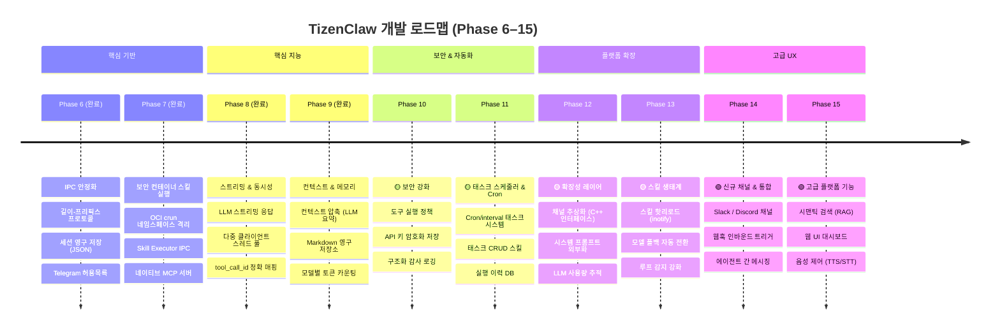
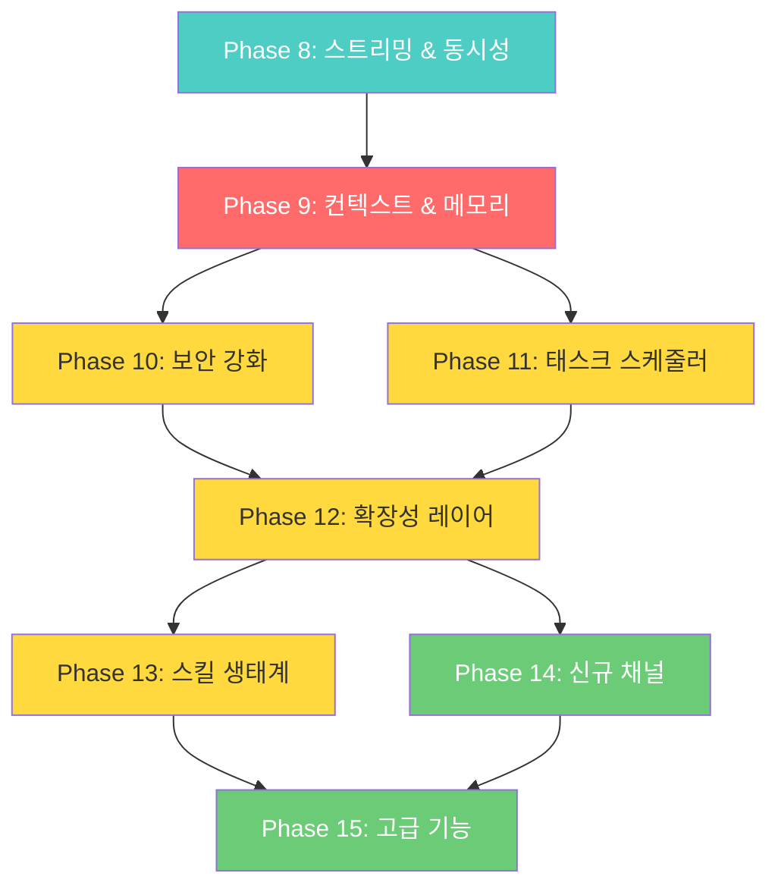

# TizenClaw 개발 로드맵 v3.0

> **작성일**: 2026-03-06
> **기반 문서**: [프로젝트 분석](ANALYSIS.md) | [설계 문서](DESIGN.md)

---

## 기능 비교 매트릭스

> **OpenClaw** (TypeScript, ~700+ 파일) 및 **NanoClaw** (TypeScript, ~50 파일)과의 경쟁 분석

| 카테고리 | 기능 | OpenClaw | NanoClaw | TizenClaw | 갭 |
|----------|------|:--------:|:--------:|:---------:|:--:|
| **IPC** | 다중 클라이언트 동시 처리 | ✅ 병렬 세션 | ✅ 그룹 큐 | ❌ 순차 처리 | 🔴 |
| **IPC** | 스트리밍 응답 | ✅ SSE / WebSocket | ✅ `onOutput` 콜백 | ❌ 블로킹 | 🔴 |
| **IPC** | 견고한 메시지 프레이밍 | ✅ WebSocket + JSON-RPC | ✅ 센티널 마커 | ⚠️ 길이-프리픽스 (부분) | 🟡 |
| **메모리** | 대화 영구 저장 | ✅ SQLite + Vector DB | ✅ SQLite | ⚠️ JSON 파일 (부분) | 🟡 |
| **메모리** | 컨텍스트 압축 | ✅ LLM 자동 요약 | ❌ | ❌ 20턴 FIFO | 🔴 |
| **메모리** | 시맨틱 검색 (RAG) | ✅ MMR + 임베딩 | ❌ | ❌ | 🔴 |
| **LLM** | 모델 폴백 | ✅ 자동 전환 (18K LOC) | ❌ | ❌ 에러만 반환 | 🔴 |
| **LLM** | 토큰 카운팅 | ✅ 모델별 정확 계산 | ❌ | ❌ | 🟡 |
| **LLM** | 사용량 추적 | ✅ 모델별 토큰 사용량 | ❌ | ❌ | 🟡 |
| **보안** | 도구 실행 정책 | ✅ 화이트/블랙리스트 | ❌ | ❌ | 🔴 |
| **보안** | 발신자 허용목록 | ✅ `allowlist-match.ts` | ✅ `sender-allowlist.ts` | ⚠️ UID만 | 🟡 |
| **보안** | API 키 관리 | ✅ 로테이션 + 암호화 | ✅ stdin 전달 | ❌ 평문 JSON | 🔴 |
| **보안** | 감사 로깅 | ✅ 45K LOC `audit.ts` | ✅ `ipc-auth.test.ts` | ⚠️ dlog만 | 🟡 |
| **자동화** | 태스크 스케줄러 | ✅ 기본 cron | ✅ cron/interval/일회성 | ❌ `schedule_alarm`만 | 🔴 |
| **채널** | 멀티 채널 지원 | ✅ 22개 이상 | ✅ 5개 (스킬 기반) | ⚠️ 2개 (Telegram, MCP) | 🟡 |
| **채널** | 채널 추상화 | ✅ 정적 레지스트리 | ✅ 자기 등록 | ❌ 하드코딩 | 🔴 |
| **프롬프트** | 시스템 프롬프트 | ✅ 동적 생성 | ✅ 그룹별 `CLAUDE.md` | ✅ 외부 파일 + 동적 생성 | ✅ |
| **에이전트** | 에이전트 간 통신 | ✅ `sessions_send` | ✅ Agent Swarms | ❌ | 🟢 |
| **에이전트** | 루프 감지 | ✅ 18K LOC 감지기 | ✅ 타임아웃 + idle | ⚠️ `kMaxIterations=5` | 🟡 |
| **에이전트** | tool_call_id 매핑 | ✅ 정확 추적 | ✅ SDK 네이티브 | ⚠️ 하드코딩 ID | 🟡 |
| **인프라** | DB 엔진 | ✅ SQLite + sqlite-vec | ✅ SQLite | ❌ | 🔴 |
| **인프라** | 구조화 로깅 | ✅ Pino (JSON) | ✅ Pino (JSON) | ❌ dlog 평문 | 🟡 |
| **인프라** | 스킬 핫리로드 | ✅ 런타임 설치 | ✅ apply/rebase | ❌ 수동 복사 | 🟢 |
| **UX** | 브라우저 제어 | ✅ CDP Chrome | ❌ | ❌ | 🟢 |
| **UX** | 음성 인터페이스 | ✅ 웨이크 워드 + TTS | ❌ | ❌ | 🟢 |
| **UX** | 웹 UI | ✅ 제어 UI + 웹챗 | ❌ | ❌ | 🟢 |

---

## TizenClaw 고유 강점

| 강점 | 설명 |
|------|------|
| **네이티브 C++ 성능** | TypeScript 대비 낮은 메모리/CPU — Tizen 임베디드 환경에 최적 |
| **OCI 컨테이너 격리** | crun 기반 `seccomp` + `namespace` — 앱 수준 샌드박싱보다 정밀한 시스콜 제어 |
| **Tizen C-API 직접 접근** | ctypes 래퍼로 디바이스 하드웨어 (배터리, Wi-Fi, BT, 햅틱, 알람) 직접 제어 |
| **멀티 LLM 지원** | 5개 백엔드 (Gemini, OpenAI, Claude, xAI, Ollama) 런타임 전환 가능 |
| **경량 배포** | systemd + RPM — Node.js/Docker 없이 단독 디바이스 실행 |
| **네이티브 MCP 서버** | C++ MCP 서버가 데몬에 내장 — Claude Desktop에서 sdb를 통해 Tizen 디바이스 제어 |

---

## 로드맵 개요



---

## 완료된 Phase

### Phase 1–5: 기반 → 엔드-투-엔드 파이프라인 ✅

| Phase | 주요 결과물 |
|:-----:|-----------|
| 1 | C++ 데몬, 5개 LLM 백엔드, `HttpClient`, 팩토리 패턴 |
| 2 | `ContainerEngine` (crun OCI), 이중 컨테이너 아키텍처, `unshare+chroot` 폴백 |
| 3 | Agentic Loop (최대 5회 반복), 병렬 도구 실행 (`std::async`), 세션 메모리 |
| 4 | 9개 스킬, `tizen_capi_utils.py` ctypes 래퍼, `CLAW_ARGS` 규약 |
| 5 | 추상 유닉스 소켓 IPC, `SO_PEERCRED` 인증, Telegram 브릿지, MCP 서버 |

### Phase 6: IPC/Agentic Loop 안정화 ✅

- ✅ 길이-프리픽스 IPC 프로토콜 (`[4바이트 길이][JSON]`)
- ✅ 세션 영구 저장 (JSON 파일 기반, `/opt/usr/share/tizenclaw/sessions/`)
- ✅ Telegram 발신자 `allowed_chat_ids` 검증
- ✅ 모든 백엔드에서 `tool_call_id` 정확 매핑

### Phase 7: 보안 컨테이너 스킬 실행 ✅

- ✅ OCI 컨테이너 스킬 샌드박스 — 네임스페이스 격리 (PID/Mount)
- ✅ Skill Executor IPC 패턴 (길이-프리픽스 JSON + 유닉스 도메인 소켓)
- ✅ 호스트 바인드 마운트 전략 — 컨테이너 내부에서 Tizen C-API 접근
- ✅ 네이티브 C++ MCP 서버 (`--mcp-stdio`, JSON-RPC 2.0)
- ✅ 내장 도구: `execute_code`, `file_manager`

---

## Phase 8: 스트리밍 & 동시성 ✅ (완료)

> **목표**: 응답 지연 제거, 다중 클라이언트 동시 사용 지원

### 8.1 LLM 스트리밍 응답 전달
| 항목 | 내용 |
|------|------|
| **갭** | 전체 응답 버퍼링 후 전달 — 긴 응답 시 체감 지연 발생 |
| **참고** | OpenClaw: SSE/WebSocket 스트리밍 · NanoClaw: `onOutput` 콜백 |
| **계획** | 청크 단위 IPC 응답 (`type: "stream_chunk"` / `"stream_end"`) |

**수정 대상 파일:**
- 각 LLM 백엔드 (`gemini_backend.cc`, `openai_backend.cc`, `anthropic_backend.cc`, `ollama_backend.cc`) — 스트리밍 API 지원
- `agent_core.cc` — 스트리밍 콜백 전파
- `tizenclaw.cc` — IPC 소켓 청크 전달
- `telegram_client.cc` — `editMessageText`를 통한 점진적 메시지 편집

**완료 기준:**
- [x] LLM 토큰 생성과 동시에 클라이언트에 전달
- [x] Telegram에서 점진적 응답 표시
- [x] 스트리밍 미지원 백엔드에 대한 비스트리밍 폴백

---

### 8.2 다중 클라이언트 동시 처리
| 항목 | 내용 |
|------|------|
| **갭** | 순차 `accept()` — 한 번에 하나의 클라이언트만 처리 |
| **참고** | NanoClaw: `GroupQueue` 공정 스케줄링 · OpenClaw: 병렬 세션 |
| **계획** | 스레드 풀 (`std::thread`) + 세션별 뮤텍스 |

**수정 대상 파일:**
- `tizenclaw.cc` — 풀 제한 있는 클라이언트별 스레드 생성
- `agent_core.cc` — 동시 접근 보호를 위한 세션별 뮤텍스

**완료 기준:**
- [x] Telegram + MCP 동시 요청 시 양쪽 모두 응답
- [x] 데이터 레이스 없음 (session_mutex_ 세션별 잠금)
- [x] 연결 제한: `kMaxConcurrentClients = 4`

---

### 8.3 tool_call_id 정확 매핑
| 항목 | 내용 |
|------|------|
| **갭** | `call_0`, `toolu_0` 하드코딩 — 병렬 도구 결과 혼동 가능 |
| **참고** | OpenClaw: `tool-call-id.ts` 정확 추적 |
| **계획** | 각 LLM 응답에서 실제 ID 파싱, 피드백까지 일관 전달 |

**완료 기준:**
- [x] 각 백엔드에서 실제 `tool_call_id` 파싱
- [x] Gemini/Ollama 전역 고유 ID 생성 (timestamp+hex+index)

---

## Phase 9: 컨텍스트 & 메모리 ✅ (완료)

> **목표**: 지능적 컨텍스트 관리, 구조화된 영구 저장소

### 9.1 컨텍스트 압축
| 항목 | 내용 |
|------|------|
| **갭** | 20턴 초과 시 단순 FIFO 삭제 — 초기 중요 컨텍스트 손실 |
| **참고** | OpenClaw: `compaction.ts` LLM 자동 요약 (15K LOC) |
| **구현** | 15턴 초과 시 가장 오래된 10턴을 LLM으로 요약 → 1턴으로 압축 |

**수정 대상 파일:**
- `agent_core.hh` — `CompactHistory()` 메서드 추가, 압축 임계값 상수
- `agent_core.cc` — LLM 요약 기반 컨텍스트 압축 구현, FIFO 폴백

**완료 기준:**
- [x] 15턴 초과 시 가장 오래된 10턴 요약
- [x] `[compressed]` 마커 표시
- [x] 요약 실패 시 FIFO 트리밍 폴백
- [x] 하드 리밋 30턴 (FIFO)

---

### 9.2 Markdown 영구 저장소
| 항목 | 내용 |
|------|------|
| **갭** | 세션 데이터를 JSON 파일로 관리 — 가독성 부족, 메타데이터 없음 |
| **참고** | NanoClaw: `db.ts` (19K LOC) — 메시지, 태스크, 세션, 그룹 |
| **구현** | Markdown 파일 (YAML frontmatter) — 새 의존성 없이 구조화 저장 |

**저장 구조:**
```
/opt/usr/share/tizenclaw/
├── sessions/{id}.md       ← YAML frontmatter + ## role 헤더
├── logs/{YYYY-MM-DD}.md   ← 일별 스킬 실행 테이블
└── usage/{id}.md          ← 세션별 토큰 사용량
```

**수정 대상 파일:**
- `session_store.hh` — 새 구조체 (`SkillLogEntry`, `TokenUsageEntry`, `TokenUsageSummary`), Markdown 직렬화 메서드
- `session_store.cc` — Markdown 파서/라이터, YAML frontmatter, 레거시 JSON 자동 마이그레이션, 원자적 파일 쓰기

**완료 기준:**
- [x] 세션 히스토리 Markdown 저장 (JSON → MD 자동 마이그레이션)
- [x] 스킬 실행 로그 일별 Markdown 테이블
- [x] 데몬 재시작 시 모든 데이터 보존

---

### 9.3 모델별 토큰 카운팅
| 항목 | 내용 |
|------|------|
| **갭** | 컨텍스트 윈도우 소비량 파악 불가 |
| **참고** | OpenClaw: 모델별 정확 토큰 카운팅 |
| **구현** | 각 백엔드 응답의 `usage` 필드 파싱 → Markdown 파일 저장 |

**수정 대상 파일:**
- `llm_backend.hh` — `LlmResponse`에 `prompt_tokens`, `completion_tokens`, `total_tokens` 추가
- `gemini_backend.cc` — `usageMetadata` 파싱
- `openai_backend.cc` — `usage` 파싱 + `insert()` 모호성 버그 수정
- `anthropic_backend.cc` — `usage.input_tokens/output_tokens` 파싱
- `ollama_backend.cc` — `prompt_eval_count/eval_count` 파싱
- `agent_core.cc` — 매 LLM 호출 후 토큰 로깅, 스킬 실행 시간 측정

**완료 기준:**
- [x] 요청별 토큰 사용량 로깅
- [x] 세션별 누적 사용량 Markdown 파일에 기록
- [x] 스킬 실행 시간 `std::chrono`로 측정 및 로깅

---

## Phase 10: 보안 강화 🟡

> **목표**: 도구 실행 안전성, 자격증명 보호, 감사 추적

### 10.1 도구 실행 정책 시스템
| 항목 | 내용 |
|------|------|
| **갭** | LLM이 요청하는 모든 도구를 무조건 실행 |
| **참고** | OpenClaw: `tool-policy.ts` (화이트/블랙리스트) |
| **계획** | 스킬별 `risk_level` + 루프 감지 + 정책 위반 피드백 |

**완료 기준:**
- [ ] 부작용 스킬 (`launch_app`, `vibrate_device`) `risk_level: "high"` 지정
- [ ] 동일 스킬 + 동일 인자 3회 반복 → 차단 (루프 방지)
- [ ] 정책 위반 사유를 LLM 피드백에 포함

---

### 10.2 API 키 암호화 저장
| 항목 | 내용 |
|------|------|
| **갭** | `llm_config.json`에 API 키 평문 저장 |
| **참고** | OpenClaw: `secrets/` · NanoClaw: stdin 전달 |
| **계획** | Tizen KeyManager C-API 연동 또는 AES 암호화 파일 |

**완료 기준:**
- [ ] KeyManager 사용 가능 시 암호화 저장/조회
- [ ] 기존 평문 파일 폴백
- [ ] `llm_config.json`에서 키 제거 마이그레이션 가이드

---

### 10.3 구조화 감사 로깅
| 항목 | 내용 |
|------|------|
| **갭** | dlog 평문 — 구조화 쿼리 불가, 원격 수집 미지원 |
| **참고** | OpenClaw: Pino JSON 로깅 · NanoClaw: Pino JSON 로깅 |
| **계획** | 보안 민감 이벤트에 대한 구조화 JSON 로그 엔트리 |

**완료 기준:**
- [ ] 모든 IPC 요청, 도구 실행, 인증 이벤트를 구조화 JSON으로 로깅
- [ ] 설정 가능한 보존 기간의 로그 로테이션
- [ ] dlog + 파일 이중 출력

---

## Phase 11: 태스크 스케줄러 & Cron 🟡

> **목표**: LLM 연동 시간 기반 자동화

### 11.1 Cron/Interval 태스크 시스템
| 항목 | 내용 |
|------|------|
| **갭** | `schedule_alarm`은 단순 타이머 — 반복, cron, LLM 연동 없음 |
| **참고** | NanoClaw: `task-scheduler.ts` (8K LOC) — cron, interval, 일회성 |
| **계획** | 새 스킬 (`create_task`, `list_tasks`, `cancel_task`) + 데몬 스케줄러 루프 |

**완료 기준:**
- [ ] "매일 오전 9시에 날씨 알려줘" → cron 태스크 → 자동 실행
- [ ] 자연어로 태스크 목록 조회 및 취소
- [ ] 실행 이력 Markdown 저장 (Phase 9.2)
- [ ] 실패 태스크 백오프 재시도

---

## Phase 12: 확장성 레이어 🟡

> **목표**: 미래 성장을 위한 아키텍처 유연성

### 12.1 채널 추상화 레이어
| 항목 | 내용 |
|------|------|
| **갭** | Telegram과 MCP가 완전히 별개 — 새 채널 추가 시 대규모 작업 필요 |
| **참고** | NanoClaw: `channels/registry.ts` 자기 등록 · OpenClaw: 정적 레지스트리 |
| **계획** | `Channel` 인터페이스 (C++) → `TelegramChannel`, `McpChannel` 구현 |

**완료 기준:**
- [ ] 새 채널은 `Channel` 인터페이스 구현만으로 추가
- [ ] `channels/` 디렉터리에 채널별 설정
- [ ] 기존 Telegram + MCP를 인터페이스로 마이그레이션

---

### 12.2 시스템 프롬프트 외부화 ✅ (완료)
| 항목 | 내용 |
|------|------|
| **갭** | 시스템 프롬프트 C++ 하드코딩 — 변경 시 재빌드 필요 |
| **참고** | NanoClaw: 그룹별 `CLAUDE.md` · OpenClaw: `system-prompt.ts` |
| **계획** | `llm_config.json`의 `system_prompt` 또는 `/opt/usr/share/tizenclaw/config/system_prompt.txt` |

**구현 내용:**
- `LlmBackend::Chat()` 인터페이스: `system_prompt` 파라미터 추가
- 4단계 fallback 로딩: config inline → `system_prompt_file` 경로 → 기본 파일 → 하드코딩
- `{{AVAILABLE_TOOLS}}` placeholder를 현재 스킬 목록으로 동적 치환
- 백엔드별 API 형식: Gemini (`system_instruction`), OpenAI/Ollama (`system` role), Anthropic (`system` 필드)

**완료 기준:**
- [x] 외부 파일/설정에서 로드
- [x] 현재 스킬 목록을 프롬프트에 동적 포함
- [x] 설정 없으면 기본 하드코딩 프롬프트 (하위 호환)

---

### 12.3 LLM 사용량 추적
| 항목 | 내용 |
|------|------|
| **갭** | API 비용/사용량 가시성 없음 |
| **참고** | OpenClaw: `usage.ts` (5K LOC) |
| **계획** | `usage` 필드 파싱 → SQLite 집계 → 세션/일/월별 보고서 |

**완료 기준:**
- [ ] 세션별 토큰 사용량 요약
- [ ] SQLite에 일별/월별 누적 저장
- [ ] IPC 명령을 통한 사용량 조회

---

## Phase 13: 스킬 생태계 🟡

> **목표**: 강인한 스킬 관리와 LLM 복원력

### 13.1 스킬 핫리로드
| 항목 | 내용 |
|------|------|
| **갭** | 신규/수정 스킬 적용 시 데몬 재시작 필요 |
| **참고** | OpenClaw: 런타임 스킬 업데이트 · NanoClaw: skills-engine apply/rebase |
| **계획** | `inotify` 파일 변경 감지 → 매니페스트 자동 리로드 |

**완료 기준:**
- [ ] 새 스킬 디렉터리 자동 감지
- [ ] `manifest.json` 수정 시 리로드 트리거
- [ ] 데몬 재시작 불필요

---

### 13.2 모델 폴백 자동 전환
| 항목 | 내용 |
|------|------|
| **갭** | LLM API 실패 시 에러 반환 — 대안 백엔드 미시도 |
| **참고** | OpenClaw: `model-fallback.ts` (18K LOC) |
| **계획** | `llm_config.json`에 `fallback_backends` 배열, 순차 재시도 |

**완료 기준:**
- [ ] Gemini 실패 → 자동으로 OpenAI → Ollama 시도
- [ ] 폴백 사유 로깅
- [ ] rate-limit 에러 시 백오프 후 재시도

---

### 13.3 루프 감지 강화
| 항목 | 내용 |
|------|------|
| **갭** | `kMaxIterations = 5`만 존재 — 컨텐츠 기반 감지 없음 |
| **참고** | OpenClaw: 18K LOC `tool-loop-detection.ts` · NanoClaw: 타임아웃 + idle 감지 |
| **계획** | 동일 도구+인자 반복 감지, idle 감지, 세션별 max iterations 설정 |

**완료 기준:**
- [ ] 동일 도구 + 동일 인자 3회 반복 → 설명과 함께 강제 중단
- [ ] 반복 간 진행 없음 감지 (idle)
- [ ] 세션별 `max_iterations` 설정 가능

---

## Phase 14: 신규 채널 & 통합 🟢

> **목표**: 커뮤니케이션 범위 확장, 에이전트 협조 도입

### 14.1 신규 커뮤니케이션 채널
| 항목 | 내용 |
|------|------|
| **갭** | Telegram + MCP만 — Slack, Discord, 웹훅 미지원 |
| **참고** | OpenClaw: 22개 이상 · NanoClaw: WhatsApp, Telegram, Slack, Discord, Gmail |
| **계획** | Phase 12 채널 추상화를 활용하여 Slack + Discord 구현 |

**완료 기준:**
- [ ] Slack 채널 (Bot API Socket Mode)
- [ ] Discord 채널 (Discord.js 유사 통합)
- [ ] 각 채널은 독립 프로세스로 실행 (Telegram 브릿지와 유사)

---

### 14.2 웹훅 인바운드 트리거
| 항목 | 내용 |
|------|------|
| **갭** | 외부 이벤트로 작업을 트리거할 방법 없음 |
| **참고** | OpenClaw: 웹훅 자동화 · NanoClaw: Gmail Pub/Sub |
| **계획** | 경량 HTTP 리스너로 웹훅 이벤트 수신 → Agentic Loop로 라우팅 |

**완료 기준:**
- [ ] 수신 웹훅용 HTTP 엔드포인트
- [ ] 설정 가능한 URL 경로 → 스킬 매핑
- [ ] HMAC 서명 검증

---

### 14.3 에이전트 간 메시징
| 항목 | 내용 |
|------|------|
| **갭** | 단일 에이전트 세션 — 에이전트 간 협조 불가 |
| **참고** | OpenClaw: `sessions_send` · NanoClaw: Agent Swarms |
| **계획** | 다중 세션 관리 + 세션 간 메시지 전달 |

**완료 기준:**
- [ ] 서로 다른 시스템 프롬프트의 복수 동시 에이전트 세션
- [ ] `send_to_session` 도구로 에이전트 간 통신
- [ ] 세션별 격리 (별도 히스토리, 백엔드, 권한)

---

## Phase 15: 고급 플랫폼 기능 🟢

> **목표**: TizenClaw 고유 플랫폼 위치를 활용한 장기 비전 기능

### 15.1 시맨틱 검색 (RAG)
| 항목 | 내용 |
|------|------|
| **갭** | 대화 히스토리 외 지식 검색 불가 |
| **참고** | OpenClaw: sqlite-vec + 임베딩 검색 + MMR |
| **계획** | 대화 히스토리 + 문서 저장소에 대한 임베딩 기반 검색 |

**완료 기준:**
- [ ] 문서 수집 및 임베딩 저장
- [ ] Agentic Loop 내 시맨틱 검색 쿼리
- [ ] SQLite 연동 (sqlite-vec 확장)

---

### 15.2 웹 UI 대시보드
| 항목 | 내용 |
|------|------|
| **갭** | 모니터링/제어용 시각 인터페이스 없음 |
| **참고** | OpenClaw: Gateway에서 제공하는 제어 UI + 웹챗 |
| **계획** | 내장 HTTP 서버에서 제공하는 경량 HTML+JS 대시보드 |

**완료 기준:**
- [ ] 세션 상태, 활성 태스크, 스킬 실행 이력 표시
- [ ] 실시간 로그 스트리밍
- [ ] 직접 상호작용을 위한 기본 채팅 인터페이스

---

### 15.3 음성 제어 (TTS/STT)
| 항목 | 내용 |
|------|------|
| **갭** | 텍스트 전용 상호작용 |
| **참고** | OpenClaw: Voice Wake + Talk Mode (ElevenLabs + 시스템 TTS) |
| **계획** | Tizen 네이티브 TTS/STT C-API 연동 — 음성 입출력 |

**완료 기준:**
- [ ] Tizen STT C-API를 통한 음성 입력
- [ ] Tizen TTS C-API를 통한 응답 음성 출력
- [ ] 웨이크 워드 감지 (선택사항)

---

## Phase 의존성 & 규모 추정



| Phase | 핵심 목표 | 예상 LOC | 우선순위 | 의존성 |
|:-----:|---------|:--------:|:--------:|:------:|
| **8** | 스트리밍 & 동시성 | ~1,000 | ✅ 완료 | Phase 7 ✅ |
| **9** | 컨텍스트 & 메모리 | ~1,200 | 🔴 긴급 | Phase 8 ✅ |
| **10** | 보안 강화 | ~800 | 🟡 중간 | Phase 9 |
| **11** | 태스크 스케줄러 & cron | ~1,000 | 🟡 중간 | Phase 9 |
| **12** | 확장성 레이어 | ~600 | 🟡 중간 | Phase 10, 11 |
| **13** | 스킬 생태계 | ~800 | 🟡 중간 | Phase 12 |
| **14** | 신규 채널 & 통합 | ~1,200 | 🟢 낮음 | Phase 12 |
| **15** | 고급 플랫폼 기능 | ~2,000 | 🟢 낮음 | Phase 13, 14 |

> **총 예상 추가 코드**: ~8,600 LOC (현재 ~4,500 LOC → ~13,100 LOC)
