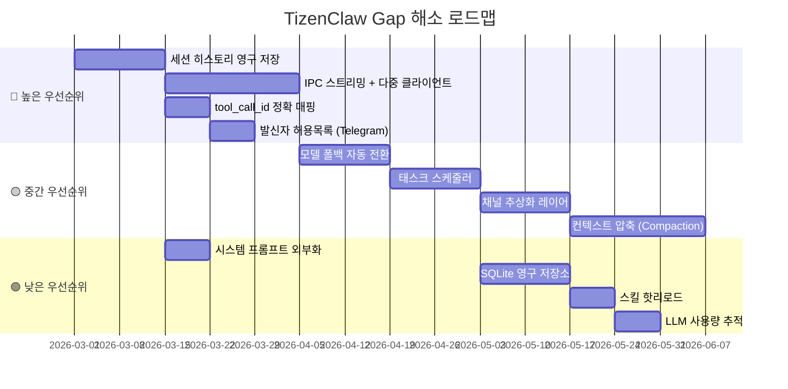

# TizenClaw 경쟁 분석: OpenClaw & NanoClaw 대비 Gap 분석

> **분석 기준**: 2026-03-05
> **분석 대상**: [openclaw](file:///home/hjhun/samba/github/openclaw), [nanoclaw](file:///home/hjhun/samba/github/nanoclaw)

---

## 1. 프로젝트 규모 비교

| 항목 | **TizenClaw** | **OpenClaw** | **NanoClaw** |
|------|:---:|:---:|:---:|
| 언어 | C++ / Python | TypeScript | TypeScript |
| 소스 파일 수 | ~44 | ~700+ | ~50 |
| 스킬 수 | 9 | 52 | 5+ (skills-engine) |
| LLM 백엔드 | 5 | 15+ | Claude SDK |
| 채널 수 | 2 (Telegram, MCP) | 8+ | 5 (WhatsApp, Telegram, Slack, Discord, Gmail) |
| 테스트 커버리지 | 7 케이스 | 수백 개 | 수십 개 |
| 플러그인 시스템 | ❌ | ✅ (npm 기반) | ❌ |

---

## 2. TizenClaw에 부족한 영역 (Gap 목록)

### 🔴 높은 우선순위 (핵심 기능 Gap)

#### 2.1 메모리 / 대화 지속성

| 항목 | OpenClaw | NanoClaw | TizenClaw 현황 | 필요 작업 |
|------|---------|----------|-------------|----------|
| 대화 히스토리 저장 | SQLite + 벡터 DB | SQLite (`db.ts`) | **인메모리 only** (재시작 시 소멸) | 세션 히스토리 영구 저장 (SQLite 또는 파일) |
| 임베딩 검색 | 다중 백엔드 (OpenAI, Gemini, Voyage, Ollama, Mistral) | 그룹별 `CLAUDE.md` 파일 | ❌ 없음 | 장기적으로 검토 |
| 시맨틱 검색 | MMR 알고리즘, 쿼리 확장 | ❌ | ❌ 없음 | 장기적으로 검토 |

> **제안**: 최소한 `nlohmann::json`으로 세션 히스토리를 파일에 저장 → 재시작 후 복원할 수 있어야 함.

---

#### 2.2 컨텍스트 창 관리

| 항목 | OpenClaw | NanoClaw | TizenClaw 현황 |
|------|---------|----------|-------------|
| 컨텍스트 압축 | `compaction.ts` (15,274 LOC) - 토큰 사용량 기반 자동 요약 | 세션 히스토리 제한 | 최대 20턴 단순 트리밍 |
| 토큰 카운팅 | 모델별 정확한 토큰 계산 | ❌ | ❌ 없음 |
| 컨텍스트 창 가드 | `context-window-guard.ts` - 초과 시 자동 요약 | ❌ | ❌ 없음 |

> **제안**: 턴 수가 아닌 **추정 토큰 수** 기반으로 히스토리를 관리하고, 임계치 초과 시 오래된 대화를 LLM으로 요약하는 compaction 로직 추가.

---

#### 2.3 보안 강화

| 항목 | OpenClaw | NanoClaw | TizenClaw 현황 |
|------|---------|----------|-------------|
| 보안 감사 | `audit.ts` (45,786 LOC) - 커맨드 실행 전/후 감사 | `ipc-auth.test.ts` (17,135 LOC) | `SO_PEERCRED` UID 검증만 |
| 스킬 스캐너 | `skill-scanner.ts` - 악성 스킬 탐지 | ❌ | ❌ 없음 |
| 마운트 보안 | ❌ | `mount-security.ts` (10,633 LOC) - symlink 공격 방지, 경로 검증 | readonly rootfs + seccomp |
| 발신자 허용목록 | `allowlist-match.ts` | `sender-allowlist.ts` - 사용자별 접근 제어 | ❌ 없음 |
| 시크릿 관리 | `secrets/` 디렉터리, API 키 로테이션 | stdin으로 시크릿 전달 (파일 미저장) | `llm_config.json` 평문 |
| 도구 실행 정책 | `tool-policy.ts` - 화이트/블랙리스트, 위험 도구 승인 | ❌ | ❌ 없음 |

> **제안**: 1) `sender-allowlist` (Telegram chat_id 기반 접근 제어), 2) 스킬 실행 전 매니페스트 검증 강화, 3) API 키를 Tizen KeyManager로 이전.

---

#### 2.4 IPC 프로토콜 고도화

| 항목 | OpenClaw | NanoClaw | TizenClaw 현황 |
|------|---------|----------|-------------|
| 메시지 프레이밍 | WebSocket + JSON-RPC | 센티널 마커 기반 구조화 파싱 | `shutdown(SHUT_WR)` EOF 기반 |
| 스트리밍 응답 | SSE / WebSocket 실시간 스트리밍 | 스트리밍 출력 콜백 (`onOutput`) | ❌ 블로킹 응답만 |
| 동시 클라이언트 | 다중 세션 병렬 처리 | `GroupQueue` 기반 공정 스케줄링 | 순차 처리 (한 번에 하나) |

> **제안**: 1) 길이-프리픽스 프로토콜 도입, 2) `epoll` 또는 스레드풀 기반 다중 클라이언트 처리, 3) 스트리밍 응답 지원 (LLM 스트리밍 → IPC 전달).

---

### 🟡 중간 우선순위 (확장성 Gap)

#### 2.5 태스크 스케줄러

| 항목 | OpenClaw | NanoClaw | TizenClaw 현황 |
|------|---------|----------|-------------|
| 예약 작업 | 기본 cron 지원 | `task-scheduler.ts` - cron 표현식, 간격 반복, 일회성 | `schedule_alarm` 스킬 (단순 알람만) |
| 작업 DB | ❌ | SQLite (tasks, task_run_logs 테이블) | ❌ |
| 실행 이력 | ❌ | `logTaskRun()` - 실행 시간, 결과, 에러 기록 | ❌ |

> **제안**: LLM이 직접 예약 작업을 생성하고 관리할 수 있는 `create_task`, `list_tasks`, `cancel_task` 스킬 세트 추가. cron 표현식 지원.

---

#### 2.6 다중 채널 아키텍처

| 항목 | OpenClaw | NanoClaw | TizenClaw 현황 |
|------|---------|----------|-------------|
| 채널 레지스트리 | 정적 등록 | `registry.ts` - 자기 등록(self-registration) 패턴 | 하드코딩 (Telegram, MCP 개별 구현) |
| 지원 채널 | Telegram, Discord, Slack, WhatsApp, iMessage, Signal, Line, Web | WhatsApp, Telegram, Slack, Discord, Gmail | Telegram, MCP |
| 채널 추가 용이성 | 플러그인 기반 | 스킬로 채널 추가 | 코드 수정 필요 |

> **제안**: 채널 추상화 레이어 (`Channel` 인터페이스 → `TelegramChannel`, `McpChannel`) 도입. 새 채널 추가 시 인터페이스만 구현.

---

#### 2.7 모델 관리 고도화

| 항목 | OpenClaw | NanoClaw | TizenClaw 현황 |
|------|---------|----------|-------------|
| 모델 카탈로그 | `model-catalog.ts` - 자동 탐색, 메타데이터 | Claude SDK 내장 | `llm_config.json` 수동 설정 |
| 모델 폴백 | `model-fallback.ts` (18,501 LOC) - 자동 백엔드 전환 | ❌ | ❌ (실패 시 에러만 반환) |
| Auth 프로필 로테이션 | `auth-profiles.ts` - API 키 쿨다운, 라운드로빈 | ❌ | ❌ |
| 프로바이더 자동 감지 | Ollama 자동 모델 발견, HuggingFace, Venice 등 | ❌ | ❌ |

> **제안**: 1) LLM 호출 실패 시 자동으로 다른 백엔드로 폴백, 2) API 키 로테이션 (rate limit 대응), 3) Ollama 모델 목록 자동 갱신.

---

#### 2.8 도구 루프 감지 및 안전 장치

| 항목 | OpenClaw | NanoClaw | TizenClaw 현황 |
|------|---------|----------|-------------|
| 도구 루프 감지 | `tool-loop-detection.ts` (18,674 LOC) | 타임아웃 + 아이들 감지 | `kMaxIterations = 5` 단순 카운터 |
| tool_call_id 매핑 | 정확한 ID 추적 | Claude SDK 네이티브 | `call_0`, `toolu_0` 하드코딩 |
| 실행 타임아웃 | 도구별 세밀한 타임아웃 | 컨테이너 레벨 타임아웃 (리셋 가능) | ❌ 없음 |

> **제안**: 1) LLM 응답의 실제 `tool_call_id`를 추적하여 정확 매핑, 2) 동일 스킬+동일 인자 반복 호출 감지 (무한 루프 방지), 3) 개별 스킬 실행 타임아웃 추가.

---

### 🟢 낮은 우선순위 (UX/인프라 Gap)

#### 2.9 스킬 생명주기 관리

| 항목 | OpenClaw | NanoClaw | TizenClaw 현황 |
|------|---------|----------|-------------|
| 스킬 설치/제거 | `skills-install.ts` - 원격 다운로드, 추출, 검증 | `skills-engine/` - apply, rebase, replay, uninstall | 수동 복사 |
| 스킬 마켓플레이스 | ClawHub (`clawhub.ai`) | ❌ | ❌ |
| 스킬 버전 관리 | 시맨틱 버저닝 검증 | 해시 기반 충돌 감지, 경로 리맵 | ❌ |
| 핫 리로드 | 런타임 스킬 업데이트 | ❌ | ❌ |

> **제안**: 최소한 스킬 디렉터리 파일 변경 감지 → 자동 매니페스트 리로드. 나중에 원격 스킬 설치 기능 추가.

---

#### 2.10 시스템 프롬프트 관리

| 항목 | OpenClaw | NanoClaw | TizenClaw 현황 |
|------|---------|----------|-------------|
| 시스템 프롬프트 | `system-prompt.ts` (32,349 LOC) - 동적 생성, 도구 목록 포함, 컨텍스트 인식 | 그룹별 `CLAUDE.md` 커스텀 프롬프트 | 하드코딩 문자열 |
| 프로젝트 설정 | 에이전트별 프로파일 | 그룹별 격리 | ❌ |
| 커스터마이징 | 파일/환경변수/훅 기반 | 파일 기반 | ❌ |

> **제안**: 시스템 프롬프트를 외부 파일 (`system_prompt.txt` 또는 `llm_config.json`의 `system_prompt` 필드)로 분리. 스킬 목록 동적 포함.

---

#### 2.11 영구 저장소 (DB)

| 항목 | OpenClaw | NanoClaw | TizenClaw 현황 |
|------|---------|----------|-------------|
| DB 엔진 | SQLite + sqlite-vec (벡터 검색) | SQLite (better-sqlite3) | ❌ 없음 |
| 저장 대상 | 세션, 메모리, 임베딩, 플러그인 상태 | 메시지, 태스크, 세션, 그룹, 라우터 상태 | 인메모리 `std::map` |
| 마이그레이션 | 스키마 마이그레이션 지원 | JSON → SQLite 마이그레이션 | ❌ |

> **제안**: 경량 SQLite (Tizen에서 기본 제공) 도입. 세션 히스토리, 스킬 실행 로그, 태스크 스케줄 저장.

---

#### 2.12 에러 복구 및 안정성

| 항목 | OpenClaw | NanoClaw | TizenClaw 현황 |
|------|---------|----------|-------------|
| 세션 트랜스크립트 복구 | `session-transcript-repair.ts` (15,411 LOC) | `recoverPendingMessages()` - 크래시 복구 | ❌ |
| 세션 쓰기 잠금 | `session-write-lock.ts` (16,322 LOC) | ❌ | ❌ |
| Graceful 종료 | SIGTERM → 진행 중 작업 완료 후 종료 | SIGTERM/SIGINT 핸들링, 큐 드레인 | SIGTERM/SIGINT → 즉시 종료 |

> **제안**: SIGTERM 수신 시 진행 중인 LLM 호출을 완료하거나 타임아웃 후 종료하는 graceful shutdown 개선.

---

#### 2.13 로깅 및 관측성

| 항목 | OpenClaw | NanoClaw | TizenClaw 현황 |
|------|---------|----------|-------------|
| 로깅 프레임워크 | 구조화 로깅 (Pino 기반), 레벨 필터링 | Pino (구조화 JSON 로깅) | dlog (단순 텍스트) |
| 사용량 추적 | `usage.ts` - 모델별 토큰 사용량 | ❌ | ❌ |
| 캐시 트레이싱 | `cache-trace.ts` - 캐시 히트/미스 추적 | ❌ | ❌ |

> **제안**: 1) LLM API 호출별 토큰 사용량/비용 추적, 2) 구조화 로깅 (JSON 형식 + 레벨 필터), 3) 스킬 실행 이력 로그.

---

## 3. 우선순위별 로드맵 제안

---

## 4. TizenClaw만의 강점

TizenClaw가 타 프로젝트 대비 우위에 있는 부분도 있다:

| 강점 | 설명 |
|------|------|
| **네이티브 C++ 성능** | TypeScript 대비 낮은 메모리/CPU 사용량. 임베디드 환경에 최적 |
| **OCI 컨테이너 격리** | crun 기반 `seccomp` + `namespace` 격리. OpenClaw/NanoClaw보다 세밀한 syscall 제어 |
| **Tizen C-API 직접 호출** | ctypes 래퍼를 통한 디바이스 하드웨어 직접 제어 (배터리, Wi-Fi, 블루투스, 햅틱 등) |
| **강력한 다중 LLM 지원** | 5개 백엔드 (Gemini, OpenAI, Claude, xAI, Ollama)를 런타임 전환 가능 |
| **경량 배포** | systemd 서비스 + RPM 패키징. 서버 없이 디바이스 독립 실행 |
| **MCP Server 지원** | Claude Desktop에서 sdb를 통해 디바이스를 직접 제어할 수 있는 고유 기능 |
