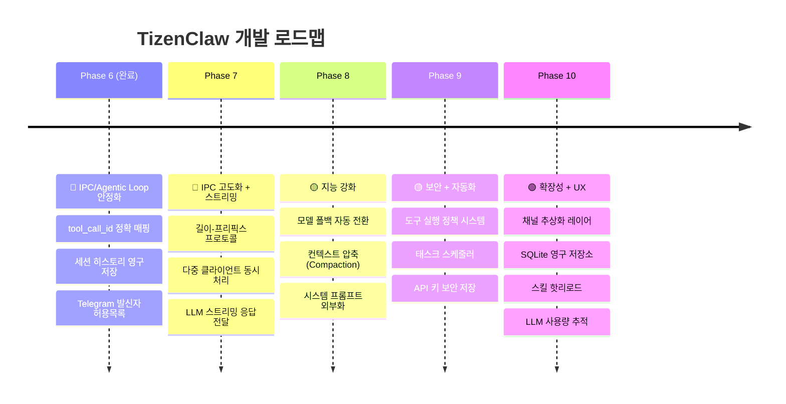

# TizenClaw 개발 로드맵 v2.0

> **작성일**: 2026-03-05
> **기반 문서**: [경쟁 분석](competitive_analysis.md) | [프로젝트 분석](project_analysis.md)

---

## 로드맵 개요

---

## Phase 6: IPC/Agentic Loop 안정화 🔴

> **목표**: Agentic Loop의 핵심 결함 수정, 데이터 지속성 확보, 기본 보안 강화

### 6.1 tool_call_id 정확 매핑
| 항목 | 내용 |
|------|------|
| **현재 문제** | `call_0`, `toolu_0` 하드코딩으로 병렬 tool 호출 시 결과가 뒤섞임 |
| **참고** | OpenClaw `tool-call-id.ts` (8,197 LOC) |
| **구현 범위** | `AgentCore::ProcessToolCalls()`에서 LLM 응답의 실제 ID를 추적하여 피드백 시 정확 매핑 |

**수정 대상 파일:**
- `src/agent_core.cc` — tool_call 결과 매핑 로직
- `inc/llm_backend.hh` — `LlmToolCall` 구조체에 ID 필드 확인
- 각 백엔드 (`gemini_backend.cc`, `openai_backend.cc`, `anthropic_backend.cc`, `ollama_backend.cc`) — 응답 파싱 시 실제 ID 추출

**완료 기준:**
- [ ] 각 백엔드에서 `tool_call_id`를 정확히 파싱
- [ ] `AgentCore`에서 결과 피드백 시 원본 ID로 매핑
- [ ] 병렬 2개 이상 tool 호출 E2E 테스트 통과

---

### 6.2 세션 히스토리 영구 저장
| 항목 | 내용 |
|------|------|
| **현재 문제** | `std::map<string, vector<LlmMessage>>` 인메모리 — 데몬 재시작 시 전체 소멸 |
| **참고** | NanoClaw `db.ts` (SQLite), OpenClaw `session-files.ts` (파일 기반) |
| **구현 방식** | JSON 파일 기반 (`/opt/usr/share/tizenclaw/sessions/{session_id}.json`) |

**수정 대상 파일:**
- [NEW] `src/session_store.cc/hh` — 세션 직렬화/역직렬화
- `src/agent_core.cc` — 초기화 시 로드, 턴 완료 시 저장
- `inc/agent_core.hh` — `SessionStore` 멤버 추가

**완료 기준:**
- [ ] 데몬 재시작 후 이전 대화 컨텍스트 유지
- [ ] 세션당 최대 파일 크기 제한 (예: 512KB)
- [ ] 비정상 JSON 파일 로드 시 graceful fallback
- [ ] 단위 테스트: 저장/로드/트리밍

---

### 6.3 Telegram 발신자 허용목록
| 항목 | 내용 |
|------|------|
| **현재 문제** | Telegram 봇 토큰만 있으면 누구나 명령 가능 |
| **참고** | NanoClaw `sender-allowlist.ts` (3,142 LOC) |
| **구현 방식** | `telegram_config.json`에 `allowed_chat_ids` 배열 추가 |

**수정 대상 파일:**
- `skills/telegram_listener/telegram_listener.py` — `allowed_chat_ids` 검증 로직
- `data/telegram_config.json.sample` — 샘플에 필드 추가

**완료 기준:**
- [ ] `allowed_chat_ids`가 비어있으면 모든 사용자 허용 (하위 호환)
- [ ] 목록에 없는 `chat_id`의 메시지는 무시 + 로그
- [ ] 단위 테스트

---

## Phase 7: IPC 고도화 + 스트리밍 🔴

> **목표**: 다중 클라이언트 동시 처리, 스트리밍 응답, 견고한 메시지 프레이밍

### 7.1 길이-프리픽스 IPC 프로토콜
| 항목 | 내용 |
|------|------|
| **현재 문제** | `shutdown(SHUT_WR)` 기반 EOF 감지 — 연결당 1요청만 가능 |
| **참고** | NanoClaw 센티널 마커 기반, OpenClaw WebSocket |
| **구현 방식** | `[4바이트 길이][JSON 페이로드]` 프레이밍 |

**수정 대상 파일:**
- `src/tizenclaw.cc` — `IpcServerLoop()` 리팩터링
- `skills/telegram_listener/telegram_listener.py` — 클라이언트 측 프로토콜 업데이트
- `skills/mcp_server/server.py` — MCP 클라이언트 프로토콜 업데이트

**완료 기준:**
- [ ] 단일 연결에서 다중 요청/응답 가능
- [ ] 기존 `shutdown(SHUT_WR)` 방식 하위 호환 (감지 후 fallback)
- [ ] IPC 통합 테스트

---

### 7.2 다중 클라이언트 동시 처리
| 항목 | 내용 |
|------|------|
| **현재 문제** | `while` 루프에서 순차 `accept()` → 한 번에 하나의 클라이언트만 처리 |
| **참고** | NanoClaw `GroupQueue` (공정 스케줄링), OpenClaw 병렬 세션 |
| **구현 방식** | `std::thread` 풀 또는 `accept()` 후 개별 스레드 생성 |

**수정 대상 파일:**
- `src/tizenclaw.cc` — 클라이언트 연결당 스레드 생성
- `src/agent_core.cc` — 세션별 뮤텍스 (동시 접근 보호)
- `inc/agent_core.hh` — `std::mutex` 멤버 추가

**완료 기준:**
- [ ] Telegram + MCP 동시 요청 시 양쪽 모두 응답
- [ ] 세션 데이터 race condition 없음 (TSAN 통과)

---

### 7.3 LLM 스트리밍 응답 전달
| 항목 | 내용 |
|------|------|
| **현재 문제** | LLM 전체 응답을 기다린 후 한 번에 전달 — 긴 응답 시 사용자 체감 지연 |
| **참고** | OpenClaw SSE/WebSocket 실시간 스트리밍, NanoClaw `onOutput` 콜백 |
| **구현 방식** | IPC 응답을 청크 단위로 전송 (`type: "stream_chunk"` / `"stream_end"`) |

**수정 대상 파일:**
- 각 LLM 백엔드 — 스트리밍 API 호출 지원
- `src/agent_core.cc` — 스트리밍 콜백 전파
- `src/tizenclaw.cc` — IPC 소켓으로 청크 전달
- `skills/telegram_listener/telegram_listener.py` — 스트리밍 수신 처리

**완료 기준:**
- [ ] LLM 토큰 생성과 동시에 클라이언트에 전달
- [ ] Telegram에서 "typing..." 표시 동안 점진적 응답

---

## Phase 8: 지능 강화 🟡

> **목표**: LLM 활용 효율 극대화, 장애 복원력, 사용자 경험 개선

### 8.1 모델 폴백 자동 전환
| 항목 | 내용 |
|------|------|
| **현재 문제** | LLM API 호출 실패 시 에러만 반환 — 다른 백엔드가 설정되어 있어도 시도 안 함 |
| **참고** | OpenClaw `model-fallback.ts` (18,501 LOC) |
| **구현 방식** | `llm_config.json`에 `fallback_backends` 배열 추가, 실패 시 순차 시도 |

**수정 대상 파일:**
- `src/agent_core.cc` — 폴백 리트라이 로직
- `data/llm_config.json.sample` — `fallback_backends` 필드 추가
- `inc/llm_backend.hh` — 에러 타입 분류 (rate_limit, auth_error, server_error)

**완료 기준:**
- [ ] Gemini API 실패 → 자동으로 OpenAI/Ollama로 전환
- [ ] 폴백 시도 dlog 로그
- [ ] rate_limit 에러 시 백오프 후 재시도

---

### 8.2 컨텍스트 압축 (Compaction)
| 항목 | 내용 |
|------|------|
| **현재 문제** | 20턴 초과 시 단순 FIFO 삭제 — 중요 컨텍스트 손실 |
| **참고** | OpenClaw `compaction.ts` (15,274 LOC) |
| **구현 방식** | 임계치 초과 시 오래된 턴을 LLM으로 요약 → 1턴으로 압축 |

**수정 대상 파일:**
- `src/agent_core.cc` — `CompactHistory()` 메서드 추가
- `inc/agent_core.hh` — compaction 관련 상수/메서드

**완료 기준:**
- [ ] 15턴 초과 시 가장 오래된 10턴을 LLM 요약으로 대체
- [ ] 요약 실패 시 기존 FIFO 트리밍으로 fallback
- [ ] 요약 된 턴에 `[compressed]` 마커 표시

---

### 8.3 시스템 프롬프트 외부화
| 항목 | 내용 |
|------|------|
| **현재 문제** | 시스템 프롬프트가 C++ 코드 내 하드코딩 — 변경 시 재빌드 필요 |
| **참고** | NanoClaw 그룹별 `CLAUDE.md`, OpenClaw `system-prompt.ts` |
| **구현 방식** | `llm_config.json`의 `system_prompt` 필드 또는 외부 텍스트 파일 |

**수정 대상 파일:**
- `src/agent_core.cc` — 시스템 프롬프트 외부 로딩
- `data/llm_config.json.sample` — `system_prompt` 또는 `system_prompt_file` 필드

**완료 기준:**
- [ ] 외부 파일/설정에서 시스템 프롬프트 로드
- [ ] 스킬 목록을 프롬프트에 동적 포함
- [ ] 설정 없으면 기본 하드코딩 프롬프트 사용 (하위 호환)

---

## Phase 9: 보안 + 자동화 🟡

> **목표**: 도구 실행 안전성, 예약 작업, API 키 보안

### 9.1 도구 실행 정책 시스템
| 항목 | 내용 |
|------|------|
| **현재 문제** | LLM이 요청하는 모든 스킬을 무조건 실행 |
| **참고** | OpenClaw `tool-policy.ts` (5,902 LOC), `tool-loop-detection.ts` |
| **구현 방식** | 스킬별 `risk_level` (low/medium/high) + high-risk 스킬 실행 전 확인 |

**수정 대상 파일:**
- 각 스킬 `manifest.json` — `risk_level` 필드 추가
- `src/agent_core.cc` — 정책 검증 로직
- [NEW] `inc/tool_policy.hh` — 정책 규칙 정의

**완료 기준:**
- [ ] `launch_app`, `vibrate_device` 등 부작용 있는 스킬에 `risk_level: "medium"` 이상 부여
- [ ] 동일 스킬 + 동일 인자 3회 반복 감지 시 루프 차단
- [ ] 정책 위반 시 LLM에 사유 설명 피드백

---

### 9.2 태스크 스케줄러
| 항목 | 내용 |
|------|------|
| **현재 문제** | `schedule_alarm`은 단순 타이머 — 반복/cron 미지원, LLM 연동 없음 |
| **참고** | NanoClaw `task-scheduler.ts` (8,011 LOC) — cron, interval, 일회성 지원 |
| **구현 방식** | 새 스킬 세트 (`create_task`, `list_tasks`, `cancel_task`) + 데몬 내 스케줄러 루프 |

**수정 대상 파일:**
- [NEW] `src/task_scheduler.cc/hh` — cron 파싱, 스케줄 루프
- [NEW] `skills/create_task/`, `skills/list_tasks/`, `skills/cancel_task/`
- `src/tizenclaw.cc` — 스케줄러 스레드 시작

**완료 기준:**
- [ ] "매일 오전 9시에 날씨 알려줘" → cron 태스크 생성 → 자동 실행
- [ ] 태스크 목록 조회 및 취소 가능
- [ ] 태스크 실행 이력 로그 저장

---

### 9.3 API 키 보안 저장
| 항목 | 내용 |
|------|------|
| **현재 문제** | `llm_config.json`에 API 키 평문 저장 |
| **참고** | OpenClaw `secrets/`, NanoClaw stdin 전달 방식 |
| **구현 방식** | Tizen KeyManager C-API 연동 또는 암호화 파일 |

**수정 대상 파일:**
- [NEW] `src/secret_store.cc/hh` — KeyManager 래퍼
- `src/agent_core.cc` — 키 로드 시 SecretStore 우선 사용

**완료 기준:**
- [ ] KeyManager 사용 가능 시 API 키 암호화 저장/조회
- [ ] KeyManager 미지원 시 기존 평문 파일 fallback
- [ ] `llm_config.json`에서 API 키 제거 가이드 문서

---

## Phase 10: 확장성 + UX 🟢

> **목표**: 아키텍처 유연성, 장기 데이터 관리, 사용자 편의

### 10.1 채널 추상화 레이어
| 항목 | 내용 |
|------|------|
| **현재 문제** | Telegram, MCP가 완전히 별개 구현 — 새 채널 추가 시 대규모 코드 작성 필요 |
| **참고** | NanoClaw `channels/registry.ts` (자기 등록 패턴) |
| **구현 방식** | `Channel` 인터페이스 (C++) → `TelegramChannel`, `McpChannel` 구현 |

**수정 대상 파일:**
- [NEW] `inc/channel.hh` — 추상 채널 인터페이스
- [NEW] `src/telegram_channel.cc` — 기존 TelegramBridge 리팩터링
- [NEW] `src/mcp_channel.cc` — MCP 서버 채널화

**완료 기준:**
- [ ] 새 채널 추가 시 인터페이스 구현만으로 가능
- [ ] 채널별 독립 설정 (`channels/` 디렉터리)

---

### 10.2 SQLite 영구 저장소
| 항목 | 내용 |
|------|------|
| **현재 문제** | 모든 데이터가 인메모리 또는 개별 JSON 파일 |
| **참고** | NanoClaw `db.ts` (19,515 LOC) — 메시지, 태스크, 세션, 그룹 |
| **구현 방식** | Tizen 기본 제공 SQLite 활용 |

**수정 대상 파일:**
- [NEW] `src/database.cc/hh` — SQLite 래퍼
- `CMakeLists.txt` — `sqlite3` 의존성 추가
- 기존 `SessionStore`, `TaskScheduler` → DB 백엔드로 전환

**저장 대상:**
- [ ] 세션 히스토리 (Phase 6.2에서 파일 → DB 마이그레이션)
- [ ] 스킬 실행 이력 (스킬명, 인자, 결과, 소요시간)
- [ ] 예약 태스크 (Phase 9.2 연동)
- [ ] LLM API 호출 로그 (토큰 사용량)

---

### 10.3 스킬 핫리로드
| 항목 | 내용 |
|------|------|
| **현재 문제** | 새 스킬 추가 시 데몬 재시작 필요 |
| **참고** | OpenClaw 런타임 스킬 업데이트 |
| **구현 방식** | `inotify` 파일 변경 감지 → 매니페스트 자동 리로드 |

**수정 대상 파일:**
- `src/agent_core.cc` — `ReloadSkillDeclarations()` 메서드
- [NEW] `src/file_watcher.cc/hh` — inotify 래퍼

**완료 기준:**
- [ ] `/opt/usr/share/tizenclaw/skills/` 에 새 스킬 디렉터리 추가 시 자동 인식
- [ ] 기존 스킬 `manifest.json` 수정 시 재로드

---

### 10.4 LLM 사용량 추적
| 항목 | 내용 |
|------|------|
| **현재 문제** | API 호출 비용/사용량 추적 불가 |
| **참고** | OpenClaw `usage.ts` (4,898 LOC) |
| **구현 방식** | 각 백엔드의 응답에서 `usage` 필드 파싱 → 누적 집계 |

**수정 대상 파일:**
- `inc/llm_backend.hh` — `LlmResponse`에 `prompt_tokens`, `completion_tokens` 필드
- 각 백엔드 — usage 파싱 추가
- [NEW] `src/usage_tracker.cc/hh` — 세션별/일별 사용량 집계

**완료 기준:**
- [ ] 세션별 토큰 사용량 `dlog` 출력
- [ ] 일별/월별 누적 집계 저장 (SQLite 연동)

---

## Phase 진행 순서 요약

| Phase | 핵심 목표 | 예상 규모 | 의존성 |
|:-----:|---------|:---------:|:------:|
| **6** | Agentic Loop 안정화 + 데이터 지속성 | ~800 LOC | 없음 |
| **7** | IPC 고도화 + 스트리밍 | ~1,200 LOC | Phase 6 |
| **8** | LLM 활용 효율 극대화 | ~600 LOC | Phase 6 |
| **9** | 보안 + 자동화 | ~1,500 LOC | Phase 7, 8 |
| **10** | 확장성 + UX | ~2,000 LOC | Phase 9 |

> **총 예상 추가 코드**: ~6,100 LOC (현재 ~3,770 LOC → ~9,870 LOC)
