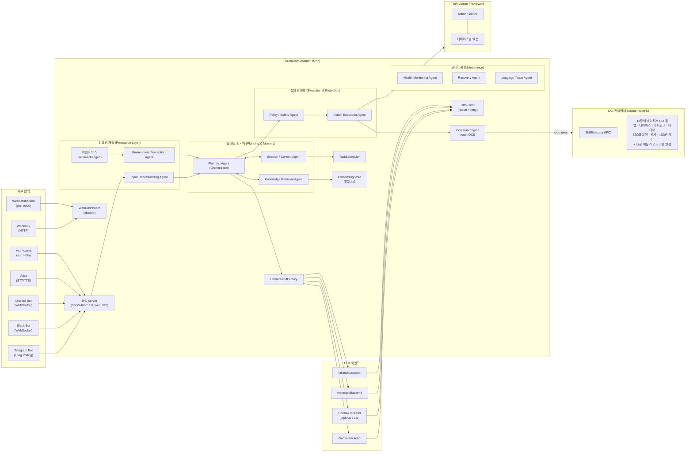

# TizenClaw 프로젝트 분석

> **최종 업데이트**: 2026-03-18

---

## 1. 프로젝트 개요

**TizenClaw**는 Tizen Embedded Linux 환경에서 동작하는 **Native C++ AI Agent 시스템 데몬**입니다.

사용자의 자연어 프롬프트를 다중 LLM 백엔드(Gemini, OpenAI, Claude, xAI, Ollama)를 통해 해석하고, OCI 컨테이너(crun) 안에서 Python 스킬을 실행하고 **Tizen Action Framework**를 통해 디바이스 액션을 수행하여 디바이스를 제어합니다. Function Calling 기반의 반복 루프(Agentic Loop)를 통해 복합 작업을 자율적으로 수행합니다. 7개 통신 채널, 암호화된 자격증명 저장, 구조화된 감사 로깅, 예약 작업 자동화, 시맨틱 검색(RAG), 웹 기반 관리 대시보드, 멀티 에이전트 오케스트레이션(슈퍼바이저 패턴, 스킬 파이프라인, A2A 프로토콜), 헬스 모니터링, OTA 업데이트를 지원합니다.



---

## 2. 프로젝트 구조

```
tizenclaw/
├── src/                             # 소스 및 헤더
│   ├── tizenclaw/                   # 데몬 코어 (151개 파일, 7개 서브디렉토리)
│   │   ├── tizenclaw.cc/hh          # 데몬 메인, IPC 서버, 시그널 핸들링
│   │   ├── agent_core.cc/hh         # Agentic Loop, 스킬 디스패치, 세션 관리
│   │   ├── container_engine.cc/hh   # OCI 컨테이너 생명주기 관리 (crun)
│   │   ├── http_client.cc/hh        # libcurl HTTP Post (재시도, 타임아웃, SSL)
│   │   ├── llm_backend.hh           # LlmBackend 추상 인터페이스
│   │   ├── llm_backend_factory.cc   # 백엔드 팩토리 패턴
│   │   ├── gemini_backend.cc/hh     # Google Gemini API
│   │   ├── openai_backend.cc/hh     # OpenAI / xAI (Grok) API
│   │   ├── anthropic_backend.cc/hh  # Anthropic Claude API
│   │   ├── ollama_backend.cc/hh     # Ollama 로컬 LLM
│   │   ├── telegram_client.cc/hh    # Telegram Bot 클라이언트 (네이티브)
│   │   ├── slack_channel.cc/hh      # Slack Bot (libwebsockets)
│   │   ├── discord_channel.cc/hh    # Discord Bot (libwebsockets)
│   │   ├── mcp_server.cc/hh         # 네이티브 MCP 서버 (JSON-RPC 2.0)
│   │   ├── webhook_channel.cc/hh    # 웹훅 HTTP 리스너 (libsoup)
│   │   ├── voice_channel.cc/hh      # Tizen STT/TTS (조건부 컴파일)
│   │   ├── web_dashboard.cc/hh      # 관리 대시보드 SPA (libsoup)
│   │   ├── channel.hh               # Channel 추상 인터페이스
│   │   ├── channel_registry.cc/hh   # 채널 생명주기 관리
│   │   ├── session_store.cc/hh      # Markdown 대화 영구 저장
│   │   ├── task_scheduler.cc/hh     # Cron/interval 태스크 자동화
│   │   ├── tool_policy.cc/hh        # 위험등급 + 루프 감지
│   │   ├── key_store.cc/hh          # API 키 암호화 저장
│   │   ├── audit_logger.cc/hh       # Markdown 감사 로깅
│   │   ├── skill_watcher.cc/hh      # inotify 스킬 핫리로드
│   │   └── embedding_store.cc/hh    # SQLite RAG 벡터 스토어
│   ├── tizenclaw-cli/               # CLI 도구 (모듈라 클래스)
│   │   ├── main.cc                  # 진입점, 인자 파싱
│   │   ├── socket_client.cc/hh      # UDS IPC 클라이언트
│   │   ├── request_handler.cc/hh    # JSON-RPC 요청 빌더
│   │   ├── response_printer.cc/hh   # 포맷팅된 출력 렌더러
│   │   └── interactive_shell.cc/hh  # 대화형 REPL 모드
│   ├── tizenclaw-tool-executor/     # 도구 실행기 데몸 (소켓 활성화)
│   │   ├── tizenclaw_tool_executor.cc # 메인, IPC 디스패쳐, execute_cli 핸들러
│   │   ├── python_engine.cc/hh      # 내장 Python 인터프리터
│   │   ├── tool_handler.cc/hh       # 스킬 실행 핸들러
│   │   ├── sandbox_proxy.cc/hh      # 코드 샌드박스 프록시
│   │   ├── file_manager.cc/hh       # 파일 작업 핸들러
│   │   └── peer_validator.cc/hh     # SO_PEERCRED 피어 검증
│   └── common/                      # 공통 유틸리티 (로깅, nlohmann JSON)
├── tools/cli/                       # 네이티브 CLI 도구 수트 (13개 디렉터리)
│   ├── common/tizen_capi_utils.py   # ctypes 기반 Tizen C-API 래퍼
│   ├── skill_executor.py            # 컨테이너 측 IPC 스킬 실행기
│   ├── list_apps/                   # 설치된 앱 목록 조회
│   ├── send_app_control/            # 앱 실행 (명시적 app_id 또는 암시적 인텐트)
│   ├── terminate_app/               # 앱 종료
│   ├── get_device_info/             # 디바이스 정보 조회
│   ├── get_battery_info/            # 배터리 상태 조회
│   ├── get_wifi_info/               # Wi-Fi 상태 조회
│   ├── get_bluetooth_info/          # 블루투스 상태 조회
│   ├── get_display_info/            # 디스플레이 밝기/상태
│   ├── get_system_info/             # 하드웨어 및 플랫폼 정보
│   ├── get_runtime_info/            # CPU/메모리 사용량
│   ├── get_storage_info/            # 저장소 공간 정보
│   ├── get_system_settings/         # 시스템 설정 (로케일, 글꼴 등)
│   ├── get_network_info/            # 네트워크 연결 정보
│   ├── get_sensor_data/             # 센서 데이터 (가속도, 자이로 등)
│   ├── get_package_info/            # 패키지 상세 정보
│   ├── control_display/             # 디스플레이 밝기 제어
│   ├── control_haptic/              # 햄틱 진동
│   ├── control_led/                 # 카메라 플래시 LED 제어
│   ├── control_volume/              # 볼륨 레벨 제어
│   ├── control_power/               # 전원 잠금 관리
│   ├── play_tone/                   # DTMF/비프 톤 재생
│   ├── play_feedback/               # 피드백 패턴 재생
│   ├── send_notification/           # 알림 게시
│   ├── schedule_alarm/              # 알람 스케줄링
│   ├── get_thermal_info/            # 디바이스 온도
│   ├── get_data_usage/              # 네트워크 데이터 사용량
│   ├── get_sound_devices/           # 오디오 디바이스 목록
│   ├── get_media_content/           # 미디어 파일 검색
│   ├── get_mime_type/               # MIME 타입 조회
│   ├── scan_wifi_networks/          # WiFi 스캔 (비동기, tizen-core)
│   └── web_search/                  # 웹 검색 (Wikipedia API)
├── scripts/                         # 컨테이너 & 인프라 스크립트 (9개)
│   ├── run_standard_container.sh    # 데몬용 OCI 컨테이너
│   ├── tizenclaw_secure_container.sh   # 코드 실행 보안 컨테이너
│   ├── build_rootfs.sh              # Alpine RootFS 빌드
│   ├── start_mcp_tunnel.sh          # SDB를 통한 MCP 터널
│   ├── fetch_crun_source.sh         # crun 소스 다운로드
│   ├── ci_build.sh                  # CI 빌드 스크립트
│   ├── pre-commit                   # Git pre-commit 훅
│   ├── setup-hooks.sh               # 훅 설치기
│   └── Dockerfile                   # RootFS 빌드 참고용
├── tools/embedded/                  # 내장 도구 MD 스키마 (17개 파일)
│   ├── execute_code.md              # Python 코드 실행
│   ├── file_manager.md              # 파일 시스템 작업
│   ├── create_task.md               # 태스크 스케줄러
│   ├── create_pipeline.md           # 파이프라인 생성
│   └── ...                          # + 12개 추가 도구 스키마
├── data/
│   ├── sample/                      # 샘플 설정 파일 목록 (디바이스 미설치)
│   │   ├── llm_config.json.sample
│   │   ├── telegram_config.json.sample
│   │   └── ...                      # 기타 샘플 설정들
│   ├── config/                      # 활성 설정 파일 목록
│   │   ├── tool_policy.json         # 도구 실행 정책
│   │   └── agent_roles.json         # 에이전트 역할 설정
│   ├── web/                         # 대시보드 SPA 파일
│   └── img/                         # 컨테이너 rootfs (아키텍처별)
│       └── <arch>/rootfs.tar.gz     # Alpine RootFS (49 MB)
├── tests/
│   ├── unit/                        # gtest/gmock 단위 테스트 (42개 파일)
│   ├── e2e/                         # E2E 스모크 테스트 스크립트
│   ├── cli_tools/                   # CLI 도구 검증 테스트
│   └── mcp/                         # MCP 프로토콜 준수 테스트
├── packaging/                       # RPM 패키징 & systemd
│   ├── tizenclaw.spec               # GBS RPM 빌드 스펙
│   ├── tizenclaw.service            # 데몬 systemd 서비스
│   └── tizenclaw.manifest           # Tizen SMACK 매니페스트
├── docs/                            # 문서
├── CMakeLists.txt                   # 빌드 시스템 (C++20)
└── third_party/                     # crun 1.26 소스
```

---

## 3. 핵심 모듈 상세

### 3.1 시스템 코어

| 모듈 | 파일 | 역할 | 상태 |
|------|------|------|------|
| **Daemon** | `tizenclaw.cc/hh` | systemd 서비스, IPC 서버 (스레드 풀), 채널 생명주기, 시그널 핸들링 | ✅ |
| **AgentCore** | `agent_core.cc/hh` | Agentic Loop, 스트리밍, 컨텍스트 압축, 멀티 세션, 엣지 메모리 플러시 (PSS) | ✅ |
| **ContainerEngine** | `container_engine.cc/hh` | crun OCI 컨테이너, Skill Executor IPC, 호스트 바인드 마운트, chroot 폴백 | ✅ |
| **HttpClient** | `http_client.cc/hh` | libcurl POST, 지수 백오프, SSL CA 자동 탐색 | ✅ |
| **SessionStore** | `session_store.cc/hh` | Markdown 영구 저장 (YAML frontmatter), 일별 로그, 토큰 사용량 추적 | ✅ |
| **TaskScheduler** | `task_scheduler.cc/hh` | Cron/interval/once/weekly 태스크, LLM 연동 실행, 백오프 재시도 | ✅ |
| **ActionBridge** | `action_bridge.cc/hh` | Tizen Action Framework 워커 스레드, MD 스키마 관리, 이벤트 기반 업데이트 | ✅ |
| **EmbeddingStore** | `embedding_store.cc/hh` | SQLite 벡터 스토어 | ✅ |
| **WebDashboard** | `web_dashboard.cc/hh` | libsoup SPA, REST API, 관리자 인증, 설정 편집기 | ✅ |
| **TunnelManager** | `infra/tunnel_manager.cc` | 안전한 ngrok 터널링 추상화 레이어 | ✅ |

### 3.2 LLM 백엔드 계층

| 백엔드 | 소스 파일 | API 엔드포인트 | 기본 모델 | 상태 |
|--------|-----------|---------------|-----------|------|
| **Gemini** | `gemini_backend.cc` | `generativelanguage.googleapis.com` | `gemini-2.5-flash` | ✅ |
| **OpenAI** | `openai_backend.cc` | `api.openai.com/v1` | `gpt-4o` | ✅ |
| **xAI (Grok)** | `openai_backend.cc` (공용) | `api.x.ai/v1` | `grok-3` | ✅ |
| **Anthropic** | `anthropic_backend.cc` | `api.anthropic.com/v1` | `claude-sonnet-4-20250514` | ✅ |
| **Ollama** | `ollama_backend.cc` | `localhost:11434` | `llama3` | ✅ |

- **추상화**: `LlmBackend` 인터페이스 → `LlmBackendFactory::Create()` 팩토리
- **공통 구조체**: `LlmMessage`, `LlmResponse`, `LlmToolCall`, `LlmToolDecl`
- **런타임 전환**: TizenClaw LLM Plugin을 우선하며, `active_backend` 및 `fallback_backends`로 안전하게 폴백하는 단일 통합 큐
- **모델 폴백**: 설정된 우선순위(기본 1)에 따라 후보군을 동적으로 정렬하는 견고한 폴백 시스템 지원
- **시스템 프롬프트**: 4단계 fallback + `{{AVAILABLE_TOOLS}}` 동적 placeholder

### 3.3 통신 & IPC

| 모듈 | 구현 | 프로토콜 | 상태 |
|------|------|---------|------|
| **IPC 서버** | `tizenclaw.cc` | Abstract Unix Socket, JSON-RPC 2.0, 길이-프리픽스, 스레드 풀 | ✅ |
| **UID 인증** | `IsAllowedUid()` | `SO_PEERCRED` (root, app_fw, system, developer) | ✅ |
| **Telegram** | `telegram_client.cc` | Bot API Long-Polling, 스트리밍 `editMessageText` | ✅ |
| **Slack** | `slack_channel.cc` | Socket Mode (libwebsockets) | ✅ |
| **Discord** | `discord_channel.cc` | Gateway WebSocket (libwebsockets) | ✅ |
| **MCP 서버** | `mcp_server.cc` | 네이티브 C++ stdio JSON-RPC 2.0 | ✅ |
| **Webhook** | `webhook_channel.cc` | HTTP 인바운드 (libsoup), HMAC-SHA256 인증 | ✅ |
| **Voice** | `voice_channel.cc` | Tizen STT/TTS C-API (조건부 컴파일) | ✅ |
| **Web Dashboard** | `web_dashboard.cc` | libsoup SPA, REST API, 관리자 인증 | ✅ |

### 3.4 Skills 시스템

| 스킬 | 파라미터 | Tizen C-API | 상태 |
|------|---------|-------------|------|
| `list_apps` | 없음 | `app_manager` | ✅ |
| `send_app_control` | `app_id`, `operation`, `uri`, `mime`, `extra_data` | `app_control` | ✅ |
| `terminate_app` | `app_id` (string, required) | `app_manager` | ✅ |
| `get_device_info` | 없음 | `system_info` | ✅ |
| `get_battery_info` | 없음 | `device` (battery) | ✅ |
| `get_wifi_info` | 없음 | `wifi-manager` | ✅ |
| `get_bluetooth_info` | 없음 | `bluetooth` | ✅ |
| `get_display_info` | 없음 | `device` (display) | ✅ |
| `control_display` | `brightness` (int) | `device` (display) | ✅ |
| `get_system_info` | 없음 | `system_info` | ✅ |
| `get_runtime_info` | 없음 | `runtime_info` | ✅ |
| `get_storage_info` | 없음 | `storage` | ✅ |
| `get_system_settings` | 없음 | `system_settings` | ✅ |
| `get_network_info` | 없음 | `connection` | ✅ |
| `get_sensor_data` | `sensor_type` (string) | `sensor` | ✅ |
| `get_package_info` | `package_id` (string) | `package_manager` | ✅ |
| `control_haptic` | `duration_ms` (int, optional) | `device` (haptic) | ✅ |
| `control_led` | `action` (string), `brightness` (int) | `device` (flash) | ✅ |
| `control_volume` | `action`, `sound_type`, `volume` | `sound_manager` | ✅ |
| `control_power` | `action`, `resource` | `device` (power) | ✅ |
| `play_tone` | `tone` (string), `duration_ms` (int) | `tone_player` | ✅ |
| `play_feedback` | `pattern` (string) | `feedback` | ✅ |
| `send_notification` | `title`, `body` (string) | `notification` | ✅ |
| `schedule_alarm` | `app_id`, `datetime` (string) | `alarm` | ✅ |
| `get_thermal_info` | 없음 | `device` (thermal) | ✅ |
| `get_data_usage` | 없음 | `connection` (통계) | ✅ |
| `get_sound_devices` | 없음 | `sound_manager` (디바이스) | ✅ |
| `get_media_content` | `media_type`, `max_count` | `media-content` | ✅ |
| `get_mime_type` | `file_extension`, `file_path`, `mime_type` | `mime-type` | ✅ |
| `scan_wifi_networks` | 없음 | `wifi-manager` + `tizen-core` (비동기) | ✅ |

| `get_metadata` | `file_path` | `metadata-extractor` | ✅ |
| `download_file` | `url`, `destination`, `file_name` | `url-download` + `tizen-core` (비동기) | ✅ |
| `scan_bluetooth_devices` | `action` | `bluetooth` + `tizen-core` (비동기) | ✅ |
| `web_search` | `query` (string, required) | 없음 (Wikipedia API) | ✅ |

AgentCore에 직접 구현된 내장 도구:
`execute_code`, `file_manager`, `manage_custom_skill`, `create_task`, `list_tasks`, `cancel_task`, `create_session`, `list_sessions`, `send_to_session`, `ingest_document`, `search_knowledge`, `execute_action`, `action_<name>` (Tizen Action Framework Per-action 도구), `execute_cli` (CLI 도구 플러그인 - **원샷(One-shot) 및 스트리밍(Streaming)** 모드 통합 지원), `create_workflow`, `list_workflows`, `run_workflow`, `delete_workflow`, `create_pipeline`, `list_pipelines`, `run_pipeline`, `delete_pipeline`, `run_supervisor`, `remember`, `recall`, `forget` (영속 메모리)

### 3.5 보안

| 컴포넌트 | 파일 | 역할 |
|---------|------|------|
| **KeyStore** | `key_store.cc` | 디바이스 바인딩 API 키 암호화 (GLib SHA-256 + XOR) |
| **ToolPolicy** | `tool_policy.cc` | 스킬별 risk_level, 루프 감지, idle 진행 체크 |
| **AuditLogger** | `audit_logger.cc` | Markdown 테이블 일별 감사 파일, 크기 기반 로테이션 |
| **UID 인증** | `tizenclaw.cc` | SO_PEERCRED IPC 발신자 검증 |
| **Admin 인증** | `web_dashboard.cc` | 세션 토큰 + SHA-256 비밀번호 해싱 |
| **Webhook 인증** | `webhook_channel.cc` | HMAC-SHA256 서명 검증 |

### 3.6 빌드 & 패키징

| 항목 | 세부 내용 |
|------|----------|
| **빌드 시스템** | CMake 3.12+, C++20, `pkg-config` (tizen-core, glib-2.0, dlog, libcurl, libsoup-2.4, libwebsockets, sqlite3, capi-appfw-tizen-action, libaurum, capi-appfw-event, capi-appfw-app-manager, capi-appfw-package-manager, aul, rua, vconf) |
| **패키징** | GBS RPM (`tizenclaw.spec`), crun 소스 빌드 포함 |
| **아키텍처** | x86_64 (에뮬레이터), armv7l (32-bit ARM), aarch64 (64-bit ARM) — 아키텍처별 rootfs `data/img/<arch>/` |
| **systemd** | `tizenclaw.service` (Type=simple), `tizenclaw-tool-executor.service` (Type=simple) |
| **테스트** | gtest/gmock (42개 테스트 파일), `%check`에서 `ctest -V` 실행 |

---

## 4. 완료된 개발 Phase

| Phase | 제목 | 주요 결과물 | 상태 |
|:-----:|------|-----------|:----:|
| 1 | 기반 아키텍처 | C++ 데몬, 5개 LLM 백엔드, HttpClient, 팩토리 패턴 | ✅ |
| 2 | 컨테이너 실행 환경 | ContainerEngine (crun OCI), 이중 컨테이너, unshare+chroot 폴백 | ✅ |
| 3 | Agentic Loop | 최대 5회 반복, 병렬 도구 실행, 세션 메모리 | ✅ |
| 4 | Skills 시스템 | 10개 스킬, tizen_capi_utils.py, CLAW_ARGS 규약 | ✅ |
| 5 | 통신 | Unix Socket IPC, SO_PEERCRED 인증, Telegram, MCP | ✅ |
| 6 | IPC 안정화 | 길이-프리픽스 프로토콜, JSON 세션 영구 저장, Telegram 허용목록 | ✅ |
| 7 | 보안 컨테이너 | OCI 스킬 샌드박스, Skill Executor IPC, 네이티브 MCP, 내장 도구 | ✅ |
| 8 | 스트리밍 & 동시성 | LLM 스트리밍, 스레드 풀 (4 클라이언트), tool_call_id 매핑 | ✅ |
| 9 | 컨텍스트 & 메모리 | 컨텍스트 압축, Markdown 영구 저장, 토큰 카운팅 | ✅ |
| 10 | 보안 강화 | 도구 실행 정책, 키 암호화, 감사 로깅 | ✅ |
| 11 | 태스크 스케줄러 | Cron/interval/once/weekly, LLM 연동, 재시도 백오프 | ✅ |
| 12 | 확장성 레이어 | 채널 추상화, 시스템 프롬프트 외부화, 사용량 추적 | ✅ |
| 13 | 스킬 생태계 | inotify 핫리로드, 모델 폴백, 루프 감지 강화 | ✅ |
| 14 | 신규 채널 | Slack, Discord, Webhook, 에이전트 간 메시징 | ✅ |
| 15 | 고급 기능 | RAG (SQLite 임베딩), 웹 대시보드, 음성 (TTS/STT) | ✅ |
| 16 | 운영 우수성 | 관리자 인증, 설정 편집기, 브랜딩 | ✅ |
| 17 | 멀티 에이전트 오케스트레이션 | 슈퍼바이저 에이전트, 스킬 파이프라인, A2A 프로토콜 | ✅ |
| 18 | 프로덕션 준비 | 헬스 메트릭스, OTA 업데이트, Action Framework, 도구 스키마 | ✅ |
| 19 | 엣지 최적화 및 터널링 | ngrok 터널 연동, 엣지 메모리 최적화, 바이너리 크기 최적화 | ✅ |

---

## 5. 경쟁 분석: OpenClaw, NanoClaw & ZeroClaw 대비 Gap 분석

> **분석 기준**: 2026-03-08 (Phase 18 완료 후)
> **분석 대상**: OpenClaw, NanoClaw, ZeroClaw

### 5.1 프로젝트 규모 비교

| 항목 | **TizenClaw** | **OpenClaw** | **NanoClaw** | **ZeroClaw** |
|------|:---:|:---:|:---:|:---:|
| 언어 | C++ / Python | TypeScript | TypeScript | Rust |
| 소스 파일 수 | ~89 | ~700+ | ~50 | ~100+ |
| 스킬 수 | 13종 CLI 수트 + 20+ 내장 | 52 | 5+ (skills-engine) | TOML 기반 |
| LLM 백엔드 | 5 | 15+ | Claude SDK | 5+ (trait 기반) |
| 채널 수 | 7 | 22+ | 5 | 17 |
| 테스트 커버리지 | 205+ 케이스 | 수백 개 | 수십 개 | 포괄적 |
| 플러그인 시스템 | Channel 인터페이스 | ✅ (npm 기반) | ❌ | ✅ (trait 기반) |
| 피크 RAM | ~30MB 추정 | ~100MB+ | ~80MB+ | <5MB |

### 5.2 남은 Gap

Phase 6-19를 통해 원래 분석에서 식별된 대부분의 Gap이 해소되었습니다. 남은 Gap:

| 영역 | 참조 프로젝트 | TizenClaw 현황 | 우선순위 |
|------|---------|---------------|:--------:|
| **RAG 확장성** | OpenClaw: sqlite-vec + ANN | 순차 코사인 유사도 | 🟡 중간 |
| **스킬 레지스트리** | OpenClaw: ClawHub | 수동 복사/inotify (Phase 20) | 🟢 낮음 |
| **채널 수** | OpenClaw: 22+ / ZeroClaw: 17 | 7개 | 🟢 낮음 |

---

## 6. TizenClaw만의 강점

| 강점 | 설명 |
|------|------|
| **네이티브 C++ 성능** | TypeScript 대비 낮은 메모리/CPU — 임베디드 환경에 최적 |
| **공격적인 엣지 메모리 관리** | 데몬 유휴 상태 모니터링 및 `malloc_trim`, SQLite 캐시 플러시를 통한 공격적 PSS 기반 엣지 메모리 최적화 |
| **OCI 컨테이너 격리** | crun 기반 `seccomp` + `namespace` — 앱 수준보다 정밀한 시스콜 제어 |
| **Tizen C-API 직접 호출** | ctypes 래퍼를 통한 디바이스 하드웨어 직접 제어 |
| **모듈형 CAPI 익스포트** | 타 앱의 시스템 레벨 AI SDK로 동작 가능하도록 외부 라이브러리(`src/libtizenclaw`) 캡슐화 |
| **강력한 다중 LLM 지원** | 5개 백엔드 런타임 전환 가능 + 자동 폴백 |
| **경량 배포** | systemd + RPM — Node.js/Docker 없이 단독 디바이스 실행 |
| **앤트로픽 표준 규격 지원** | 스킬 시스템은 앤트로픽 표준 포맷(`SKILL.md`)을 준수하며, 내장된 MCP 클라이언트를 통해 외부 서버와 Model Context Protocol로 완벽하게 연동됩니다. |
| **네이티브 MCP 서버** | C++ 데몬 내장 MCP — Claude Desktop에서 Tizen 디바이스 제어 |
| **RAG 통합** | 다중 프로바이더 임베딩을 갖춘 SQLite 기반 시맨틱 검색 |
| **웹 관리 대시보드** | 설정 편집 및 관리자 인증을 갖춘 인데몬 글래스모피즘 SPA |
| **음성 제어** | 네이티브 Tizen STT/TTS 연동 (조건부 컴파일) |
| **멀티 에이전트 오케스트레이션** | 슈퍼바이저 패턴, 스킬 파이프라인, A2A 크로스 디바이스 프로토콜 |
| **헬스 모니터링** | Prometheus 스타일 `/api/metrics` + 라이브 대시보드 패널 |
| **Tizen Action Framework** | Per-action LLM 도구 + MD 스키마 캐싱 + `action_event_cb` 이벤트 기반 업데이트 |
| **도구 스키마 디스커버리** | 내장 + 액션 도구 스키마를 MD 파일로 저장, LLM 시스템 프롬프트에 자동 로드 |
| **OTA 업데이트** | 버전 확인 및 롤백이 포함된 무선 스킬 업데이트 |

---

## 7. 기술 부채 및 개선 포인트

| 항목 | 현재 상태 | 개선 방향 |
|------|----------|----------|
| **모놀리식 루프** | AgentCore 단일 개체로 처리 | **분산된 11개의 MVP 에이전트 환경으로 전환 (진행 중)** |
| **퍼셉션** | LLM에게 Raw log 직접 전달 | **이벤트 버스 및 구조화된 상태 스키마 정립 (진행 중)** |
| RAG 인덱스 | 순차 코사인 검색 | 대규모 문서셋을 위한 ANN 인덱스 (HNSW) |
| 토큰 예산 | 응답 후 카운팅 | 사전 추정으로 오버플로 방지 |
| 동시 태스크 | 순차 실행 | 의존성 그래프 기반 병렬 실행 |
| 스킬 출력 파싱 | Raw stdout JSON | JSON 스키마 검증 |
| 에러 복구 | 크래시 시 진행 중 요청 손실 | 요청 저널링 |
| 로그 집약 | 로컬 Markdown 파일 | 원격 syslog 포워딩 |
| 스킬 버전 관리 | 버전 메타데이터 없음 | 매니페스트 v2 표준 (Phase 20) |

---

## 8. 코드 통계

| 카테고리 | 파일 수 | LOC |
|---------|--------|-----|
| C++ 소스 & 헤더 (`src/`) | 151 | ~34,200 |
| Python 스킬 & 유틸 | 36 | ~4,700 |
| Shell 스크립트 | 9 | ~950 |
| Web 프론트엔드 (HTML/CSS/JS) | 3 | ~3,700 |
| 단위 테스트 | 42 | ~7,800 |
| 종합 테스트 | 2 | ~800 |
| **총계** | ~243 | ~52,150 |
