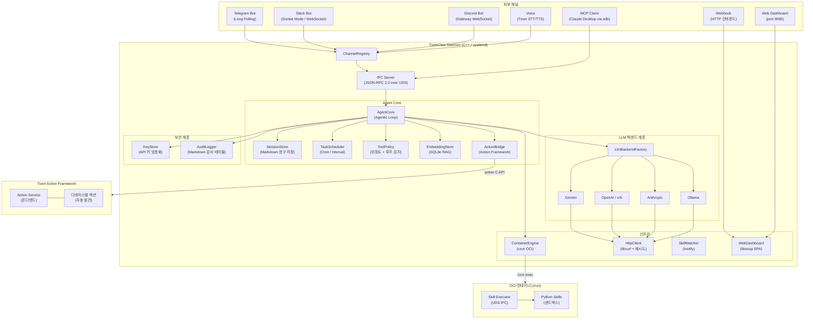
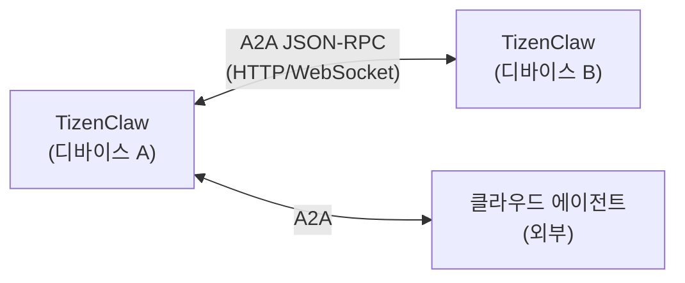
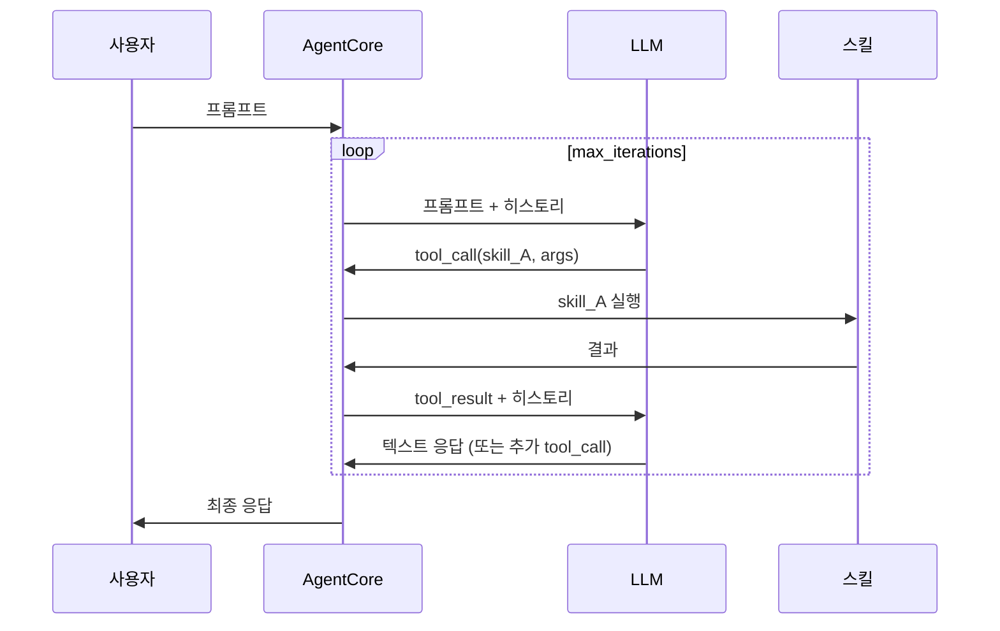
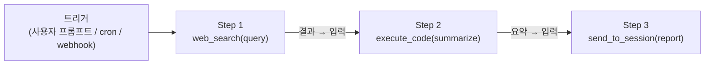

# TizenClaw 설계 문서

> **최종 업데이트**: 2026-03-12
> **버전**: 2.2

---

## 1. 개요

**TizenClaw**는 Tizen Embedded Linux 환경에 최적화된 네이티브 C++ AI 에이전트 **데몬**입니다. **systemd 서비스**로 백그라운드에서 실행되며, 다중 통신 채널(Telegram, Slack, Discord, MCP, Webhook, Voice, Web Dashboard)을 통해 사용자 프롬프트를 수신하고, 설정 가능한 LLM 백엔드를 통해 해석하여, OCI 컨테이너 내에서 샌드박스된 Python 스킬 및 **Tizen Action Framework**를 통해 디바이스 작업을 수행합니다.

Tizen의 보안 정책(SMACK, DAC, kUEP) 하에서도 안전하고 확장 가능한 Agent-Skill 상호작용 환경을 구축하며, 멀티 에이전트 협조, 스트리밍 응답, 암호화된 자격증명 저장, 구조화된 감사 로깅 등 엔터프라이즈급 기능을 제공합니다.

### 시스템 구동 환경

- **OS**: Tizen Embedded Linux (Tizen 10.0)
- **런타임**: systemd 데몬 (`tizenclaw.service`)
- **보안**: SMACK + DAC 적용, kUEP (Kernel Unprivileged Execution Protection) 활성화
- **언어**: C++20, Python 3.x (스킬)

---

## 2. 시스템 아키텍처



---

## 3. 핵심 모듈 설계

### 3.1 데몬 프로세스 (`tizenclaw.cc`)

메인 데몬 프로세스가 전체 생명주기를 관리합니다:

- **systemd 통합**: `Type=simple` 서비스로 실행, `SIGINT`/`SIGTERM`으로 안전한 종료
- **IPC 서버**: Abstract Unix Domain Socket (`\0tizenclaw.sock`), 표준 `JSON-RPC 2.0` 및 길이-프리픽스 프레이밍 (`[4바이트 길이][JSON]`)
- **UID 인증**: `SO_PEERCRED` 기반 발신자 검증 (root, app_fw, system, developer)
- **스레드 풀**: `kMaxConcurrentClients = 4` 동시 요청 처리
- **채널 생명주기**: `ChannelRegistry`를 통한 모든 채널 초기화 및 관리
- **모듈형 CAPI (`src/libtizenclaw`)**: 내부 로직이 외부 CAPI 계층(`tizenclaw.h`)과 완전히 분리되어, SDK로서의 배포가 용이합니다.

### 3.2 Agent Core (`agent_core.cc`)

**Agentic Loop**을 구현하는 핵심 오케스트레이션 엔진:

- **반복적 도구 호출**: LLM이 도구 호출 생성 → 실행 → 결과 피드백 → 반복 (설정 가능한 `max_iterations`)
- **스트리밍 응답**: 청크 IPC 전달 (`stream_chunk` / `stream_end`), Telegram `editMessageText` 점진적 편집
- **컨텍스트 압축**: 15턴 초과 시 가장 오래된 10턴을 LLM으로 요약하여 1턴으로 압축
- **엣지 메모리 최적화**: `MaintenanceLoop`가 유휴 시간을 적극 모니터링하여, 5분 비활성 시 `malloc_trim(0)` 및 `sqlite3_release_memory`를 호출해 PSS 메모리를 회수합니다.
- **멀티 세션**: 세션별 시스템 프롬프트와 히스토리 격리를 통한 동시 에이전트 세션
- **통합 백엔드 선택**: `SwitchToBestBackend()` 알고리즘을 통해 단일 우선순위 큐(`Plugin` > `active_backend` > `fallback_backends`)를 기반으로 동적으로 활성 백엔드를 선택합니다.
- **내장 도구**: `execute_code`, `file_manager`, `create_task`, `list_tasks`, `cancel_task`, `create_session`, `list_sessions`, `send_to_session`, `ingest_document`, `search_knowledge`, `execute_action`, `action_<name>` (Per-action 도구), `remember`, `recall`, `forget` (영속 메모리), `execute_cli` (CLI 도구 플러그인)
- **도구 디스패치**: `std::unordered_map<string, ToolHandler>` O(1) 조회, 동적 이름 도구(예: `action_*`)는 `starts_with` 폴백 처리

### 3.3 LLM 백엔드 계층

`LlmBackend` 인터페이스를 통한 프로바이더 불가지 추상화:

| 백엔드 | 소스 | 기본 모델 | 스트리밍 | 토큰 카운팅 |
|--------|------|----------|:--------:|:----------:|
| Gemini | `gemini_backend.cc` | `gemini-2.5-flash` | ✅ | ✅ |
| OpenAI | `openai_backend.cc` | `gpt-4o` | ✅ | ✅ |
| xAI (Grok) | `openai_backend.cc` | `grok-3` | ✅ | ✅ |
| Anthropic | `anthropic_backend.cc` | `claude-sonnet-4-20250514` | ✅ | ✅ |
| Ollama | `ollama_backend.cc` | `llama3` | ✅ | ✅ |

- **팩토리 패턴**: `LlmBackendFactory::Create()` 인스턴스 생성
- **통합 우선순위 전환**: `active_backend`와 `fallback_backends` 배열 모두 기본 우선순위인 `1`을 가집니다.
- **동적 플러그인**: RPK를 통해 설치된 TizenClaw LLM Plugin 백엔드는 자체 우선순위(예: `10`)를 명시합니다. 플러그인이 설치되어 실행 중일 경우, `SwitchToBestBackend()`는 트래픽을 해당 플러그인 인스턴스로 라우팅합니다. 삭제 시 우선순위 `1`을 가진 기본 백엔드로 원활하게 폴백됩니다.
- **시스템 프롬프트**: 4단계 fallback (config inline → 파일 경로 → 기본 파일 → 하드코딩), `{{AVAILABLE_TOOLS}}` 동적 placeholder

### 3.4 컨테이너 엔진 (`container_engine.cc`)

OCI 호환 스킬 실행 환경:

- **런타임**: `crun` 1.26 (RPM 패키징 시 소스 빌드)
- **이중 아키텍처**: Standard Container (데몬) + Skills Secure Container (샌드박스)
- **네임스페이스 격리**: PID, Mount, User 네임스페이스
- **폴백**: cgroup 미사용 시 `unshare + chroot`
- **Skill Executor IPC**: 데몬과 컨테이너 내 Python 실행기 간 길이-프리픽스 JSON + Unix Domain Socket
- **호스트 바인드 마운트**: Tizen C-API 접근을 위한 `/usr/bin`, `/usr/lib`, `/usr/lib64`, `/lib64`

### 3.5 채널 추상화 계층

모든 통신 엔드포인트를 위한 통합 `Channel` 인터페이스:

```cpp
class Channel {
 public:
  virtual std::string GetName() const = 0;
  virtual bool Start() = 0;
  virtual void Stop() = 0;
  virtual bool IsRunning() const = 0;
};
```

| 채널 | 구현 | 프로토콜 |
|------|------|---------|
| Telegram | `telegram_client.cc` | Bot API Long-Polling |
| Slack | `slack_channel.cc` | Socket Mode (libwebsockets) |
| Discord | `discord_channel.cc` | Gateway WebSocket (libwebsockets) |
| MCP | `mcp_server.cc` | stdio JSON-RPC 2.0 |
| Webhook | `webhook_channel.cc` | HTTP 인바운드 (libsoup) |
| Voice | `voice_channel.cc` | Tizen STT/TTS C-API (조건부 컴파일) |
| Web Dashboard | `web_dashboard.cc` | libsoup SPA (port 9090) |

`ChannelRegistry`가 생명주기 관리 (등록, 전체 시작/정지, 이름별 검색).

### 3.6 보안 서브시스템

| 컴포넌트 | 파일 | 기능 |
|---------|------|------|
| **KeyStore** | `key_store.cc` | 디바이스 바인딩 API 키 암호화 (GLib SHA-256 + XOR, `/etc/machine-id`) |
| **ToolPolicy** | `tool_policy.cc` | 스킬별 `risk_level`, 루프 감지 (3회 반복 차단), idle 진행 체크 |
| **AuditLogger** | `audit_logger.cc` | Markdown 테이블 감사 파일 (`audit/YYYY-MM-DD.md`), 일별 로테이션, 5MB 제한 |
| **UID 인증** | `tizenclaw.cc` | `SO_PEERCRED` IPC 발신자 검증 |
| **Webhook 인증** | `webhook_channel.cc` | HMAC-SHA256 서명 검증 (GLib `GHmac`) |

### 3.7 영구 저장 및 스토리지

모든 저장소는 **Markdown + YAML frontmatter** 사용 (RAG용 SQLite 제외):

```
/opt/usr/share/tizenclaw/
├── sessions/{YYYY-MM-DD}-{id}.md    ← 대화 히스토리
├── logs/{YYYY-MM-DD}.md             ← 일별 스킬 실행 로그
├── usage/
│   ├── {session-id}.md              ← 세션별 토큰 사용량
│   ├── daily/YYYY-MM-DD.md          ← 일별 누적
│   └── monthly/YYYY-MM.md           ← 월별 누적
├── audit/YYYY-MM-DD.md              ← 감사 추적
├── tasks/task-{id}.md               ← 예약 태스크
├── tools/actions/{name}.md          ← Action 스키마 캐시 (디바이스별, 자동 동기화)
├── tools/embedded/{name}.md         ← 내장 도구 스키마 (RPM으로 설치)
├── tools/cli/{pkgid__name}/         ← CLI 도구 플러그인 (TPK에서 symlink)
│   ├── executable                   ← CLI 바이너리 symlink
│   └── tool.md                      ← LLM 도구 설명서 symlink
├── memory/
│   ├── memory.md                    ← 자동 생성 요약 (idle 시 dirty-flag 기반 갱신)
│   ├── long-term/{date}-{title}.md  ← 사용자 선호, 영속 사실
│   ├── episodic/{date}-{skill}.md   ← 스킬 실행 이력 (자동 기록)
│   └── short-term/{session_id}/     ← 세션별 최근 명령
├── config/memory_config.json        ← 메모리 보존 주기 및 크기 제한
└── knowledge/embeddings.db          ← SQLite 벡터 저장소 (RAG)
```

- **메모리 서브시스템**: `MemoryStore` 클래스(`memory_store.hh/cc`)가 3개 메모리 타입에 대한 CRUD, YAML-frontmatter Markdown 형식, idle 시 dirty-flag 기반 `memory.md` 요약 갱신, `memory_config.json`을 통한 설정 가능한 보존 주기, `RecordSkillExecution()`을 통한 자동 episodic 메모리 기록을 제공합니다.

### 3.8 Tizen Action Framework 브릿지 (`action_bridge.cc`)

Tizen Action Framework와의 네이티브 통합:

- **아키텍처**: `ActionBridge`가 전용 `tizen_core_task` 워커 스레드에서 Action C API 실행, `tizen_core_channel`로 스레드 간 통신
- **스키마 관리**: 액션별 Markdown 파일 (파라미터 테이블, 권한, JSON 스키마 포함)
- **초기화 동기화**: `SyncActionSchemas()`가 `action_client_foreach_action`으로 모든 액션 가져와 MD 파일 작성/덮어쓰기, 더 이상 존재하지 않는 파일 정리
- **이벤트 기반 업데이트**: `action_client_add_event_handler`로 INSTALL/UNINSTALL/UPDATE 이벤트 구독 → MD 파일 자동 갱신 → 도구 캐시 무효화
- **Per-Action 도구**: 등록된 각 액션이 타입이 지정된 LLM 도구로 변환 (예: `action_<name>`). 사용 가능한 액션은 디바이스마다 다름.
- **실행**: 모든 액션 실행은 JSON-RPC 2.0 모델 형식의 `action_client_execute`를 통해 수행

Action 스키마는 런타임에 자동 생성되며 디바이스마다 다릅니다. `SyncActionSchemas()`가 초기화 시 디렉터리를 채웁니다.

### 3.9 태스크 스케줄러 (`task_scheduler.cc`)

LLM 연동 인프로세스 자동화:

- **스케줄 타입**: `daily HH:MM`, `interval Ns/Nm/Nh`, `once YYYY-MM-DD HH:MM`, `weekly DAY HH:MM`
- **실행**: `AgentCore::ProcessPrompt()` 직접 호출 (IPC 슬롯 미소비)
- **영구 저장**: YAML frontmatter Markdown
- **재시도**: 실패 태스크 지수 백오프 재시도 (최대 3회)

### 3.10 RAG / 시맨틱 검색 (`embedding_store.cc`)

대화 히스토리 너머의 지식 검색:

- **저장소**: SQLite + 순차 코사인 유사도 (임베디드 규모에 충분)
- **임베딩 API**: Gemini (`text-embedding-004`), OpenAI (`text-embedding-3-small`), Ollama
- **내장 도구**: `ingest_document` (청킹 + 임베딩), `search_knowledge` (코사인 유사도 쿼리)

### 3.11 웹 대시보드 (`web_dashboard.cc`)

내장 관리 대시보드:

- **서버**: libsoup `SoupServer` 포트 9090
- **프론트엔드**: 다크 글래스모피즘 SPA (HTML+CSS+JS)
- **REST API**: `/api/sessions`, `/api/tasks`, `/api/logs`, `/api/chat`, `/api/config`
- **관리자 인증**: SHA-256 비밀번호 해싱을 사용한 세션 토큰 메커니즘
- **설정 편집기**: 백업-온-라이트 기능의 7개 설정 파일 인브라우저 편집

### 3.12 도구 스키마 디스커버리

Markdown 스키마 파일을 통한 LLM 도구 발견:

- **내장 도구**: `/opt/usr/share/tizenclaw/tools/embedded/` 아래 13개 MD 파일이 내장 도구를 기술 (execute_code, file_manager, 파이프라인, 태스크, RAG 등)
- **Action 도구**: Action Framework MD 파일이 Tizen Action Framework 액션을 기술 (디바이스별, 자동 동기화)
- **CLI 도구**: `/opt/usr/share/tizenclaw/tools/cli/` 아래 `.tool.md` 설명서가 CLI 도구 플러그인을 기술 (커맨드, 인자, 출력 형식). `CliPluginManager`가 TPK 패키지에서 symlink 생성 후 시스템 프롬프트에 주입.
- **시스템 프롬프트 통합**: 프롬프트 빌드 시 모든 디렉터리를 스캔하여 전체 MD 내용을 `{{AVAILABLE_TOOLS}}` 섹션에 추가
- **스키마-실행 분리**: MD 파일은 LLM 컨텍스트만 제공; 실행 로직은 `AgentCore` 디스패치 (내장), `ActionBridge` (액션), `ExecuteCli` (CLI 도구)가 독립적으로 처리

---

## 4. 멀티 에이전트 오케스트레이션 및 퍼셉션 설계

TizenClaw는 현재 **멀티 세션 에이전트 간 메시징**을 지원합니다. 이 섹션은 임베디드 리눅스에 최적화된 고급 퍼셉션(Perception) 계층을 기반으로, 고도로 분산되고 안정적인 멀티 에이전트 모델로 전환하기 위한 구조적 방향을 기술합니다.

### 4.1 11-Agent MVP 세트

임베디드 디바이스에서의 운영 안정성을 달성하기 위해, 단일 에이전트 토폴로지를 논리적으로 분류된 11개의 MVP 에이전트 세트로 분할합니다:

| 카테고리 | 에이전트 | 주요 책임 |
|----------|----------|-----------|
| **이해** | `Input Understanding Agent` | 7개 채널의 원시 사용자 입력을 통합된 인텐트(Intent) 구조로 표준화합니다. |
| **인식** | `Environment Perception Agent` | 이벤트 버스를 구독하여 공통 상태 스키마(Common State Schema)를 유지합니다. |
| **기억** | `Session / Context Agent` | 단기 기억(현재 작업), 장기 기억(사용자 선호), 에피소드 기억(과거 실행의 성공/실패)을 관리합니다. |
| **판단** | `Planning Agent` (오케스트레이터) | 퍼셉션과 Capability Registry를 기반으로 목표를 논리적 단계로 분해합니다. |
| **실행** | `Action Execution Agent` | 명확한 함수 계약에 따라 실제 OCI 컨테이너 스킬 및 Action Framework 명령을 호출합니다. |
| **보호** | `Policy / Safety Agent` | 실행 전 계획을 가로채어 정책(야간 제한, 샌드박스 권한 등)을 반영합니다. |
| **유틸리티** | `Knowledge Retrieval Agent` | 시맨틱 검색을 위해 SQLite RAG 저장소와 인터페이스합니다. |
| **유지 (모니터링)** | `Health Monitoring Agent` | 메모리 압박(PSS 제약), 데몬 업타임, 컨텍스트 용량 등을 모니터링합니다. |
| | `Recovery Agent` | 구조화된 실패(예: DNS 타임아웃)를 분석하고 폴백(Fallback) 또는 오류 수정을 시도합니다. |
| | `Logging / Trace Agent` | 디버깅 및 감사 기록을 메인 컨텍스트를 비대화시키지 않도록 분리하여 저장합니다. |

*(기존의 `Skill Manager` 에이전트는 RPK 기반 도구 생태계가 성숙해짐에 따라 실행/복구 레이어로 흡수되거나 대체될 예정입니다.)*
    User["사용자 프롬프트"]
    MainAgent["메인 에이전트<br/>(기본 세션)"]
    SubAgent1["리서치 에이전트<br/>(세션: research)"]
    SubAgent2["코드 에이전트<br/>(세션: code)"]

    User --> MainAgent
    MainAgent -->|"create_session<br/>+ send_to_session"| SubAgent1
    MainAgent -->|"create_session<br/>+ send_to_session"| SubAgent2
    SubAgent1 -->|"send_to_session"| MainAgent
    SubAgent2 -->|"send_to_session"| MainAgent
```

- 각 세션은 고유한 시스템 프롬프트와 대화 히스토리 보유
- `create_session`, `list_sessions`, `send_to_session` 내장 도구
- 세션은 격리되지만 메시지 전달을 통해 통신 가능

### 4.2 퍼셉션 아키텍처 (임베디드 리눅스 최적화)

강력한 멀티 에이전트 시스템은 고품질의 퍼셉션(Perception)에 의존합니다. 임베디드 환경에서는 원시 로그 전체를 LLM에 전달하는 것이 비효율적이므로, 다음 원칙을 기반으로 설계됩니다:

**1. 공통 상태 스키마 (Common State Schema)**
원시 데이터 대신 정규화된 JSON 스키마를 제공합니다:
- `DeviceState`: 활성화 기능 (디스플레이, BT, WiFi), 모델명 등
- `RuntimeState`: 네트워크 상태, 전원 모드, 메모리 압박 수준
- `UserState`: 로캘, 선호설정, 사용자 권한
- `TaskState`: 현재 목표, 활성 단계, 누락된 인텐트 변수

**2. Capability Registry 및 Function Contract**
Planning Agent가 현실적인 계획을 세우려면, 동적으로 로드된 RPK 플러그인과 내장 스킬들이 입력/출력 스키마, 권한, 부작용(Side effects) 등을 명확히 기술해야 합니다.

**3. 이벤트 버스 (Event-Driven Updates)**
지속적인 폴링 대신 `sensor.changed`, `network.disconnected`, `action.failed` 같은 세분화된 이벤트에 반응하여 CPU 소모 없이 상태를 최신화합니다.

**4. 메모리 구조**
- *단기 (Short-term)*: 세션별 분리 (`short-term/{session_id}/`), 최근 명령 (세션당 최대 50개, 24시간 보존), 요약 데이터만 저장.
- *장기 (Long-term)*: 사용자 선호, 영속 사실 (`long-term/{date}-{title}.md`, 파일당 최대 2KB).
- *에피소드 (Episodic)*: 스킬 실행 이력 자동 기록 (`episodic/{date}-{skill}.md`, 최대 2KB, 30일 보존).
- *요약*: `memory.md` (최대 8KB) idle 시 dirty-flag 기반 자동 갱신. Recent Activity (최근 5건), Long-term 요약, Recent Episodic (최근 10건) 포함.
- *LLM 도구*: `remember` (long-term/episodic 저장), `recall` (키워드 검색), `forget` (특정 항목 삭제).
- *설정*: `memory_config.json`으로 타입별 보존 주기 및 크기 제한 설정 가능.
- *시스템 프롬프트 통합*: `{{MEMORY_CONTEXT}}` placeholder로 `memory.md` 내용을 system prompt에 주입.

**5. 임베디드 설계 원칙 반영**
- **선택적 컨텍스트 주입 (Selective Context Injection)**: `[network: disconnected, reason: dns_timeout]` 처럼 정제되고 해석된 상태값만 LLM에 전달.
- **인식과 실행의 분리**: Perception Agent가 상태를 인식하고 Action Agent는 실행만 전담.
- **확신도(Confidence) 제공**: 인텐트 판별 결과에 `confidence: 0.82` 등을 부여해 불확실 시 사용자에게 되묻도록 처리.

### 4.3 향후: A2A (Agent-to-Agent) 프로토콜

크로스 디바이스 또는 크로스 인스턴스 에이전트 협조:



**구현 방향**:
- WebDashboard HTTP 서버의 A2A 엔드포인트
- Agent Card 디스커버리 (`.well-known/agent.json`)
- 태스크 생명주기: submit → working → artifact → done

---

## 5. 스킬/툴 파이프라인 (Chain) 실행 설계

현재 Agentic Loop는 도구를 **반응적으로** 실행합니다 (LLM이 각 단계를 결정). 이 섹션은 결정적 다단계 워크플로우를 위한 **능동적 파이프라인 실행**을 제안합니다.

### 5.1 현재: 반응적 Agentic Loop



### 5.2 향후: 결정적 스킬 파이프라인

단계 간 데이터 흐름을 가진 사전 정의된 스킬 실행 시퀀스:



**설계**:

```json
{
  "pipeline_id": "daily_news_summary",
  "trigger": "daily 09:00",
  "steps": [
    {"skill": "web_search", "args": {"query": "{{topic}}"}, "output_as": "search_result"},
    {"skill": "execute_code", "args": {"code": "summarize({{search_result}})"}, "output_as": "summary"},
    {"skill": "send_to_session", "args": {"session": "report", "message": "{{summary}}"}}
  ]
}
```

**구현 방향**:
- `PipelineExecutor` 클래스: 파이프라인 JSON 로드 → 단계별 순차 실행 → `{{variable}}` 보간으로 출력 전달
- 에러 핸들링: 단계별 재시도, 실패 시 건너뛰기, 롤백
- 내장 도구: `create_pipeline`, `list_pipelines`, `run_pipeline`
- 저장소: `pipelines/pipeline-{id}.json`
- `TaskScheduler`와 통합하여 cron 트리거 파이프라인

### 5.3 향후: 조건부 / 분기 파이프라인

```json
{
  "steps": [
    {"skill": "get_battery_info", "output_as": "battery"},
    {
      "condition": "{{battery.level}} < 20",
      "then": [{"skill": "vibrate_device", "args": {"duration_ms": 500}}],
      "else": [{"skill": "execute_code", "args": {"code": "print('Battery OK')"}}]
    }
  ]
}
```

---

## 6. 향후 개선사항 / TODO

### 6.1 추가할 신규 기능

| 기능 | 우선순위 | 설명 |
|------|:-------:|------|
| **슈퍼바이저 에이전트** | 🔴 높음 | 멀티 에이전트 목표 분해 및 위임 |
| **스킬 파이프라인 엔진** | 🔴 높음 | 결정적 순차/조건 스킬 실행 |
| **A2A 프로토콜** | 🟡 중간 | 크로스 디바이스 에이전트 통신 (JSON-RPC) |
| **웨이크 워드 감지** | 🟡 중간 | 하드웨어 마이크 기반 음성 활성화 (STT 하드웨어 필요) |
| **스킬 마켓플레이스** | 🟢 낮음 | 원격 스킬 다운로드, 검증, 설치 |

### 6.2 보완이 필요한 영역

| 영역 | 현재 상태 | 개선 방향 |
|------|----------|----------|
| **RAG 확장성** | 순차 코사인 유사도 | 대규모 문서셋을 위한 ANN 인덱스 (HNSW) |
| **토큰 예산** | 응답 후 토큰 카운팅 | 사전 요청 토큰 추정으로 컨텍스트 오버플로 방지 |
| **동시 태스크** | 순차 태스크 실행 | 의존성 그래프 기반 병렬 태스크 실행 |
| **스킬 출력 검증** | Raw stdout JSON | 스킬별 JSON 스키마 검증 |
| **에러 복구** | 크래시 시 진행 중 요청 손실 | 크래시 복구를 위한 요청 저널링 |
| **로그 집약** | 로컬 Markdown 파일 | 원격 syslog 또는 구조화된 로그 포워딩 |

---

## 7. 요구사항 요약

### 7.1 기능 요구사항

- **Agent Core**: 멀티 LLM Agentic Loop, 스트리밍, 컨텍스트 압축을 갖춘 네이티브 C++ 데몬
- **스킬 실행**: inotify 핫리로드를 갖춘 OCI 컨테이너 격리 Python 스킬
- **통신**: 7개 채널 (Telegram, Slack, Discord, MCP, Webhook, Voice, Web)
- **보안**: 암호화된 키, 도구 실행 정책, 감사 로깅, UID/HMAC 인증
- **자동화**: LLM 연동 Cron/interval 태스크 스케줄러
- **지식**: SQLite 기반 RAG 및 임베딩 검색
- **관리**: 설정 편집기 및 관리자 인증을 갖춘 웹 대시보드

### 7.2 비기능 요구사항

- **배포**: systemd 서비스, GBS를 통한 RPM 패키징
- **런타임**: Container RootFS 내부에 Python 캡슐화 (호스트 설치 불필요)
- **성능**: 임베디드 디바이스의 낮은 메모리/CPU 사용을 위한 네이티브 C++
- **안정성**: 모델 폴백, 지수 백오프, 실패 태스크 재시도
