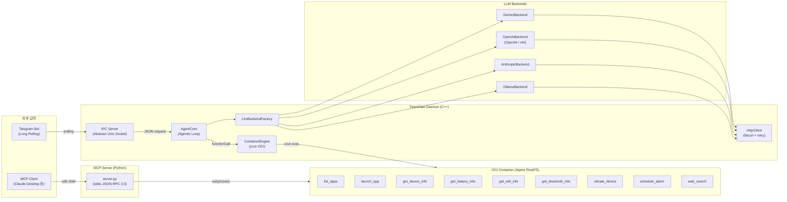

# TizenClaw 프로젝트 분석 및 향후 로드맵

> **최종 업데이트**: 2026-03-05

---

## 1. 프로젝트 개요

**TizenClaw**는 Tizen Embedded Linux 환경에서 동작하는 **Native C++ AI Agent 시스템 데몬**입니다.

사용자의 자연어 프롬프트를 다중 LLM 백엔드(Gemini, OpenAI, Claude, xAI, Ollama)를 통해 해석하고, OCI 컨테이너(crun) 안에서 Python 스킬을 실행하여 디바이스를 제어합니다. Function Calling 기반의 반복 루프(Agentic Loop)를 통해 복합 작업을 자율적으로 수행합니다.



---

## 2. 프로젝트 구조

```
tizenclaw/
├── src/                             # C++ 소스 (10개 파일, ~2,070 LOC)
│   ├── tizenclaw.cc                 # 데몬 메인, IPC 서버, 시그널 핸들링
│   ├── agent_core.cc                # Agentic Loop, 스킬 디스패치, 세션 관리
│   ├── container_engine.cc          # OCI 컨테이너 생명주기 관리 (crun)
│   ├── http_client.cc               # libcurl HTTP Post (재시도, 타임아웃, SSL)
│   ├── llm_backend_factory.cc       # 백엔드 팩토리 패턴
│   ├── gemini_backend.cc            # Google Gemini API 연동
│   ├── openai_backend.cc            # OpenAI / xAI (Grok) API 연동
│   ├── anthropic_backend.cc         # Anthropic Claude API 연동
│   ├── ollama_backend.cc            # Ollama 로컬 LLM 연동
│   └── telegram_bridge.cc           # Telegram Listener 프로세스 관리 (fork+exec, watchdog)
├── inc/                             # 헤더 파일 (10개 + nlohmann/json.hpp)
│   ├── tizenclaw.hh                 # TizenClawDaemon 클래스
│   ├── agent_core.hh                # AgentCore 클래스
│   ├── container_engine.hh          # ContainerEngine 클래스
│   ├── llm_backend.hh               # LlmBackend 추상 인터페이스, 공유 구조체
│   ├── http_client.hh               # HttpClient/HttpResponse
│   ├── gemini_backend.hh
│   ├── openai_backend.hh            # OpenAI + xAI 공용
│   ├── anthropic_backend.hh
│   ├── ollama_backend.hh
│   ├── telegram_bridge.hh           # TelegramBridge 클래스
│   └── nlohmann/json.hpp            # JSON 파서 (header-only)
├── skills/                          # Python 스킬 (12개 디렉터리)
│   ├── common/                      # 공용 유틸리티
│   │   └── tizen_capi_utils.py      # ctypes 기반 Tizen C-API 래퍼
│   ├── list_apps/                   # 설치된 앱 목록 조회
│   ├── launch_app/                  # 앱 실행
│   ├── get_device_info/             # 디바이스 정보 조회
│   ├── get_battery_info/            # 배터리 상태 조회
│   ├── get_wifi_info/               # Wi-Fi 상태 조회
│   ├── get_bluetooth_info/          # 블루투스 상태 조회
│   ├── vibrate_device/              # 햅틱 진동
│   ├── schedule_alarm/              # 알람 스케줄링
│   ├── web_search/                  # 웹 검색 (Wikipedia API)
│   ├── telegram_listener/           # Telegram Bot 브릿지
│   └── mcp_server/                  # MCP 서버 (stdio, JSON-RPC 2.0)
├── scripts/                         # 컨테이너 & 인프라 스크립트 (6개)
│   ├── run_standard_container.sh    # 데몬용 OCI 컨테이너 (cgroup fallback 포함)
│   ├── skills_secure_container.sh   # 스킬 실행용 보안 컨테이너
│   ├── build_rootfs.sh              # Alpine RootFS 빌드
│   ├── start_mcp_tunnel.sh          # SDB를 통한 MCP 터널 시작
│   ├── fetch_crun_source.sh         # crun 소스 다운로드
│   └── Dockerfile                   # RootFS 빌드 참고용
├── data/
│   ├── llm_config.json.sample       # LLM 설정 샘플
│   ├── telegram_config.json.sample  # Telegram Bot 설정 샘플
│   └── rootfs.tar.gz                # Alpine RootFS (49 MB)
├── test/unit_tests/                 # gtest/gmock 단위 테스트
│   ├── agent_core_test.cc           # AgentCore 테스트 (4개 케이스)
│   ├── container_engine_test.cc     # ContainerEngine 테스트 (3개 케이스)
│   ├── main.cc                      # gtest main
│   └── mock/                        # Mock 헤더
├── packaging/                       # RPM 패키징 & systemd
│   ├── tizenclaw.spec               # GBS RPM 빌드 스펙 (crun 소스 빌드 포함)
│   ├── tizenclaw.service            # 데몬 systemd 서비스
│   ├── tizenclaw-skills-secure.service  # 스킬 컨테이너 systemd 서비스
│   └── tizenclaw.manifest           # Tizen SMACK 매니페스트
├── docs/                            # 설계 문서 (4개)
├── CMakeLists.txt                   # 빌드 시스템 (C++17)
└── third_party/                     # crun 1.26 소스 (소스 빌드)
```

---

## 3. 핵심 모듈 상세

### 3.1 시스템 코어

| 모듈 | 파일 | 역할 | LOC | 상태 |
|------|------|------|-----|------|
| **Daemon** | `tizenclaw.cc/hh` | Tizen Core 이벤트 루프, SIGINT/SIGTERM 핸들링, IPC 서버 스레드, TelegramBridge 관리 | 335 | ✅ 완료 |
| **AgentCore** | `agent_core.cc/hh` | Agentic Loop (최대 5회 반복), 세션별 대화 히스토리 (최대 20턴), 병렬 tool 실행 (`std::async`) | 304 | ✅ 완료 |
| **ContainerEngine** | `container_engine.cc/hh` | crun 기반 OCI 컨테이너 생성/실행, `config.json` 동적 생성, namespace 격리, `crun exec` | 348 | ✅ 완료 |
| **HttpClient** | `http_client.cc/hh` | libcurl POST, 지수 백오프 재시도, SSL CA 자동 탐색, 커넥트/요청 타임아웃 | 137 | ✅ 완료 |

### 3.2 LLM 백엔드 계층

| 백엔드 | 소스 파일 | API 엔드포인트 | 기본 모델 | 상태 |
|--------|-----------|---------------|-----------|------|
| **Gemini** | `gemini_backend.cc` | `generativelanguage.googleapis.com` | `gemini-2.5-flash` | ✅ |
| **OpenAI** | `openai_backend.cc` | `api.openai.com/v1` | `gpt-4o` | ✅ |
| **xAI (Grok)** | `openai_backend.cc` (공용) | `api.x.ai/v1` | `grok-3` | ✅ |
| **Anthropic** | `anthropic_backend.cc` | `api.anthropic.com/v1` | `claude-sonnet-4-20250514` | ✅ |
| **Ollama** | `ollama_backend.cc` | `localhost:11434` | `llama3` | ✅ |

- **추상화**: `LlmBackend` 인터페이스 → `LlmBackendFactory::Create()` 팩토리
- **공통 구조체**: `LlmMessage`, `LlmResponse`, `LlmToolCall`, `LlmToolDecl`
- **런타임 전환**: `llm_config.json`의 `active_backend` 필드로 백엔드 교체

### 3.3 IPC & 통신

| 모듈 | 구현 | 프로토콜 | 상태 |
|------|------|---------|------|
| **IPC Server** | `tizenclaw.cc::IpcServerLoop()` | Abstract Unix Socket (`\0tizenclaw.ipc`), JSON 양방향 | ✅ 완료 |
| **UID 인증** | `IsAllowedUid()` | `SO_PEERCRED` 기반, root/app_fw/system/developer | ✅ 완료 |
| **Telegram Listener** | `telegram_listener.py` | Bot API Long-Polling → IPC Socket → sendMessage 회신 | ✅ 완료 |
| **TelegramBridge** | `telegram_bridge.cc/hh` | `fork()+execv()` 자식 프로세스 관리, watchdog 재시작 (3회, 5초) | ✅ 완료 |
| **MCP Server** | `mcp_server/server.py` | stdio JSON-RPC 2.0, `sdb shell` 터널링 | ✅ 완료 |

### 3.4 Skills 시스템

| 스킬 | manifest.json | 파라미터 | Tizen C-API | 상태 |
|------|--------------|---------|-------------|------|
| `list_apps` | ✅ | 없음 | `app_manager` | ✅ |
| `launch_app` | ✅ | `app_id` (string, required) | `app_control` | ✅ |
| `get_device_info` | ✅ | 없음 | `system_info` | ✅ |
| `get_battery_info` | ✅ | 없음 | `device` (battery) | ✅ |
| `get_wifi_info` | ✅ | 없음 | `wifi-manager` | ✅ |
| `get_bluetooth_info` | ✅ | 없음 | `bluetooth` | ✅ |
| `vibrate_device` | ✅ | `duration_ms` (int, optional) | `feedback` / `haptic` | ✅ |
| `schedule_alarm` | ✅ | `delay_sec` (int), `prompt_text` (string) | `alarm` | ✅ |
| `web_search` | ✅ | `query` (string, required) | 없음 (Wikipedia API) | ✅ |

- **공통 유틸**: `skills/common/tizen_capi_utils.py` (ctypes 래퍼, 에러 핸들링, 라이브러리 로더)
- **스킬 입력**: `CLAW_ARGS` 환경변수 (JSON)
- **스킬 출력**: stdout JSON → `ContainerEngine::ExecuteSkill()` 캡처

### 3.5 컨테이너 인프라

| 컴포넌트 | 파일 | 역할 |
|---------|------|------|
| **Standard Container** | `run_standard_container.sh` | 데몬 프로세스 실행 (cgroup disabled, chroot fallback 지원) |
| **Skills Secure Container** | `skills_secure_container.sh` | 장기 실행 스킬 샌드박스 (no capabilities, unshare fallback) |
| **RootFS Builder** | `build_rootfs.sh` / `Dockerfile` | Alpine 기반 RootFS 생성 |
| **crun 소스 빌드** | `tizenclaw.spec` | crun 1.26을 RPM 빌드 시 소스에서 직접 빌드 |

### 3.6 빌드 & 패키징

| 항목 | 세부 내용 |
|------|----------|
| **빌드 시스템** | CMake 3.0+, C++17, `pkg-config` (tizen-core, glib-2.0, dlog, libcurl) |
| **패키징** | GBS RPM (`tizenclaw.spec`), crun 소스 빌드 포함 |
| **systemd** | `tizenclaw.service` (Type=simple), `tizenclaw-skills-secure.service` (Type=oneshot) |
| **테스트** | gtest/gmock, `%check`에서 `ctest -V` 실행 |
| **테스트 대상** | `AgentCoreTest` (4개 케이스), `ContainerEngineTest` (3개 케이스) |

---

## 4. 현재까지 완료된 작업

### Phase 1: 기반 아키텍처 구축 ✅
- C++ Native 데몬 스켈레톤 (`tizenclaw.cc`, Tizen Core 이벤트 루프)
- `LlmBackend` 추상 인터페이스 설계 및 팩토리 패턴 구현
- 5개 LLM 백엔드: Gemini, OpenAI, Anthropic(Claude), xAI(Grok), Ollama
- `llm_config.json`을 통한 런타임 백엔드 전환 및 API 키 통합 관리
- `HttpClient` 공통 모듈: 지수 백오프 재시도, SSL CA 자동 탐색

### Phase 2: 실행 환경 (Container) 구축 ✅
- `ContainerEngine` 모듈: crun 기반 OCI 컨테이너 생명주기 관리
- `config.json` 동적 생성 (namespace 분리, 마운트 설정, capability 제한)
- 이중 컨테이너 구조: Standard (데몬) + Skills Secure (스킬 샌드박스)
- cgroup unavailable 시 `unshare + chroot` fallback
- crun 1.26 소스 빌드를 RPM spec에 통합

### Phase 3: Agentic Loop & Function Calling ✅
- Skill manifest 동적 로딩 → `LlmToolDecl` 변환 → Function Calling
- 최대 5회 반복 Agentic Loop (tool call → execute → feedback → next)
- 병렬 tool 실행 지원 (`std::async`)
- 세션 메모리: 사용자별 대화 히스토리 (최대 20턴) 관리

### Phase 4: Skills 시스템 구축 ✅
- 9개 기능 스킬 구현 (list_apps, launch_app, device/battery/wifi/bt info, vibrate, alarm, web_search)
- `tizen_capi_utils.py`: ctypes 기반 공용 유틸리티 모듈
- `CLAW_ARGS` 환경변수 → JSON stdout 기반 입출력 규약

### Phase 5: 통신 및 외부 연동 ✅
- JSON 기반 양방향 IPC: Abstract Unix Domain Socket (`\0tizenclaw.ipc`)
- `SO_PEERCRED` 기반 UID 인증 (root, app_fw, system, developer만 허용)
- Telegram Listener: Bot API Long-Polling → IPC → 응답 회신
- MCP Server: stdio JSON-RPC 2.0, `sdb shell` 터널을 통한 PC-디바이스 연결
- Claude Desktop에서 Tizen 디바이스 직접 제어 가능

---

## 5. 향후 개발 로드맵

### 🔴 높은 우선순위

#### 5.1 ~~telegram_listener systemd 서비스 독립화~~ → 데몬 관리 프로세스로 통합 ✅
- [x] `TelegramBridge` 모듈: `fork()+execv()`로 `telegram_listener.py`를 자식 프로세스로 실행
- [x] `telegram_config.json`에서 `TELEGRAM_BOT_TOKEN` 로드 및 환경변수 주입
- [x] Watchdog 스레드: 비정상 종료 시 자동 재시작 (최대 3회, 5초 간격)

#### 5.2 IPC 프로토콜 고도화
- [ ] 메시지 프레이밍: 길이-프리픽스(length-prefix) 프로토콜 도입 (현재 shutdown(SHUT_WR) 기반)
- [ ] 비동기 IPC 지원: 긴 작업에 대한 진행 상태 알림 (streaming response)
- [ ] 다중 클라이언트 동시 처리 (현재 순차 처리)

#### 5.3 스킬 결과 → LLM 피드백 루프 고도화
- [ ] 병렬 tool 호출 시 `tool_call_id` 정확한 매핑 (현재 `call_0`, `toolu_0` 하드코딩)
- [ ] 복합 시나리오 E2E 테스트: 다중 스킬 체이닝 검증
- [ ] 스킬 에러 시 LLM에게 재시도 유도 로직

### 🟡 중간 우선순위

#### 5.4 MCP Server 고도화
- [ ] 현재 `subprocess` 기반 → IPC Socket을 통한 Daemon 연동으로 전환
  - MCP Server가 직접 스킬 실행 대신, IPC를 통해 Daemon의 Agentic Loop 활용
- [ ] MCP 리소스(Resource) 지원 추가 (디바이스 상태 읽기 등)
- [ ] SSE (Server-Sent Events) 트랜스포트 지원 (웹 기반 클라이언트)

#### 5.5 보안 강화
- [ ] `llm_config.json`의 보안 저장: Tizen KeyManager 또는 환경변수 기반
- [ ] 스킬 컨테이너 네트워크 격리 정책 세분화 (현재 전체 네트워크 namespace 분리)
- [ ] SMACK 레이블 세분화 (현재 `_` 레이블 일괄 적용)

#### 5.6 테스트 커버리지 확대
- [ ] `LlmBackend` Mock을 활용한 AgentCore Agentic Loop 단위 테스트
- [ ] IPC 프로토콜 통합 테스트 (소켓 통신 검증)
- [ ] 스킬 E2E 테스트 프레임워크 구축

### 🟢 낮은 우선순위

#### 5.7 신규 스킬 확장
- [ ] 카메라/스크린샷 캡처 스킬
- [ ] 알림(Notification) 생성 스킬
- [ ] 파일 관리 스킬 (목록, 복사, 삭제)
- [ ] 음량/밝기 제어 스킬
- [ ] 시스템 설정 변경 스킬 (언어, 시간대 등)

#### 5.8 인프라 개선
- [ ] CI/CD: GBS 빌드 자동화 파이프라인 구축
- [ ] 구조화 로깅: dlog + 레벨별 필터링 + 원격 수집
- [ ] 스킬 출력 JSON 스키마 검증 추가
- [ ] 스킬 Hot-Reload: 재배포 없이 새 스킬 동적 등록

#### 5.9 UX 확장
- [ ] 웹 UI 대시보드 (스킬 상태 모니터링, 세션 히스토리 조회)
- [ ] 음성 입력 연동 (STT → TizenClaw → TTS)
- [ ] 멀티모달 입력 지원 (이미지 분석 등)

---

## 6. 기술 부채 및 개선 포인트

| 항목 | 현재 상태 | 개선 방향 |
|------|----------|----------|
| IPC 메시지 프레이밍 | `shutdown(SHUT_WR)` 기반 EOF 감지 | 길이-프리픽스 프로토콜 (다중 요청/응답) |
| tool_call_id 매핑 | `call_0`, `toolu_0` 하드코딩 | LLM 응답의 실제 ID를 추적하여 정확 매핑 |
| API 키 관리 | `llm_config.json` 평문 파일 | KeyManager 또는 암호화 저장소 |
| SSL 검증 | CA 번들 자동 탐색 (✅ 개선됨) | Tizen 플랫폼 CA 경로 통합 |
| 에러 로깅 | dlog만 사용 | 구조화 로깅 (레벨별 + 원격 수집) |
| 스킬 출력 파싱 | stdout JSON 그대로 반환 | JSON 스키마 검증 추가 |
| telegram_listener 배포 | ~~수동 실행~~ 데몬 자식 프로세스 (fork+exec) | ✅ TelegramBridge 모듈로 해결 |
| MCP Server 실행 방식 | `subprocess`로 스킬 직접 실행 | Daemon IPC를 통한 Agentic Loop 활용 |
| 동시 IPC 처리 | 순차 처리 (한 번에 하나의 클라이언트) | 스레드풀 또는 비동기 I/O |

---

## 7. 코드 통계

| 카테고리 | 파일 수 | LOC |
|---------|--------|-----|
| C++ 소스 (`src/*.cc`) | 10 | ~2,070 |
| C++ 헤더 (`inc/*.hh`) | 10 | ~440 |
| Python 스킬 & 유틸 | ~20 | ~1,100 |
| Shell 스크립트 | 6 | ~500 |
| **총계** | ~44 | ~3,770 |
